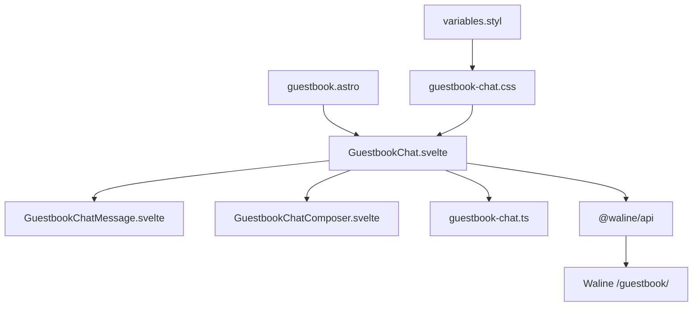

# 留言板 Waline QQ 群聊设计

> 本方案将 `/guestbook/` 改为 Waline 驱动的单频道群聊界面。评审重点是平铺消息协议、30 s 同步边界、匿名与登录身份处理、失败状态，以及实现是否符合 `CLAUDE.md`。原 KV 留言链路已删除，当前留言板只通过 Waline 收发消息。

**实施状态（2026-07-16）**：代码、Worker 路由、`VISITOR_KV` 绑定和 KV 部署说明均已清理。留言板不再依赖项目 Worker 或 Cloudflare KV。

## 问题陈述

改造前存在两套留言数据源：文章评论使用 Waline，留言板使用 Cloudflare Worker + KV。旧留言板还包含卡片堆叠、拖拽投票、列表弹窗、详情弹窗和自定义缓存。这些功能无法复用 Waline 的登录、审核和后台管理。

新频道固定使用 `/guestbook/`。2026-07-15 直接请求 Waline 接口时，该频道返回 `count: 0`，因此实施时未迁移原 KV 数据（来源：`https://comment.mmzhiku.xyz/api/comment`，2026-07-15 采样）。

设计阶段的聊天室草稿包含 1157 行 Svelte 与组件内 `<style>`。该结构违反 `CLAUDE.md` 的样式组织、BEM、主题变量和 `768px` 断点规范，因此实施时按下述模块边界完成重构。

## 目标与验收

| 目标 | 验收方法 |
|---|---|
| 统一数据源 | 留言页只请求 Waline `/guestbook/`，源码不存在 `/api/guestbook` 调用 |
| 单一消息流 | 主评论和兼容读取到的旧回复按 `time` 升序展示，不渲染楼层 |
| QQ 群聊交互 | 访客左对齐，管理员右对齐；支持头像、昵称、时间、浏览器、系统、属地、引用和 `@` |
| 固定同步周期 | 页面可见且在线时每 30 s 请求最新页；发送、恢复网络和重新可见时立即同步 |
| 完整失败状态 | 覆盖首屏失败、后续同步失败、离线、发送失败、审核中和空数据 |
| 删除旧实现 | 删除卡片、投票、弹窗、KV Worker、KV 限流、`VISITOR_KV` 绑定和部署说明 |
| 遵守代码规范 | Svelte/Astro 无 `<style>`；CSS 使用 BEM、主题变量和 `768px` 断点 |
| 响应式可用 | 在 375 px、768 px、1024 px、1440 px 视口验证，无横向滚动和控件遮挡 |

## 不在范围内

- 不实现 WebSocket、SSE 或低于 30 s 的轮询。
- 不实现在线人数、正在输入、消息已读、撤回、文件传输和语音消息。
- 不迁移或自动删除 Cloudflare 上的旧 KV 命名空间数据。
- 不渲染 Waline 原生评论组件作为回退。
- 不改变文章页和友链页现有 Waline 评论 UI。

## 用户界面

### 频道栏

频道栏显示名称、最近同步时间、同步状态、登录入口和手动刷新按钮。状态只表示数据同步结果，不伪装为 QQ 在线人数。刷新按钮在请求进行中禁用，防止并发请求。

### 消息时间线

消息按发布时间从旧到新排列。首次加载后定位到最新消息；用户滚动到顶部时加载更早页面。加载历史消息后，组件补偿 `scrollHeight` 差值，保持原阅读位置。

访客消息左对齐。Waline 返回 `type: administrator` 时，消息右对齐并显示“站长”标识。管理员身份不使用昵称推断。

每条消息显示以下信息：

- 头像、昵称、日期时间。
- 正文气泡和可选引用块。
- 浏览器、操作系统、公开属地。
- 审核中、发送中或发送失败状态。

邮箱、IP 和精确位置不进入 DOM。`addr` 缺失时不显示占位文本。

### 引用与 @

鼠标悬停、键盘聚焦或移动端点击后可引用消息。输入区显示待引用消息，可在发送前取消。发送正文以 `@昵称` 开头；消息气泡在正文上方显示引用摘要。点击引用块时，页面滚动到原消息并高亮 1600 ms。

### 输入区

匿名用户填写昵称、可选邮箱和可选网站。邮箱仅提交给 Waline 生成头像，不公开展示。登录用户使用 Waline 返回的昵称、头像和 Token。

`Enter` 发送，`Shift + Enter` 换行。输入区支持常用 Unicode 表情、300 字计数、草稿恢复、发送中、发送失败重试和失败消息删除。触摸控件最小尺寸为 44 px。

### 加载与失败

首屏加载显示固定高度骨架，避免布局跳动。首次请求失败时显示失败原因和重新加载按钮，不显示 Waline 原生评论区。后续同步失败时保留已有消息，仅在频道栏和输入区显示错误。

离线时停止请求并禁用发送。浏览器触发 `online` 后立即同步。空频道显示空状态和输入区，允许发送第一条消息。

## 技术架构



| 模块 | 职责 |
|---|---|
| `src/pages/guestbook.astro` | 页面标题、布局和客户端组件挂载 |
| `src/components/features/GuestbookChat.svelte` | 请求生命周期、30 s 轮询、分页、滚动和状态协调 |
| `src/components/features/GuestbookChatMessage.svelte` | 单条消息、元信息、引用、管理员布局和失败操作 |
| `src/components/features/GuestbookChatComposer.svelte` | 匿名资料、登录状态、草稿、表情、引用条和发送动作 |
| `src/types/guestbook-chat.ts` | 聊天消息、资料、认证和本地发送状态类型 |
| `src/utils/guestbook-chat.ts` | Waline 数据扁平化、引用协议、合并去重和时间转换 |
| `src/styles/components/guestbook-chat.css` | BEM 样式、主题和 `768px` 响应式规则 |

## Waline 数据映射

| Waline 字段 | 聊天用途 | 缺失处理 |
|---|---|---|
| `objectId` | 消息唯一 ID、引用目标、轮询去重 | 丢弃无 ID 的服务端消息 |
| `time` | 时间线排序和日期分隔 | 无效值使用接收时间 |
| `nick` | 昵称和 `@` 文本 | 显示“匿名访客” |
| `avatar` | 消息头像 | 使用昵称首字符头像 |
| `orig` | 解析隐藏引用标记和纯文本正文 | 从 `comment` 提取纯文本 |
| `type` | `administrator` 决定管理员布局 | 按访客布局处理 |
| `browser` / `os` / `addr` | 气泡下方元信息 | 缺失字段不渲染 |
| `status` | `waiting` 显示审核中 | 不显示状态标签 |
| `children` | 兼容读取 Waline 旧回复 | 扁平化后按时间排序，不推断引用关系 |

组件只渲染纯文本正文，Svelte 负责 HTML 转义。该策略不使用 `{@html}`，避免把后端渲染结果直接注入页面。

## 平铺引用协议

新消息全部作为 Waline 顶级评论发送，不传 `pid` 和 `rid`。该设计确保回复旧消息后，新消息仍出现在最新页，30 s 轮询不会因根评论分页而漏掉回复。

引用消息的原始正文格式如下：

```text
<!--guestbook-reply:{objectId}:{encodeURIComponent(nick)}-->
@{nick} {message}
```

读取端使用行首严格正则解析标记。无法解析时，将整段内容作为普通正文。引用目标未加载时显示“原消息暂未加载”；用户点击引用后，组件继续加载历史页，直到找到目标或没有更多页面。

此协议放弃 Waline 原生回复邮件通知和楼层关系，换取稳定的平铺时间线。Waline 后台仍可审核、删除和搜索每条顶级消息。

## 请求与状态管理

### 首次加载

1. 请求 `page=1&pageSize=30&sortBy=insertedAt_desc`。
2. 扁平化 `children`，按时间升序排序。
3. 渲染后滚动到底部。
4. 失败时进入首屏失败状态，用户手动重试。

### 轮询

轮询周期固定为 30 s。组件在页面隐藏时清除计时器；页面重新可见时立即同步并重建计时器。网络恢复和发送成功也触发一次立即同步。

组件同一时间只允许一个同步请求。合并时以 `objectId` 去重。用户位于底部 120 px 范围内时，新消息到达后自动滚动；否则保留位置并显示“有 N 条新消息”。

### 发送

组件先插入本地发送中消息，再调用 `addComment`。服务端成功时用真实 `objectId` 消息替换临时消息；失败时保留正文并提供重试与删除操作。`status: waiting` 的响应继续显示在当前会话，并标记“审核中”。

### 身份

匿名资料和草稿存储在独立 `localStorage` Key。Waline 登录勾选“记住”时，Token 写入 `localStorage`；否则只写入 `sessionStorage`。接口返回鉴权失败时，组件清除失效 Token 并提示重新登录，避免所有后续请求持续失败。

## 样式与代码规范

- 所有 Svelte 和 Astro 组件禁止 `<style>`。
- 聊天样式写入 `src/styles/components/guestbook-chat.css`，由 `main.css` 导入。
- 类名使用 `.guestbook-chat__element--modifier`；运行状态使用 `.is-loading`、`.is-failed`、`.is-admin`。
- 颜色只引用 `variables.styl` 中的 CSS 变量，不写十六进制、RGB 或 OKLCH 字面量。
- 间距和圆角使用 `variables.styl` 中的 Token；缺失 Token 在该文件统一补充。
- 移动端只使用 `@media (max-width: 768px)`。
- 图标使用 `lucide-svelte`，图标按钮提供 `aria-label` 和 `title`。
- 动态同步与错误状态使用 `aria-live`；交互控件支持键盘焦点。
- 骨架、高亮和旋转动画限制在 `opacity`、`transform` 和 `box-shadow`，并处理 `prefers-reduced-motion`。

## 旧实现清理结果

已删除以下旧实现：

- `GuestbookCardStack`、`GuestbookCompose*`、`GuestbookDetailModal`、`GuestbookListModal`、`GuestbookView*` 和 `GuestbookVirtualList`。
- `guestbook-api.ts`、`guestbook-cache.ts`、`guestbook-card-stack.ts` 和旧 `GuestbookMessage` 类型。
- `src/workers/guestbook.js`、KV 限流工具和 `src/worker.js` 中的路由。
- `wrangler.jsonc` 与 Worker Env 类型中的 `VISITOR_KV`。
- 旧留言样式、样式入口和 README 的 KV 部署说明。

代码和部署配置不再引用留言板 KV。Cloudflare 控制台中如仍保留旧命名空间，该命名空间不会被当前版本访问，可由维护者手动删除。

## 风险

### P1：Waline 顶级评论策略不发送回复通知

风险：引用消息不使用 Waline `pid` 和 `rid`。

影响：被 `@` 的用户不会收到 Waline 原生回复邮件。

应对：UI 明确定位为群聊频道；如果邮件通知成为必需项，则增加服务端通知 Hook，不改回楼层数据结构。

### P1：管理员类型字段缺失

风险：Waline 未返回评论的 `type` 字段。

影响：管理员消息按访客样式左对齐，但不会获得越权能力。

应对：只信任 `type: administrator`；不使用昵称或前端白名单猜测管理员身份。

### P1：登录 Token 失效

风险：本地 Token 过期后，带 Token 的读取或发送请求失败。

影响：聊天室保留现有消息，但同步和发送停止。

应对：识别鉴权错误，清除 Token，切换到匿名状态并提示重新登录。

### P2：根评论分页在新增消息后发生偏移

风险：用户加载历史页期间，最新页插入新消息导致后续页包含重复数据。

影响：接口可能返回重复消息，但不会丢失已加载消息。

应对：所有合并操作使用 `objectId` 去重；每次重新进入页面从第 1 页建立分页状态。

### P2：30 s 轮询不提供实时通信语义

风险：其他访客消息最多延迟 30 s 出现。

影响：聊天室不支持在线人数、输入中和已读状态。

应对：频道栏显示“每 30 秒同步”和最近同步时间，不展示误导性的在线状态。

## 验证计划

实现完成后按以下顺序验证：

1. 执行 `pnpm check`、`pnpm type-check`、`pnpm lint` 和 `pnpm build`。
2. 搜索 `/api/guestbook`、`VISITOR_KV`、旧组件名和组件内 `<style>`，结果应为 0。
3. 在 375 px、768 px、1024 px、1440 px 视口检查亮色与暗色主题。
4. 模拟 Waline 空数据、首屏 500、轮询失败、离线、发送失败和审核中响应。
5. 验证匿名发送、Waline 登录、管理员右对齐、引用跳转、历史分页和 30 s 同步。
6. 检查浏览器控制台错误、横向滚动、文本溢出和交互控件遮挡。
