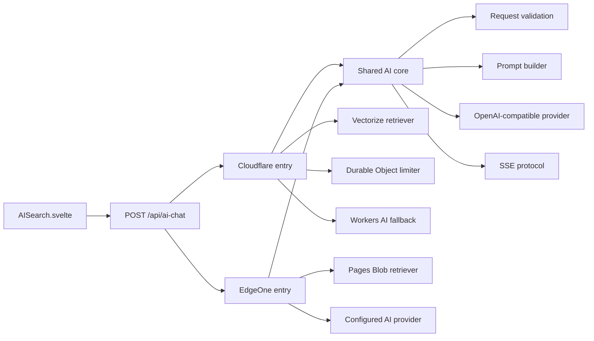

# AI 搜索 Cloudflare / EdgeOne 双运行时设计

> 本方案将 AI 搜索拆分为运行时无关核心、Cloudflare 适配器和 EdgeOne 适配器。评审重点是平台目录是否隔离、Cloudflare 现有行为是否保持、EdgeOne Blob 索引发布是否具备一致性，以及自定义 AI 接口和安全边界是否明确。目标是在不互相代理的前提下，让同一前端分别部署到 Cloudflare 或 EdgeOne 后都能通过同域 `/api/ai-chat` 独立运行。

## 现状与数据

当前 `/api/ai-chat` 由 `src/worker.js` 接收请求，`src/workers/ai-chat.ts` 同时负责请求校验、限流、Embedding、Vectorize 检索、Prompt 组装、模型调用和 SSE 输出。该实现直接依赖 Cloudflare `AI`、`VECTORIZE`、`AI_RATE_LIMITER` 和 `ASSETS` 绑定，无法在 EdgeOne Pages Functions 中运行。

2026-07-16 对当前内容执行与 `build-vectorize-index.js` 相同的标题分块规则，得到以下数据：

| 指标 | 当前值 | 说明 |
|---|---:|---|
| 已扫描文章 | 18 篇 | `src/content/posts/**/*.{md,mdx}` |
| 有效分块 | 549 个 | 丢弃少于 50 个字符的分块 |
| 1024 维 Float32 向量 | 2.14 MiB | `549 x 1024 x 4 B` |
| 检索元数据 | 0.39 MiB | 标题、路径、日期、章节和 500 字符摘要 |
| 索引估算合计 | 2.54 MiB | 不含 Blob 协议开销 |

数据来源：本地仓库内容统计，2026-07-16 采样。该数据只用于确定初始实现，不代表 EdgeOne Functions 的性能结论。

## 目标与验收

| 目标 | 验收方式 |
|---|---|
| 双平台独立运行 | EdgeOne 请求链路不访问 Cloudflare；Cloudflare 请求链路不访问 EdgeOne |
| 前端协议不变 | 两个平台均提供同域 `POST /api/ai-chat`，继续输出 `refs`、`chunk`、`done`、`error` SSE 事件 |
| 平台目录隔离 | Cloudflare 代码只位于 `src/worker.*` 与 `src/workers/cloudflare/`；EdgeOne 代码只位于 `functions/` |
| 核心逻辑复用 | 请求校验、Prompt、OpenAI 兼容客户端和 SSE 编码只保留一份平台无关实现 |
| Cloudflare 行为保持 | 保留 Vectorize 检索、Durable Object 限流、自定义 AI 优先和 Workers AI 回退 |
| EdgeOne 无 KV | EdgeOne 只使用 Pages Functions、Pages Blob 和用户配置的 OpenAI 兼容 AI，不使用 Pages KV 或 EdgeOne AI |
| 索引一致 | 运行时只加载模型指纹匹配、长度与校验和有效的完整索引 |
| 密钥不入库 | `AI_API_KEY`、`EDGEONE_API_TOKEN` 和平台凭证只从环境变量读取 |
| 自动化验证 | 核心、Cloudflare 适配器和 EdgeOne 适配器均有测试；`pnpm check`、`pnpm type-check`、`pnpm test`、`pnpm build` 通过 |

## 非目标

- 不让 EdgeOne 调用 Cloudflare Worker，也不让 Cloudflare 调用 EdgeOne Function。
- 不迁移 Cloudflare Vectorize 中的索引到 EdgeOne Blob；两个索引独立构建和发布。
- 不使用 EdgeOne AI、EdgeOne KV 或 Blob 计数实现应用级限流。
- 不承诺兼容所有厂商私有协议，只支持本文定义的 OpenAI 兼容契约。
- 不在本阶段引入 HNSW、IVF 或独立向量数据库。

## 核心决策

### 目录与组件边界

目录按共享核心、Cloudflare 和 EdgeOne 3 个所有权边界组织。平台入口只做依赖组装，不承载业务流程。

```text
src/
├── config/
│   └── aiSearchConfig.ts
├── server/
│   └── ai/
│       ├── contracts.ts
│       ├── handler.ts
│       ├── openai-compatible.ts
│       ├── prompt.ts
│       ├── request.ts
│       └── sse.ts
├── worker.ts
└── workers/
    └── cloudflare/
        ├── ai-chat.ts
        ├── durable-rate-limiter.ts
        ├── env.ts
        ├── vectorize-retriever.ts
        └── workers-ai-provider.ts

functions/
├── api/
│   └── ai-chat/
│       └── index.ts
└── _lib/
    └── ai/
        ├── blob-index.ts
        ├── blob-retriever.ts
        ├── env.ts
        └── runtime.ts

scripts/
└── ai-index/
    ├── binary.mjs
    ├── content.mjs
    ├── embeddings.mjs
    └── manifest.mjs

tests/
└── ai/
    ├── core/
    ├── cloudflare/
    └── edgeone/
```

`src/server/ai/` 不得导入 `cloudflare:workers`、`@edgeone/pages-blob` 或平台环境类型。`src/workers/cloudflare/` 不得导入 EdgeOne SDK。`functions/` 不得引用 Cloudflare 绑定或 Workers AI 模型。

根目录保留 Cloudflare 入口 `src/worker.ts`，以符合当前 Wrangler 部署方式。EdgeOne 必须使用 `functions/api/ai-chat/index.ts`，以符合 Pages Functions 文件路由。两个入口通过同一组契约组装各自依赖。

[配图：Cloudflare 与 EdgeOne 通过共享 AI 核心独立组装的组件架构图]



### 共享接口

核心处理器依赖接口，不读取平台全局变量：

```ts
interface AiRuntime {
	retriever: Retriever;
	provider: ChatProvider;
	rateLimiter: RateLimiter;
	waitUntil(task: Promise<unknown>): void;
}

interface Retriever {
	search(question: string, signal: AbortSignal): Promise<SearchResult>;
}

interface ChatProvider {
	stream(messages: ChatMessage[], signal: AbortSignal): Promise<AsyncIterable<string>>;
}

interface RateLimiter {
	check(request: Request): Promise<RateLimitResult>;
}
```

Cloudflare 注入真实 Durable Object 限流器。EdgeOne 注入 `NoopRateLimiter`，但部署检查必须验证平台限频规则已经配置。`NoopRateLimiter` 的命名和日志必须明确其不提供安全保证，禁止伪装为内存分布式限流。

### 配置分层

非敏感配置继续集中在 `src/config/aiSearchConfig.ts`，但按职责拆分：

```ts
export const aiSearchConfig = {
	provider: {
		apiUrl: "https://api-inference.modelscope.cn/v1",
		chatModel: "deepseek-ai/DeepSeek-V4-Flash",
		embeddingModel: "Qwen/Qwen3-Embedding-8B",
		embeddingDimensions: 1024,
	},
	retrieval: {
		topK: 10,
		minScore: 0.2,
		chunkSchemaVersion: 1,
	},
	cloudflare: {
		indexName: "blog-ai-search",
		batchSize: 500,
		embedBatchSize: 50,
	},
	edgeOne: {
		blobStoreName: "blog-ai-search",
		manifestPrefix: "ai/manifests",
		cacheTtlSeconds: 60,
		maxIndexBytes: 32 * 1024 * 1024,
	},
} as const;
```

`apiUrl` 可以进入前端构建产物，因为它不是凭证。`AI_API_KEY` 必须分别配置在 Cloudflare Secret 和 EdgeOne 环境变量中。EdgeOne 不提供无密钥回退；缺少密钥时返回 `503 AI_PROVIDER_NOT_CONFIGURED`。

### 自定义 AI 兼容契约

用户配置的服务必须同时满足以下条件：

| 能力 | 契约 |
|---|---|
| 传输 | 仅允许 HTTPS；服务端使用 Bearer Token |
| Embedding | `POST /v1/embeddings`，返回 `data[].embedding: number[]` |
| Chat | `POST /v1/chat/completions`，支持 `stream: true` |
| 流格式 | SSE `data:` 行，文本位于 `choices[0].delta.content`，以 `[DONE]` 结束 |
| 维度 | 查询向量长度必须等于 `embeddingDimensions` |

配置由代码维护者控制，不接收用户请求中的 API 地址、模型名或密钥，避免 SSRF 和凭证转发。运行时只记录状态码和最多 2048 B 的脱敏响应摘要，不记录 Authorization、完整问题、对话历史或完整上游响应。

## EdgeOne 索引设计

### Blob 对象布局

```text
ai/
├── manifests/
│   └── {providerFingerprint}.json
└── versions/
    └── {contentHash}/
        ├── vectors.f32
        └── metadata.json
```

`providerFingerprint` 由规范化后的 `apiUrl`、`embeddingModel`、`embeddingDimensions` 和 `chunkSchemaVersion` 计算。`contentHash` 由所有有效文章及分块结果计算。模型变更后，旧函数和新函数读取不同的 Manifest，避免发布顺序造成短暂不兼容。

`vectors.f32` 使用小端 Float32 连续存储。构建脚本先将每个向量归一化，再按 `metadata.json` 的数组顺序写入。运行时归一化查询向量后执行点积，按分数降序返回前 `topK` 个结果。

### 原子发布

`pnpm build-index:edgeone` 执行以下步骤：

1. 使用共享分块模块读取非草稿文章。
2. 调用配置的 Embedding API 生成向量。
3. 校验向量数量、维度和数值有效性。
4. 生成 `vectors.f32`、`metadata.json` 和 SHA-256 校验和。
5. 使用 `EDGEONE_PROJECT_ID` 和 `EDGEONE_API_TOKEN` 上传带 `contentHash` 的不可变版本对象。
6. 读取并校验已上传对象。
7. 最后写入 `{providerFingerprint}.json` Manifest。

Manifest 至少包含：

```ts
interface EdgeOneIndexManifest {
	schemaVersion: 1;
	providerFingerprint: string;
	contentHash: string;
	embeddingModel: string;
	embeddingDimensions: number;
	chunkSchemaVersion: number;
	chunkCount: number;
	vectorBytes: number;
	vectorSha256: string;
	metadataSha256: string;
	generatedAt: string;
}
```

运行时每 60 s 以强一致方式检查 Manifest。版本对象不可变，可使用默认缓存读取。运行时在模块作用域缓存解码后的索引；Manifest 的 `contentHash` 变化后才加载新版本。

新 Manifest 发布失败时，旧 Manifest 保持有效。清理任务不得删除任一 Manifest 当前引用的版本；非当前版本至少保留 24 h。

### 运行时防护

加载索引时必须验证：

- `providerFingerprint` 与当前配置一致。
- `vectorBytes === chunkCount * embeddingDimensions * 4`。
- `metadata.length === chunkCount`。
- 文件长度不超过 `maxIndexBytes`。
- SHA-256 与 Manifest 一致。
- 所有分数计算结果为有限数值。

任一校验失败时返回 `503 AI_INDEX_INVALID`，禁止静默降级为无博客上下文的普通聊天。Blob 不可用时返回 `503 AI_INDEX_UNAVAILABLE`。

## 双平台请求链路

### Cloudflare

1. `src/worker.ts` 将 `/api/ai-chat` 交给 Cloudflare 组合根。
2. 共享模块校验 Origin、Content-Type、16 KiB 请求体、问题长度和历史条数。
3. Durable Object 按客户端 IP 执行现有 `10 次/min` 限流。
4. 配置了 `AI_API_KEY` 时，自定义 AI 生成查询向量；否则 Workers AI 生成查询向量。
5. Vectorize 返回 Top-K 分块和元数据。
6. 自定义 AI 或 Workers AI 生成回答。
7. 共享 SSE 编码器输出当前前端协议。

Cloudflare 重构不得改变状态码、SSE 事件名、阈值、Persona、引用字段或回退条件。回归测试以重构前行为为基准。

### EdgeOne

1. `functions/api/ai-chat/index.ts` 接收同域请求。
2. 共享模块执行与 Cloudflare 相同的请求校验。
3. EdgeOne 平台规则在函数执行前完成按 IP 限频。
4. 自定义 AI 生成查询向量；缺少配置或调用失败时终止请求。
5. Blob Retriever 加载匹配的索引并执行 Top-K 点积检索。
6. 自定义 AI 生成回答。
7. 共享 SSE 编码器输出当前前端协议。

EdgeOne 请求链路禁止访问 Cloudflare 域名、绑定或 API。Blob SDK 仅用于索引读取；上传凭证不提供给运行时函数。

## Prompt 安全边界

文章内容属于数据，不属于系统指令。Prompt 使用固定分隔符包裹检索内容，并明确要求模型忽略引用资料中的角色指令、系统提示、工具调用或越权请求。

```text
<retrieved_blog_content trust="untrusted-reference">
...
</retrieved_blog_content>
```

文章摘要进入 Prompt 前继续使用纯文本，不解析或执行其中的 HTML、脚本和模板语法。模型输出仍由前端现有 Markdown 渲染与净化链路处理。

## 错误协议

| 场景 | HTTP / SSE | 错误码 |
|---|---|---|
| 方法不支持 | 405 | `METHOD_NOT_ALLOWED` |
| Origin 不允许 | 403 | `ORIGIN_NOT_ALLOWED` |
| 请求体超过 16 KiB | 413 | `PAYLOAD_TOO_LARGE` |
| 请求格式错误 | 400 / 415 | 保留现有请求错误码 |
| Cloudflare 触发限流 | 429 | `RATE_LIMITED` |
| EdgeOne 平台触发限流 | 由平台返回 | 平台规则负责 |
| EdgeOne 缺少 AI Key | 503 | `AI_PROVIDER_NOT_CONFIGURED` |
| Blob 索引缺失 | 503 | `AI_INDEX_UNAVAILABLE` |
| Blob 索引无效 | 503 | `AI_INDEX_INVALID` |
| 上游 AI 失败 | 502 | `AI_UPSTREAM_FAILED` |
| 流中断 | SSE `error` | `AI_STREAM_FAILED` |

客户端断开后，适配器必须取消上游读取。日志使用结构化事件名，不记录密钥、完整消息或向量内容。

## 安全与部署前提

### EdgeOne 强制配置

- 设置 `AI_API_KEY`、`ALLOWED_ORIGINS` 和 `PUBLIC_SITE_URL`。
- 为 `/api/ai-chat` 的 `POST` 请求配置按客户端 IP 限频，初始值与 Cloudflare 保持为 `10 次/min`。
- 设置请求体上限；平台规则不得高于函数内 16 KiB 上限。
- 创建 Pages Blob Store，并使名称与 `edgeOne.blobStoreName` 一致。
- 使用 HTTPS 自定义域名；禁止把上传 Token 配置为前端可见变量。

EdgeOne 未配置平台限频时，部署验收失败。应用代码不使用 Blob、内存 Map 或浏览器标识模拟分布式限流。

### 环境变量

| 变量 | Cloudflare 运行时 | EdgeOne 运行时 | EdgeOne 索引构建 |
|---|---|---|---|
| `AI_API_KEY` | 可选 | 必填 | 必填 |
| `ALLOWED_ORIGINS` | 必填 | 必填 | 不使用 |
| `PUBLIC_SITE_URL` | 推荐 | 推荐 | 不使用 |
| `CLOUDFLARE_API_TOKEN` | 不使用 | 不使用 | 不使用 |
| `CLOUDFLARE_ACCOUNT_ID` | 不使用 | 不使用 | 不使用 |
| `EDGEONE_API_TOKEN` | 不使用 | 不使用 | 必填 |
| `EDGEONE_PROJECT_ID` | 不使用 | 不使用 | 必填 |

`.env.edgeone` 保存 EdgeOne 本地构建凭证并加入 `.gitignore`；仓库只提交 `.env.edgeone.example` 占位模板。

## 测试策略

实现遵循测试先行。先添加失败测试，再修改生产代码。

### 共享核心

- 请求体类型、大小、问题长度和历史条数边界。
- Origin 白名单和预检请求。
- OpenAI Embedding 响应校验。
- OpenAI SSE 跨分块解析、`[DONE]` 和非法行处理。
- 引用去重、分数阈值和 Prompt 不可信数据分隔。
- 客户端取消后，上游流被取消。

### Cloudflare

- 自定义 AI 配置完整时使用自定义 Provider。
- 缺少自定义配置时保持 Workers AI 回退。
- Vectorize 参数保持 `topK: 10` 和元数据返回。
- Durable Object 限流保持 `10 次/min` 与 `Retry-After`。
- SSE 事件与重构前保持一致。

### EdgeOne

- Float32 小端编解码和向量归一化。
- Top-K 排序、阈值、重复文章引用去重。
- Manifest 模型指纹、长度、数量和校验和验证。
- Manifest 切换前继续使用旧索引；切换后只加载一次新版本。
- Blob 缺失、索引超限和维度不匹配返回 503。
- EdgeOne 入口不包含 Cloudflare import 或绑定访问。

### 验收命令

```bash
pnpm check
pnpm type-check
pnpm test
pnpm lint
pnpm build
pnpm build-index:edgeone -- --dry-run
```

EdgeOne 预览环境还需执行 3 项人工验收：正常流式回答、平台 429 限频、Blob Manifest 切换。Cloudflare 预览环境需验证自定义 AI 路径和 Workers AI 回退路径。

## 实施顺序

1. 建立 Vitest 配置和共享契约测试。
2. 提取平台无关请求、Prompt、OpenAI 客户端和 SSE 模块。
3. 将 Cloudflare 代码迁入独立目录，并通过行为回归测试。
4. 实现共享索引分块、二进制编码和 Manifest 模块。
5. 实现 EdgeOne Blob 索引构建与原子发布脚本。
6. 实现 EdgeOne Blob Retriever 和 Pages Function 组合根。
7. 更新 TypeScript、Biome、环境变量模板、README、隐私政策和 `CLAUDE.md`。
8. 完成两个平台的预览部署验收。

## 风险与应对

**P1 风险：EdgeOne 未配置平台限频。** 影响：公开接口可持续消耗自定义 AI 配额。应对：将 `10 次/min/IP` 规则设为部署验收阻断项；未截图确认规则和 429 响应时不得发布。

**P1 风险：自定义服务并非约定的 OpenAI 兼容实现。** 影响：Embedding 解析失败或 SSE 无输出。应对：构建脚本先执行能力探测；运行时校验向量维度；部署文档明确兼容契约。

**P1 风险：Blob Manifest 与版本对象不一致。** 影响：引用文章错位或检索结果失真。应对：版本对象不可变、Manifest 最后发布、运行时校验长度和 SHA-256、失败时返回 503。

**P1 风险：Cloudflare 组件化重构引入行为回归。** 影响：现有生产 AI 搜索的限流、回退或 SSE 失败。应对：修改前建立契约测试；Cloudflare 预览同时验证自定义 AI 和 Workers AI 两条路径。

**P2 风险：线性检索随文章数量增长。** 影响：索引和检索 CPU 时间线性增加。应对：记录索引字节数和检索耗时；当索引超过 32 MiB 或预览环境 P95 检索时间超过 100 ms 时，停止扩大线性索引并评审分片或 ANN。

**P2 风险：模型供应商变更隐私处理方。** 影响：隐私政策与实际数据接收方不一致。应对：部署者修改 `provider.apiUrl` 时必须同步更新隐私政策中的第三方服务说明。

## 回滚

Cloudflare 回滚使用 Wrangler 版本回滚，Vectorize 索引和 Durable Object 不迁移。EdgeOne 回滚使用 Pages 部署版本回滚；旧函数按自身 `providerFingerprint` 读取对应 Manifest。Blob 版本对象至少保留 24 h，确保回滚期间索引可用。

如果 EdgeOne 新索引异常，维护者恢复该 `providerFingerprint` 上一个有效 Manifest。回滚只切换 Manifest，不覆盖或修改版本对象。

## 文档同步范围

实现完成时同步以下文档：

- `README.md`：双平台部署矩阵、构建命令和环境变量。
- `CLAUDE.md`：共享服务目录、Cloudflare 目录和 EdgeOne Functions 目录规范。
- `.env.example`、`.env.cf.example`、`.env.edgeone.example`：平台凭证边界。
- `src/content/spec/privacy.md`：自定义 AI 服务和 EdgeOne Blob 数据处理说明。
- AI 搜索技术文章：从 Cloudflare 单平台说明调整为双运行时说明，保留历史架构背景。
