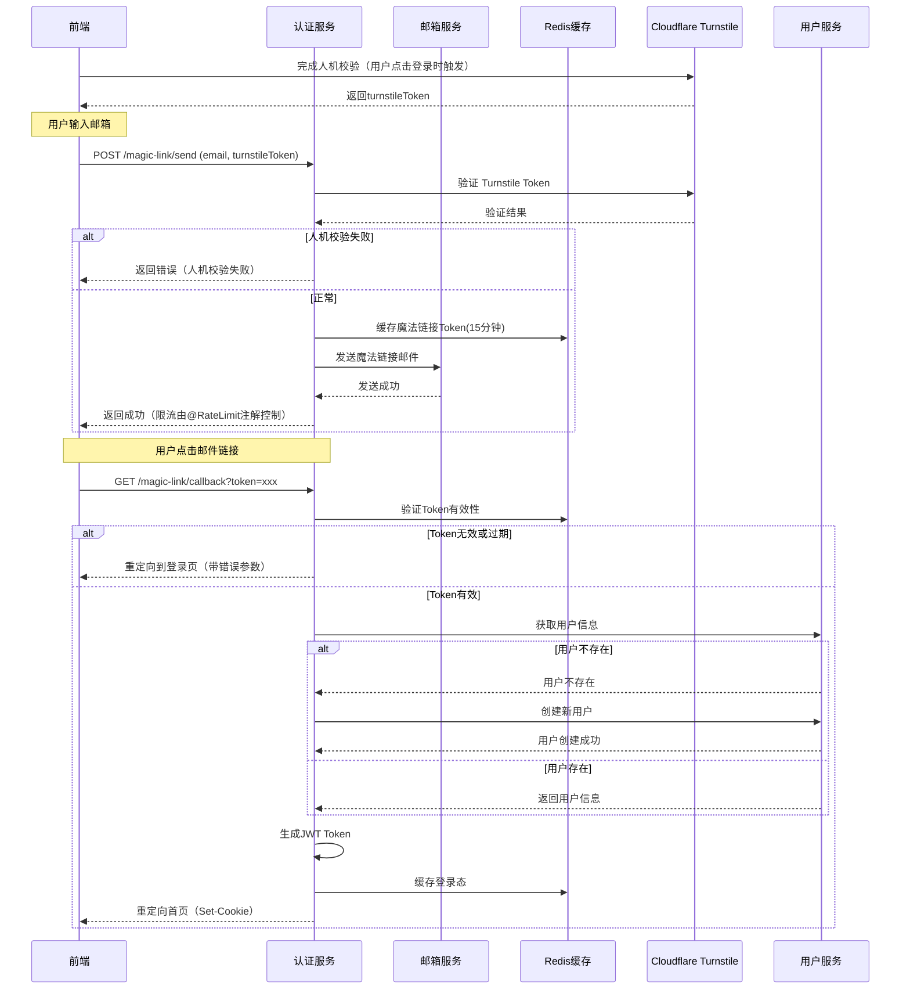
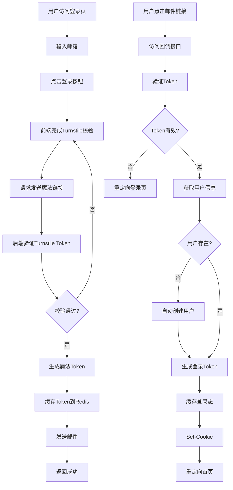

# 登录 | 魔法链接 | 设计文档

## 1. 需求分析

### 1.1 业务背景

为提升用户登录体验，减少密码输入步骤，新增魔法链接登录方式。用户只需输入邮箱并完成人机校验，即可通过点击邮件中的链接完成登录。

### 1.2 功能需求

| 序号 | 需求点    | 描述                             | 来源   |
| :- | :----- | :----------------------------- | :--- |
| 1  | 发送魔法链接 | 用户输入邮箱并完成人机校验后，后端发送包含魔法链接的邮件   | 用户需求 |
| 2  | 魔法链接验证 | 用户点击邮件链接后，后端验证链接有效性            | 用户需求 |
| 3  | 自动登录   | 验证成功后，后端写入登录态（Cookie）并跳转首页     | 用户需求 |

### 1.3 登录流程



## 2. 技术方案

### 2.1 架构设计

#### 2.1.1 模块划分

| 模块          | 职责                          | 状态    |
| :---------- | :-------------------------- | :---- |
| Controller层 | 处理HTTP请求、参数校验、响应封装          | 新增    |
| Service层    | 业务逻辑处理、Token生成验证、登录态管理      | 新增/修改 |
| 外部服务        | Cloudflare Turnstile验证、邮件发送 | 集成    |
| 缓存层         | Token存储、频率限制                | 复用    |

#### 2.1.2 核心流程图



### 2.2 目录结构

```plaintext
zsk-auth/
├── src/main/java/com/zsk/auth/
│   ├── controller/
│   │   └── AuthController.java          # 新增魔法链接接口
│   ├── service/
│   │   ├── IAuthService.java            # 新增魔法链接相关方法
│   │   ├── ICaptchaService.java         # 新增Turnstile验证方法
│   │   └── impl/
│   │       ├── AuthServiceImpl.java     # 实现魔法链接业务逻辑
│   │       └── CaptchaServiceImpl.java  # 实现Turnstile验证
│   ├── config/
│   │   └── TurnstileProperties.java     # Turnstile配置
│   └── domain/
│       └── MagicLinkRequest.java        # 魔法链接请求DTO
└── src/main/resources/
    └── application.yml                  # 新增Turnstile配置项
```

### 2.3 关键类与方法设计

#### 2.3.1 Controller层

| 方法名                 | 功能说明   | 参数                                              | 返回值                         | 所属文件                |
| :------------------ | :----- | :---------------------------------------------- | :-------------------------- | :------------------ |
| `sendMagicLink`     | 发送魔法链接 | `email`: 邮箱地址`turnstileToken`: Turnstile验证Token | `R<String>`                 | AuthController.java |
| `magicLinkCallback` | 魔法链接回调 | `token`: 魔法链接Token                              | `ResponseEntity<Void>`（重定向） | AuthController.java |

#### 2.3.2 Service层

**IAuthService 接口新增方法：**

| 方法名               | 功能说明         | 参数                                              | 返回值             |
| :---------------- | :----------- | :---------------------------------------------- | :-------------- |
| `sendMagicLink`   | 发送魔法链接       | `email`: 邮箱地址`turnstileToken`: Turnstile验证Token | `void`          |
| `verifyMagicLink` | 验证魔法链接并生成登录态 | `token`: 魔法链接Token                              | `LoginResponse` |

**ICaptchaService 接口方法：**

| 方法名                    | 功能说明                         | 参数                        | 返回值       |
| :--------------------- | :--------------------------- | :------------------------ | :-------- |
| `verifyTurnstileToken` | 验证Cloudflare Turnstile Token | `token`: Turnstile验证Token | `boolean` |

#### 2.3.3 配置类

**TurnstileProperties**

| 属性名         | 类型     | 含义                        | 默认值                                                         |
| :---------- | :----- | :------------------------ | :---------------------------------------------------------- |
| `secretKey` | String | Cloudflare Turnstile 密钥   | -                                                           |
| `siteKey`   | String | Cloudflare Turnstile 站点密钥 | -                                                           |
| `verifyUrl` | String | Turnstile验证API地址          | `https://challenges.cloudflare.com/turnstile/v0/siteverify` |

### 2.4 数据库与缓存设计

#### 2.4.1 Redis缓存键设计

| 缓存键       | 前缀                  | 有效期  | 存储内容    |
| :-------- | :------------------ | :--- | :------ |
| 魔法链接Token | `cache:magic_link:` | 15分钟 | `email` |

> **说明**：发送频率限制使用 `@RateLimit` 注解（基于Sentinel限流）。

#### 2.4.2 缓存数据结构

```json
// 魔法链接Token缓存
{
  "key": "cache:magic_link:xxx-token-xxx",
  "value": "user@example.com",
  "expire": 900 // 15分钟
}
```

### 2.5 API接口设计

#### 2.5.1 发送魔法链接

| 属性       | 值                   |
| :------- | :------------------ |
| **路径**   | `/magic-link/send`  |
| **方法**   | `POST`              |
| **所属文件** | AuthController.java |

**请求体：**

| 字段名              | 类型     | 必填 | 含义                              |
| :--------------- | :----- | :- | :------------------------------ |
| `email`          | String | 是  | 用户邮箱地址                          |
| `turnstileToken` | String | 是  | Cloudflare Turnstile验证Token（前端从Turnstile组件获取） |

**成功响应（200）：**

```json
{
  "code": 200,
  "msg": "success",
  "data": "魔法链接已发送至您的邮箱，15分钟内有效"
}
```

**失败响应（400）：**

```json
{
  "code": 400,
  "msg": "人机校验失败，请重试",
  "data": null
}
```

#### 2.5.2 魔法链接回调

| 属性       | 值                      |
| :------- | :--------------------- |
| **路径**   | `/magic-link/callback` |
| **方法**   | `GET`                  |
| **所属文件** | AuthController.java    |

**请求参数：**

| 字段名     | 类型     | 必填 | 含义          |
| :------ | :----- | :- | :---------- |
| `token` | String | 是  | 魔法链接中的Token |

**成功响应（302）：**

- **Location**: `/`（首页地址，可配置）
- **Set-Cookie**: `access_token=xxx; HttpOnly; Secure; SameSite=Strict`

**失败响应（302）：**

- **Location**: `/login?error=invalid_token`


## 3. 方案对比分析

### 3.1 两种方案对比

#### 方案 A：预校验（已废弃）

**流程：** 用户进入页面 → 完成Turnstile校验 → 获取临时凭证 → 输入邮箱 → 携带凭证调用登录接口

**优点：**
- 登录时无需等待人机校验结果，登录接口响应更快
- 可以提前拦截恶意流量，不让无效请求到达登录接口

**致命缺点：**
- **多一次网络请求**：页面加载就调用后端，浪费服务器资源
- **安全漏洞**：临时凭证如果没有严格的过期/防重放设计，攻击者可以批量刷凭证后暴力登录
- **体验割裂**：用户还没打算登录，就被强制完成人机校验
- **实现复杂**：需要管理临时凭证的生命周期（Redis存储、过期时间、单用户限制等）

#### 方案 B：登录时校验（当前实现）

**流程：** 用户输入邮箱 → 点击登录 → 前端完成Turnstile校验 → 携带turnstileToken调用登录接口 → 后端实时校验

**优点：**
- **极致用户体验**：全程静默无感，用户只操作一次登录
- **最高安全性**：登录和人机强绑定，不通过校验就绝对无法进入登录逻辑
- **架构极简**：无额外接口、无额外存储、无凭证管理逻辑
- **抗攻击最强**：每一次登录请求都必须携带全新的有效TurnstileToken，几乎无法批量刷接口

**唯一小缺点：**
- 登录接口会多一步校验逻辑（调用Cloudflare API），但Turnstile接口响应极快（毫秒级），几乎无感知

### 3.2 方案对比表

| 维度 | 方案 A（预校验） | 方案 B（登录时校验） |
| :--- | :--- | :--- |
| **用户体验** | 一般（多一步请求） | 优秀（全程无感） |
| **安全性** | 中（存在凭证复用风险） | 高（强绑定，无法提前准备） |
| **架构复杂度** | 高（需要管理凭证生命周期） | 低（无额外组件） |
| **服务器开销** | 高（页面加载就请求） | 低（仅登录时请求） |
| **抗攻击能力** | 中（可批量刷凭证） | 高（每请求都需新Token） |
| **实现难度** | 复杂 | 简单 |

### 3.3 选型结论

**方案 B（登录时校验）是最优选择。**

它以几乎可以忽略的性能损耗，换取了：
- 更简单的架构设计
- 更高的安全性
- 更好的用户体验

## 4. 部署与集成方案

### 4.1 依赖与环境

| 依赖名称              | GroupId                  | ArtifactId                     | 版本     | 用途     |
| :---------------- | :----------------------- | :----------------------------- | :----- | :----- |
| Spring Web        | org.springframework.boot | spring-boot-starter-web        | 3.2.x  | Web服务  |
| Spring Data Redis | org.springframework.boot | spring-boot-starter-data-redis | 3.2.x  | 缓存     |
| RestTemplate      | org.springframework.boot | spring-boot-starter-web        | 3.2.x  | HTTP请求 |
| Lombok            | org.projectlombok        | lombok                         | 1.18.x | 简化代码   |

### 4.2 配置与运行

#### 4.2.1 application.yml 新增配置

```yaml
# Cloudflare Turnstile 配置
turnstile:
  secret-key: ${TURNSTILE_SECRET_KEY:your-secret-key}
  site-key: ${TURNSTILE_SITE_KEY:your-site-key}
  verify-url: https://challenges.cloudflare.com/turnstile/v0/siteverify

# 魔法链接配置
magic-link:
  redirect-url: ${MAGIC_LINK_REDIRECT_URL:http://localhost:8080}
```

> **说明**：
>
> - `expire-minutes`: 魔法链接有效期固定为15分钟，无需配置
> - `rate-limit`: 限流由 `@RateLimit` 注解控制，无需在此配置


## 5. 代码安全性

### 5.1 注意事项

| 序号 | 风险点               | 风险等级 | 关联模块               |
| :- | :---------------- | :--- | :----------------- |
| 1  | Turnstile Token伪造 | 高    | CaptchaServiceImpl |
| 2  | 魔法链接Token暴力破解     | 高    | AuthServiceImpl    |
| 3  | 邮箱发送频率攻击          | 中    | AuthController     |
| 4  | 邮箱枚举攻击            | 低    | AuthServiceImpl    |
| 5  | Cookie安全配置        | 高    | AuthController     |
| 6  | 自动注册用户风险          | 中    | AuthServiceImpl    |

### 5.2 解决方案

| 序号 | 风险点               | 解决方案                                                                                                                                                                                                                                                                                                                                                                                                                                                                                                                                 |
| :- | :---------------- | :----------------------------------------------------------------------------------------------------------------------------------------------------------------------------------------------------------------------------------------------------------------------------------------------------------------------------------------------------------------------------------------------------------------------------------------------------------------------------------------------------------------------------------- |
| 1  | Turnstile Token伪造 | 调用Cloudflare官方API验证，仅信任服务端验证结果。后端接收到turnstileToken后，立即调用 `https://challenges.cloudflare.com/turnstile/v0/siteverify` 接口验证Token有效性，验证失败则直接返回错误，不进入后续业务逻辑。验证时需携带配置的secretKey，确保请求来源可信。                                                                                                                                                                                                                                                         |
| 2  | 魔法链接Token暴力破解     | 使用UUID生成Token，长度32位，15分钟过期，验证后立即删除。Token存储在Redis中，键为 `cache:magic_link:{token}`，值为用户邮箱。验证流程：1) 根据token查找Redis获取邮箱；2) 验证成功后立即删除缓存（防止重复使用）；3) 无论验证成功或失败，都不泄露任何关于Token是否存在的信息。                                                                                                                                                                                                                                                |
| 3  | 邮箱发送频率攻击          | 使用 `@RateLimit` 注解（基于Sentinel）限制同一邮箱3分钟内最多调用3次。限流策略：以邮箱地址为key，时间窗口3分钟，阈值3次。超过阈值时返回限流错误，防止恶意用户批量发送邮件。                                                                                                                                                                                                                                                                                                                                                     |
| 4  | 邮箱枚举攻击            | 支持自动注册，用户不存在时自动创建，无需区分响应。后端验证魔法链接时，先查询用户是否存在，若不存在则自动创建新用户。返回结果统一，不区分"用户不存在"和"链接无效"，避免攻击者通过响应差异枚举有效邮箱。                                                                                                                                                                                                                                                                                                                                 |
| 5  | Cookie安全配置        | 设置HttpOnly、Secure、SameSite=Strict属性。HttpOnly防止JavaScript访问Cookie，降低XSS攻击风险；Secure确保Cookie仅通过HTTPS传输；SameSite=Strict限制Cookie仅在同站请求时发送，防止CSRF攻击。Cookie有效期与Token保持一致。                                                                                                                                                                                                                                                                                                       |
| 6  | 日志敏感信息泄露          | 禁止打印邮箱地址、Token等敏感信息。在日志配置中过滤敏感字段，使用占位符或脱敏处理。禁止在异常堆栈或调试信息中暴露用户凭证。                                                                                                                                                                                                                                                                                                                                                                                                         |
| 7  | 自动注册用户风险          | 新用户默认状态为正常，用户类型为普通用户（1001）。自动创建用户时，用户名取邮箱@前部分，昵称与用户名相同，邮箱为用户输入的邮箱地址。新用户权限为最低级别，仅拥有基础访问权限。                                                                                                                                                                                                                                                                                                                                                      |


### 5.3 前端操作流程

#### 5.3.1 发送魔法链接

**步骤1：初始化Turnstile组件**

前端页面加载时，初始化Cloudflare Turnstile组件：
```html
<!-- 登录页面嵌入Turnstile -->
<div
  class="cf-turnstile"
  data-sitekey="your-site-key"
  data-callback="onTurnstileSuccess"
></div>
```

**步骤2：用户输入邮箱并点击登录**

用户输入邮箱后点击登录按钮，触发Turnstile校验：
```typescript
// 前端发送魔法链接请求
import { sendMagicLink } from '@/api/auth'

const handleSendMagicLink = async (email: string) => {
  // 等待Turnstile校验完成获取token
  const turnstileToken = await getTurnstileToken()
  
  // 调用后端接口
  await sendMagicLink({
    email,
    turnstileToken
  })
}
```

**步骤3：处理响应**

后端返回成功后，提示用户检查邮箱；校验失败则提示用户重试。

#### 5.3.2 魔法链接回调处理

**步骤1：用户点击邮件链接**

邮件中的链接格式：`https://your-domain/magic-link/callback?token=xxx`

**步骤2：后端验证并重定向**

后端验证Token成功后，设置Cookie并重定向到首页：
- `Set-Cookie: access_token=xxx; HttpOnly; Secure; SameSite=Strict`
- `Location: /`

#### 5.3.3 通过Cookie获取UserInfo

**步骤1：应用初始化时检查Cookie**

前端应用启动时，从Cookie读取`access_token`：
```typescript
// src/App.tsx
import { useEffect } from 'react'
import { useUserStore } from '@/stores/user'
import { getCurrentUser } from '@/api/auth'
import { getStorageValue, STORAGE_KEYS } from '@/utils/storage'

useEffect(() => {
  const initUser = async () => {
    // 从Cookie读取access_token
    const token = getStorageValue<string>(STORAGE_KEYS.TOKEN, undefined, 'cookie')
    
    if (token && !userInfo) {
      // 调用接口获取用户信息
      const user = await getCurrentUser()
      if (user) {
        setUserInfo(user)
      }
    }
  }
  initUser()
}, [])
```

**步骤2：请求拦截器自动携带Token**

Axios请求拦截器自动从Cookie读取Token并添加到请求头：
```typescript
// src/api/request.ts
request.interceptors.request.use((config) => {
  const token = getStorageValue<string>(STORAGE_KEYS.TOKEN, undefined, 'cookie')
  if (token && config.withToken !== false) {
    config.headers.Authorization = `Bearer ${token}`
  }
  return config
})
```

**步骤3：获取用户信息接口**

调用`/system/user/current`接口获取当前登录用户信息：
```typescript
// src/api/auth.ts
export function getCurrentUser() {
  return get<UserInfo>('/system/user/current')
}
```

**步骤4：响应拦截器处理Token过期**

当返回401状态码时，清除Cookie并跳转到登录页：
```typescript
// src/api/request.ts
request.interceptors.response.use(
  (response) => response,
  (error) => {
    if (error.response?.status === 401) {
      // 清除Cookie和本地存储
      removeStorage(STORAGE_KEYS.TOKEN, 'cookie')
      removeStorage(STORAGE_KEYS.USER_INFO, 'local')
      // 跳转到登录页
      window.location.href = '/login'
    }
    return Promise.reject(error)
  }
)
```

#### 5.3.4 Cookie操作工具函数

前端使用`js-cookie`库封装Cookie操作：
```typescript
// src/utils/storage.ts
import Cookies from 'js-cookie'

export function getStorageValue<T>(
  key: string,
  defaultValue?: T,
  type: 'local' | 'session' | 'cookie' = 'local'
): T | undefined {
  if (type === 'cookie') {
    const item = Cookies.get(key)
    if (item === undefined) return defaultValue
    try {
      return JSON.parse(item) as T
    } catch {
      return item as unknown as T
    }
  }
  // ... localStorage/sessionStorage 处理
}

export const STORAGE_KEYS = {
  TOKEN: 'access_token',  // 与后端设置的Cookie名称一致
  USER_INFO: 'zsk_user_info',
  // ... 其他键名
} as const
```

### 5.4 自动注册用户字段说明

当用户通过魔法链接登录且不存在时，系统会自动创建用户，字段默认值如下：

| 字段名        | 默认值       | 说明                            |
| :--------- | :-------- | :---------------------------- |
| `userName` | 邮箱@前部分    | 如 `user@example.com` → `user` |
| `nickName` | 同userName | 昵称与用户名相同                      |
| `email`    | 用户输入的邮箱   | 用于后续登录和通知                     |
| `status`   | `0`       | 正常状态                          |
| `userType` | `1001`    | 普通注册用户                        |