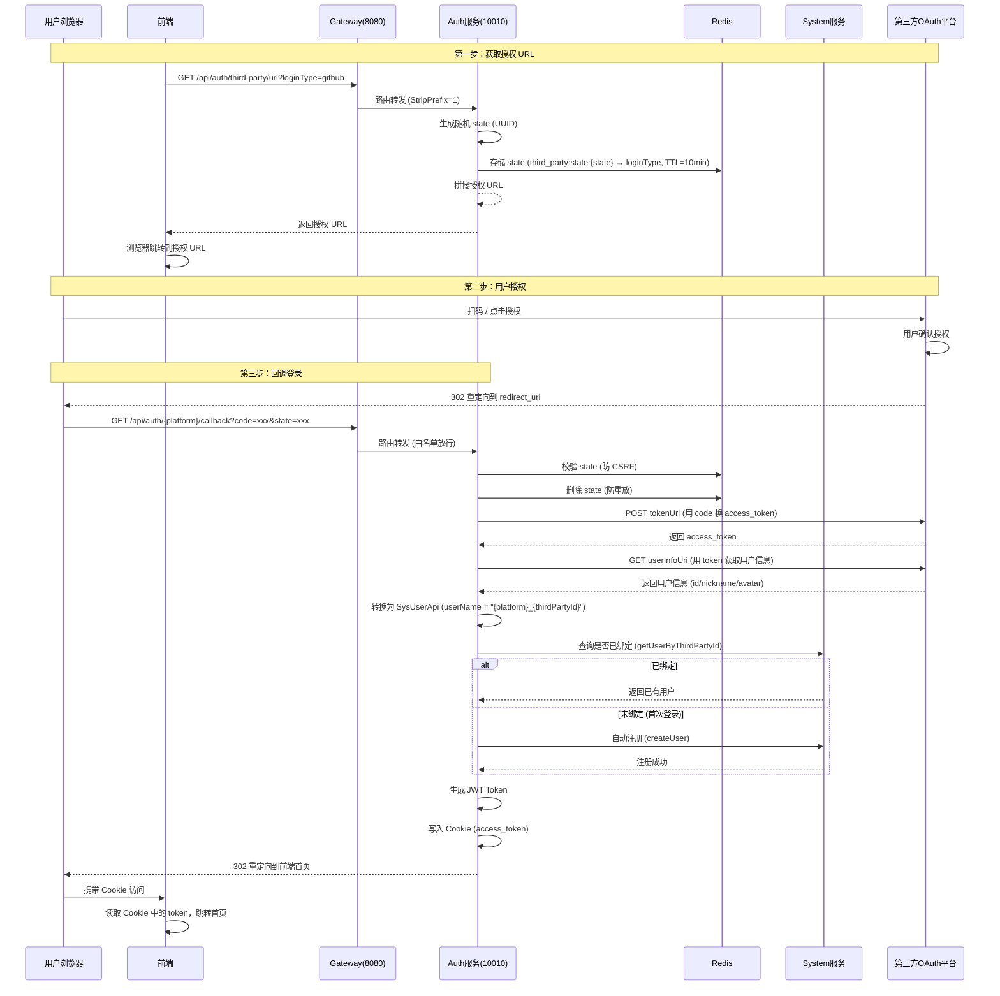

# 登录 | 第三方登录 | 设计文档

本文档记录 GitHub、微信、QQ 三种第三方登录的完整流程、代码结构及多环境配置清单。

---

## 一、通用 OAuth2 授权码流程

### 1.1 流程图



### 1.2 核心代码结构

| 文件 | 职责 |
|------|------|
| `OAuth2ClientConfig.java` | OAuth2 客户端注册（配置各平台端点 URL） |
| `ThirdPartyAuthServiceImpl.java` | 第三方认证核心逻辑（state 校验、换 token、换用户信息、注册/登录） |
| `OAuth2UserInfoStrategy.java` | 策略接口（定义各平台统一行为） |
| `GithubUserInfoStrategy.java` | GitHub 策略实现 |
| `WeChatUserInfoStrategy.java` | 微信策略实现 |
| `QQUserInfoStrategy.java` | QQ 策略实现 |
| `AuthController.java` | 回调入口（`/{platform}/callback`） |

### 1.3 关键技术点

```
1. State 防 CSRF：每次生成授权 URL 时随机生成 state，存入 Redis，回调时校验，验证后删除（防重放）
2. 用户名前缀：github_123、wechat_oABC...、qq_xxx，防止不同平台 ID 冲突
3. 自动注册：首次登录的用户自动创建账号，无需手动注册
4. Cookie 传 Token：回调成功后将 access_token 写入 Cookie，302 重定向到前端
5. Gateway 白名单：回调路由必须免鉴权，否则 JWT 验证会拦截
```

---

## 二、GitHub 登录

### 2.1 平台特性

| 配置项 | 值 |
|--------|-----|
| 授权 URL | `https://github.com/login/oauth/authorize` |
| Token URL | `https://github.com/login/oauth/access_token` |
| 用户信息 URL | `https://api.github.com/user` |
| 认证方式 | `CLIENT_SECRET_BASIC` (Basic Auth) |
| Scope | `read:user` |
| 支持 localhost | 是 |
| 内网穿透 | 不需要 |

### 2.2 回调处理流程

```
用户授权 → GitHub 302 重定向到 http://localhost:8080/api/auth/github/callback?code=xxx&state=xxx
  → AuthController.githubCallback() 接收
  → AuthService.login() 处理
  → ThirdPartyAuthServiceImpl.getUserByAuthCode()
    1. validateState() 校验 state
    2. getTokenResponse() 用 code 换 access_token
       POST https://github.com/login/oauth/access_token
       Header: Authorization: Basic base64(clientId:clientSecret)
       Body: grant_type=authorization_code&code=xxx&redirect_uri=xxx
    3. GithubUserInfoStrategy.getUserInfo() 获取用户信息
       GET https://api.github.com/user
       Header: Authorization: Bearer {access_token}
       返回: { id: 883782250, login: "WuuMing", avatar_url: "..." }
    4. processLoginOrRegister() 登录或注册
       提取 thirdPartyId = "883782250"
       查询 sys_user 表 where third_party_type='github' and third_party_id='883782250'
       不存在则自动注册，userName = "github_883782250"
    5. 生成 JWT Token，写入 Cookie，302 重定向到前端
```

### 2.3 GitHub 后台配置

**地址**：https://github.com/settings/developers → OAuth Apps → New OAuth App / 编辑已有应用

| 配置项 | 开发环境 | 生产环境 |
|--------|---------|---------|
| Application name | zsk-test | ZSK Cloud |
| Homepage URL | `http://localhost:8080` | `https://your-domain.com` |
| Authorization callback URL | `http://localhost:8080/api/auth/github/callback` | `https://your-domain.com/api/auth/github/callback` |

### 2.4 Nacos 配置

```yaml
# zsk-auth-dev.yml (开发环境)
auth:
  github:
    client-id: Ov23liNgSavJA5vHz36r
    client-secret: your-client-secret
    redirect-uri: http://localhost:8080/api/auth/github/callback

# zsk-auth-prod.yml (生产环境)
auth:
  github:
    client-id: your-prod-client-id
    client-secret: your-prod-client-secret
    redirect-uri: https://your-domain.com/api/auth/github/callback

# zsk-gateway-dev.yml (Gateway 白名单 - 生产同理)
security:
  ignore:
    whites:
      - /api/auth/github/callback
```

### 2.5 注意事项

```
1. GitHub 支持 localhost 回调，开发环境无需内网穿透
2. client-secret 需要保密，不要提交到 Git
3. 生产环境必须使用 HTTPS 回调地址
4. Token URL 使用 Basic Auth 认证，client_id:client_secret 用 Base64 编码
```

---

## 三、微信登录（网站应用）

### 3.1 平台特性

| 配置项 | 值 |
|--------|-----|
| 授权 URL | `https://open.weixin.qq.com/connect/qrconnect` |
| Token URL | `https://api.weixin.qq.com/sns/oauth2/access_token` |
| 用户信息 URL | `https://api.weixin.qq.com/sns/userinfo` |
| 认证方式 | `CLIENT_SECRET_POST` |
| Scope | `snsapi_login` |
| 支持 localhost | 授权回调域需填域名，不支持 localhost |
| 内网穿透 | 开发环境需要（hosts 映射或 frp） |

### 3.2 回调处理流程

```
用户扫码 → 微信 302 重定向到 http://your-domain.com/api/auth/wechat/callback?code=xxx&state=xxx
  → AuthController.wechatCallback() 接收
  → AuthService.login() 处理
  → ThirdPartyAuthServiceImpl.getUserByAuthCode()
    1. validateState() 校验 state
    2. getTokenResponse() 用 code 换 access_token
       GET https://api.weixin.qq.com/sns/oauth2/access_token
         ?appid=xxx&secret=xxx&code=xxx&grant_type=authorization_code
       返回: { access_token: "xxx", openid: "xxx", ... }
    3. WeChatUserInfoStrategy.getUserInfo() 获取用户信息
       GET https://api.weixin.qq.com/sns/userinfo
         ?access_token=xxx&openid=xxx&lang=zh_CN
       返回: { openid: "xxx", nickname: "微信昵称", headimgurl: "..." }
    4. processLoginOrRegister() 登录或注册
       userName = "wechat_{openid}"
    5. 生成 JWT Token，写入 Cookie，302 重定向到前端
```

### 3.3 微信开放平台配置

**地址**：https://open.weixin.qq.com/ → 管理中心 → 网站应用 → 创建/编辑应用

| 配置项 | 开发环境 | 生产环境 |
|--------|---------|---------|
| 应用名称 | zsk-dev | ZSK Cloud |
| 授权回调域 | `dev.your-domain.com` | `your-domain.com` |
| AppID | wx1234567890abcdef | 生产 AppID |
| AppSecret | 开发 Secret | 生产 Secret |

### 3.4 Nacos 配置

```yaml
# zsk-auth-dev.yml (开发环境)
auth:
  wechat:
    app-id: wx1234567890abcdef
    app-secret: your-app-secret
    redirect-uri: http://dev.your-domain.com:8080/api/auth/wechat/callback

third-party:
  redirect-url: http://dev.your-domain.com:3000

# zsk-auth-prod.yml (生产环境)
auth:
  wechat:
    app-id: your-prod-app-id
    app-secret: your-prod-app-secret
    redirect-uri: https://your-domain.com/api/auth/wechat/callback

third-party:
  redirect-url: https://your-domain.com

# zsk-gateway-dev.yml (Gateway 白名单 - 生产同理)
security:
  ignore:
    whites:
      - /api/auth/wechat/callback
```

### 3.5 开发环境绕过方案（无域名时）

```
方案 A：hosts 映射（推荐）
  1. 在 C:\Windows\System32\drivers\etc\hosts 添加:
     127.0.0.1 dev.your-domain.com
  2. 微信开放平台授权回调域填: dev.your-domain.com
  3. Nacos redirect-uri 改为: http://dev.your-domain.com:8080/api/auth/wechat/callback

方案 B：内网穿透（frp/ngrok）
  1. 启动 frp 将本地 8080 映射到公网域名
  2. 微信开放平台授权回调域填: your-frp-domain.com
  3. Nacos redirect-uri 改为: http://your-frp-domain.com/api/auth/wechat/callback

注意：微信网站应用不支持 localhost 作为授权回调域，必须使用域名
```

### 3.6 注意事项

```
1. 微信开放平台需要企业认证才能创建网站应用
2. 授权回调域只需填域名，不需要端口和路径
3. 微信 access_token 有效期 2 小时，userinfo 接口需实时请求
4. 开发环境必须使用域名（hosts 或内网穿透），不能用 localhost
```

---

## 四、QQ 登录

### 4.1 平台特性

| 配置项 | 值 |
|--------|-----|
| 授权 URL | `https://graph.qq.com/oauth2.0/authorize` |
| Token URL | `https://graph.qq.com/oauth2.0/token?fmt=json` |
| 用户信息 URL | `https://graph.qq.com/user/get_user_info` |
| 认证方式 | `CLIENT_SECRET_POST` |
| 特殊处理 | 需要单独调用 me 接口获取 OpenID |
| 支持 localhost | 是 |
| 内网穿透 | 不需要 |

### 4.2 回调处理流程

```
用户授权 → QQ 302 重定向到 http://localhost:8080/api/auth/qq/callback?code=xxx&state=xxx
  → AuthController.qqCallback() 接收
  → AuthService.login() 处理
  → ThirdPartyAuthServiceImpl.getUserByAuthCode()
    1. validateState() 校验 state
    2. getTokenResponse() 用 code 换 access_token
       POST https://graph.qq.com/oauth2.0/token?fmt=json
         ?grant_type=authorization_code&code=xxx&client_id=xxx&client_secret=xxx&redirect_uri=xxx
       返回: { access_token: "xxx", ... }
    3. QQUserInfoStrategy.getUserInfo() 获取用户信息（两步）
       步骤 1: 调用 me 接口获取 OpenID
         GET https://graph.qq.com/oauth2.0/me?access_token=xxx
         返回: callback( {"client_id":"xxx","openid":"xxx"} );
         解析 JSONP 格式提取 openid
       步骤 2: 调用 get_user_info 接口获取用户详情
         GET https://graph.qq.com/user/get_user_info
           ?access_token=xxx&oauth_consumer_key=xxx&openid=xxx&fmt=json
         返回: { ret: 0, nickname: "QQ昵称", figureurl_qq_2: "头像URL", ... }
    4. processLoginOrRegister() 登录或注册
       userName = "qq_{openid}"
       nickName = attributes.get("nickname")
       avatar = attributes.get("figureurl_qq_2") (100x100 高清)
    5. 生成 JWT Token，写入 Cookie，302 重定向到前端
```

### 4.3 QQ 互联平台配置

**地址**：https://connect.qq.com/ → 应用管理 → 创建/编辑网站应用

| 配置项 | 开发环境 | 生产环境 |
|--------|---------|---------|
| 应用名称 | zsk-dev | ZSK Cloud |
| 网站地址 | `http://localhost:8080` | `https://your-domain.com` |
| 网站回调域 | `http://localhost:8080/api/auth/qq/callback` | `https://your-domain.com/api/auth/qq/callback` |
| AppID | 100000000 | 生产 AppID |
| AppKey | 开发 Key | 生产 Key |

### 4.4 Nacos 配置

```yaml
# zsk-auth-dev.yml (开发环境)
auth:
  qq:
    app-id: 100000000
    app-secret: your-app-secret
    redirect-uri: http://localhost:8080/api/auth/qq/callback

# zsk-auth-prod.yml (生产环境)
auth:
  qq:
    app-id: your-prod-app-id
    app-secret: your-prod-app-secret
    redirect-uri: https://your-domain.com/api/auth/qq/callback

# zsk-gateway-dev.yml (Gateway 白名单 - 生产同理)
security:
  ignore:
    whites:
      - /api/auth/qq/callback
```

### 4.5 注意事项

```
1. QQ 互联支持 localhost 回调
2. QQ 响应格式不标准（text/plain/text/html），需自定义 MediaType 支持
3. QQ 需要先调 me 接口获取 OpenID（JSONP 格式），再调 get_user_info 获取详情
4. OpenID 是针对每个应用唯一的，同一用户在不同应用的 OpenID 不同
```

---

## 五、多环境配置清单

### 5.1 需要配置的地方（完整清单）

每个第三方平台在切换环境时，需要修改 **4 个地方**：

| 序号 | 配置位置 | 文件/页面 | 开发环境示例 | 生产环境示例 |
|------|---------|----------|-------------|-------------|
| 1 | 第三方平台后台 | GitHub/QQ/微信开发者中心 | localhost 地址 | 生产域名地址 |
| 2 | Nacos 配置 | zsk-auth-dev.yml / zsk-auth-prod.yml | localhost redirect-uri | 生产域名 redirect-uri |
| 3 | Gateway 白名单 | zsk-gateway-dev.yml / zsk-gateway-prod.yml | localhost 回调路径 | 生产域名回调路径 |
| 4 | 前端跳转地址 | Nacos third-party.redirect-url | http://localhost:3000 | https://your-domain.com |

### 5.2 各平台配置对比表

#### GitHub

| 配置项 | 开发环境 | 生产环境 |
|--------|---------|---------|
| GitHub 后台 Callback URL | `http://localhost:8080/api/auth/github/callback` | `https://your-domain.com/api/auth/github/callback` |
| Nacos redirect-uri | `http://localhost:8080/api/auth/github/callback` | `https://your-domain.com/api/auth/github/callback` |
| Nacos client-id | `Ov23liNgSavJA5vHz36r` | 生产 Client ID |
| Nacos client-secret | 开发 Secret | 生产 Secret |
| Nacos third-party.redirect-url | `http://localhost:3000` | `https://your-domain.com` |
| Gateway 白名单 | `/api/auth/github/callback` | `/api/auth/github/callback` |

#### 微信（网站应用）

| 配置项 | 开发环境 | 生产环境 |
|--------|---------|---------|
| 微信开放平台授权回调域 | `dev.your-domain.com` | `your-domain.com` |
| Nacos redirect-uri | `http://dev.your-domain.com:8080/api/auth/wechat/callback` | `https://your-domain.com/api/auth/wechat/callback` |
| Nacos app-id | `wx1234567890abcdef` | 生产 AppID |
| Nacos app-secret | 开发 Secret | 生产 Secret |
| Nacos third-party.redirect-url | `http://dev.your-domain.com:3000` | `https://your-domain.com` |
| Gateway 白名单 | `/api/auth/wechat/callback` | `/api/auth/wechat/callback` |

#### QQ

| 配置项 | 开发环境 | 生产环境 |
|--------|---------|---------|
| QQ 互联网站回调域 | `http://localhost:8080/api/auth/qq/callback` | `https://your-domain.com/api/auth/qq/callback` |
| Nacos redirect-uri | `http://localhost:8080/api/auth/qq/callback` | `https://your-domain.com/api/auth/qq/callback` |
| Nacos app-id | `100000000` | 生产 AppID |
| Nacos app-secret | 开发 Secret | 生产 Secret |
| Nacos third-party.redirect-url | `http://localhost:3000` | `https://your-domain.com` |
| Gateway 白名单 | `/api/auth/qq/callback` | `/api/auth/qq/callback` |

### 5.3 完整 Nacos 配置模板

```yaml
# ============ 开发环境：zsk-auth-dev.yml ============
auth:
  github:
    client-id: Ov23liNgSavJA5vHz36r
    client-secret: dev-github-secret
    redirect-uri: http://localhost:8080/api/auth/github/callback
  wechat:
    app-id: wx1234567890abcdef
    app-secret: dev-wechat-secret
    redirect-uri: http://dev.your-domain.com:8080/api/auth/wechat/callback
  qq:
    app-id: 100000000
    app-secret: dev-qq-secret
    redirect-uri: http://localhost:8080/api/auth/qq/callback

third-party:
  redirect-url: http://localhost:3000

# ============ 生产环境：zsk-auth-prod.yml ============
auth:
  github:
    client-id: prod-github-client-id
    client-secret: ${GITHUB_CLIENT_SECRET}
    redirect-uri: https://your-domain.com/api/auth/github/callback
  wechat:
    app-id: prod-wechat-app-id
    app-secret: ${WECHAT_APP_SECRET}
    redirect-uri: https://your-domain.com/api/auth/wechat/callback
  qq:
    app-id: prod-qq-app-id
    app-secret: ${QQ_APP_SECRET}
    redirect-uri: https://your-domain.com/api/auth/qq/callback

third-party:
  redirect-url: https://your-domain.com
```

### 5.4 完整 Gateway 白名单模板

```yaml
# ============ zsk-gateway-dev.yml 或 zsk-gateway-prod.yml ============
security:
  ignore:
    whites:
      # 第三方登录回调（免鉴权）
      - /api/auth/github/callback
      - /api/auth/wechat/callback
      - /api/auth/qq/callback
      - /api/auth/third-party/**
      # 其他白名单
      - /api/auth/login
      - /api/auth/register
      - /api/auth/captcha
      - /api/auth/captcha/check
      - /api/auth/public-key
      - /api/auth/email/code/**
      - /api/auth/magic-link/**
```

### 5.5 生产环境部署检查清单

```
□ GitHub
  □ 在 GitHub Settings → Developer settings → OAuth Apps 中配置生产回调地址
  □ 使用生产环境的 Client ID 和 Client Secret
  □ Nacos prod 配置中的 redirect-uri 改为 HTTPS 域名地址

□ 微信
  □ 在微信开放平台配置生产授权回调域（只需域名）
  □ 使用生产环境的 AppID 和 AppSecret
  □ Nacos prod 配置中的 redirect-uri 改为 HTTPS 域名地址
  □ 确认域名已完成 ICP 备案

□ QQ
  □ 在 QQ 互联配置生产网站回调域
  □ 使用生产环境的 AppID 和 AppKey
  □ Nacos prod 配置中的 redirect-uri 改为 HTTPS 域名地址

□ Gateway
  □ 确认 zsk-gateway-prod.yml 中回调路由在白名单中
  □ 确认 Nginx 已配置 HTTPS 证书

□ 安全
  □ 生产环境 Secret 使用环境变量/密钥管理服务，不写死在配置中
  □ 生产环境全部使用 HTTPS
  □ 确认 Cookie 的 Secure 标志已设置（代码中已设置 cookie.setSecure(true)）

□ 前端
  □ 确认 third-party.redirect-url 配置为生产环境前端地址
  □ 前端已处理 Cookie 中的 token，能正确跳转
```

---

## 六、常见问题

### 6.1 redirect_uri is not associated with this application

**原因**：第三方平台后台配置的回调地址与实际请求地址不一致。

**解决**：
1. 确认 GitHub/QQ/微信开发者后台配置的 Callback URL 正确
2. 确认 Nacos 配置中的 redirect-uri 与后台配置完全一致（包括协议、域名、路径）
3. 重启 auth 服务使 Nacos 配置生效
4. 确认 Gateway 路由转发正确（StripPrefix=1 后路径匹配）

### 6.2 微信开发环境无法使用 localhost

**原因**：微信开放平台网站应用不支持 localhost 作为授权回调域。

**解决**：
- 方案 A：hosts 映射 `127.0.0.1 dev.your-domain.com`，回调域填 `dev.your-domain.com`
- 方案 B：使用 frp/ngrok 内网穿透，映射到公网域名

### 6.3 回调后没有跳转到前端

**原因**：回调方法返回 JSON 而非重定向。

**解决**：确认回调方法返回 `ResponseEntity<Void>` 并使用 302 重定向（代码中 `handleThirdPartyCallback` 已实现）。

### 6.4 生产环境是否需要内网穿透

```
答案：不需要。

OAuth 回调是用户浏览器自己在跳转，不是第三方服务器访问你的服务。
- GitHub：支持 localhost，不需要穿透
- QQ：支持 localhost，不需要穿透
- 微信：需要域名（可用 hosts 映射），开发不需要穿透，生产用正式域名
```

### 6.5 不同平台用户的用户名会冲突吗

```
答案：不会。

每个平台的用户名都带有平台前缀：
- GitHub 用户：github_883782250
- 微信用户：wechat_oABC123...
- QQ 用户：qq_xxx123...

即使同一人在不同平台授权，也会生成不同的账号。
如需绑定同一账号，需在用户中心实现"绑定第三方账号"功能。
```

---

## 七、前端对接说明

### 7.1 前端发起登录

```javascript
// 1. 获取授权 URL
const response = await fetch('/api/auth/third-party/url?loginType=github')
const { data: authUrl } = await response.json()

// 2. 跳转到授权页面
window.location.href = authUrl
```

### 7.2 前端接收回调

```javascript
// 用户授权后，第三方平台 302 重定向到后端回调地址
// 后端处理完成后，302 重定向到前端首页，并设置 Cookie

// 前端页面加载时检查 Cookie
function getTokenFromCookie() {
  const match = document.cookie.match(/access_token=([^;]+)/)
  return match ? match[1] : null
}

const token = getTokenFromCookie()
if (token) {
  // 存入 localStorage
  localStorage.setItem('accessToken', token)
  // 跳转首页
  router.push('/dashboard')
}
```

### 7.3 后续请求携带 Token

```javascript
// 方式 1：从 localStorage 读取
const token = localStorage.getItem('accessToken')
fetch('/api/system/user/info', {
  headers: { 'Authorization': `Bearer ${token}` }
})

// 方式 2：Cookie 自动携带（HttpOnly=false 时 JS 可读取）
// Cookie 设置了 path=/，同域请求自动携带
```

---

## 八、数据库相关

### 8.1 用户表第三方登录字段

用户表 `sys_user` 需要以下字段支持第三方登录：

| 字段 | 类型 | 说明 |
|------|------|------|
| `third_party_type` | VARCHAR(20) | 第三方平台类型：github/wechat/qq |
| `third_party_id` | VARCHAR(100) | 第三方平台用户唯一标识 |

### 8.2 查询逻辑

```sql
-- 按第三方 ID 查询用户
SELECT * FROM sys_user
WHERE third_party_type = 'github'
  AND third_party_id = '883782250';
```

---

## 九、代码文件清单

| 文件路径 | 说明 |
|---------|------|
| `zsk-auth/.../AuthController.java` | 回调入口（`/{platform}/callback`） |
| `zsk-auth/.../config/OAuth2ClientConfig.java` | OAuth2 客户端注册配置 |
| `zsk-auth/.../service/impl/ThirdPartyAuthServiceImpl.java` | 第三方认证核心服务 |
| `zsk-auth/.../service/impl/AuthServiceImpl.java` | 登录分发逻辑（thirdPartyLogin） |
| `zsk-auth/.../strategy/OAuth2UserInfoStrategy.java` | 策略接口 |
| `zsk-auth/.../strategy/impl/GithubUserInfoStrategy.java` | GitHub 策略 |
| `zsk-auth/.../strategy/impl/WeChatUserInfoStrategy.java` | 微信策略 |
| `zsk-auth/.../strategy/impl/QQUserInfoStrategy.java` | QQ 策略 |
| `init/nacos/dev/zsk-auth-dev.yml` | 开发环境 Nacos 配置 |
| `init/nacos/dev/zsk-gateway-dev.yml` | 开发环境 Gateway 配置（白名单） |
| `init/nacos/prod/zsk-auth-prod.yml` | 生产环境 Nacos 配置 |

---

*文档版本：1.0 | 最后更新：2026-05-02*
