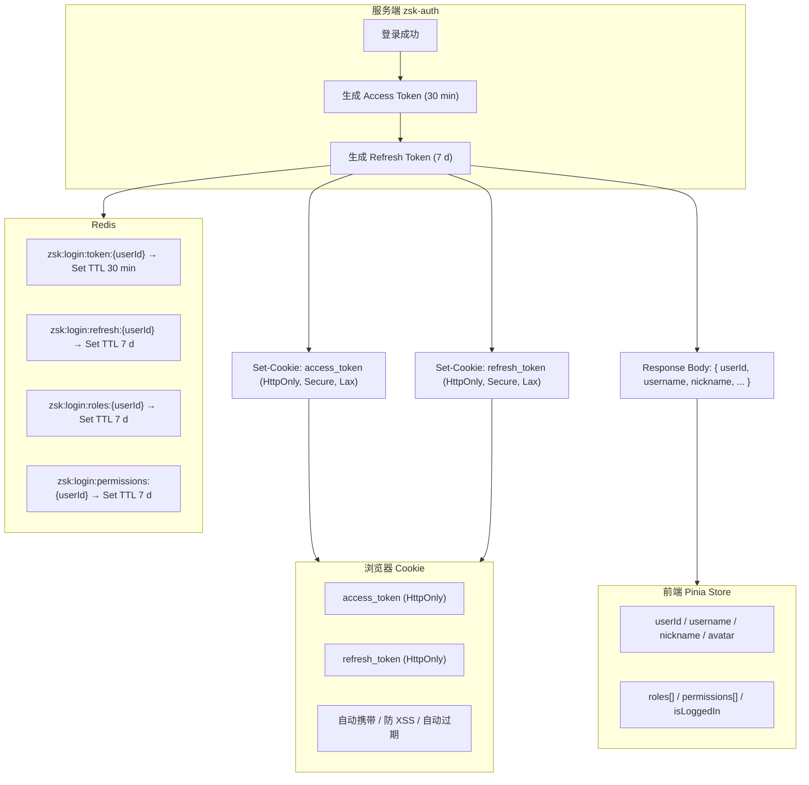
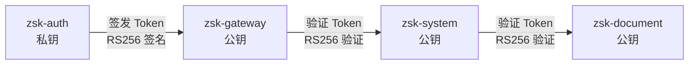

# 登录 | 前后端 token 存储方案 | 设计文档

> 核心结论：ZSK-Cloud 采用 RS256 非对称签名的 Access Token + Refresh Token 双令牌方案。Access Token 与 Refresh Token 均通过 HttpOnly Cookie 下发，利用 Redis Set 维护白名单实现主动吊销；前端 Pinia 仅缓存非敏感用户状态，不持有任何 Token。

---

## 一、背景与问题

### 1.1 当前系统现状

ZSK-Cloud 当前采用单 Access Token 方案：

- Token 有效期为 720 min（12 h），由 `SecurityConstants.TOKEN_EXPIRE` 控制。
- Token 通过登录接口 Response Body 返回给前端。
- 前端自行决定 Token 存储位置（localStorage / Pinia / Cookie 并存）。
- 服务端通过 Redis Set 维护 Token 白名单，支持退出登录时删除 Token，但不支持密码修改后的全局吊销。

该方案在单体阶段运行正常，但进入 Spring Cloud 微服务架构后，存在以下问题：

| 问题 | 影响 | 风险等级 |
|------|------|----------|
| 单 Token 有效期过长 | Token 泄露后 12 h 内均可被利用 | P0 |
| Token 通过 Body 返回 | 前端可能存入 localStorage，XSS 可窃取 | P0 |
| 密码修改后旧 Token 仍有效 | 用户感知不到其他会话仍在活动 | P1 |
| 跨服务共享鉴权信息 | 各业务服务需重复查询用户权限 | P1 |
| 移动端 / App 集成困难 | Cookie 机制对非浏览器客户端不友好 | P2 |

### 1.2 目标

本次方案目标：

1. 将 Token 存储迁移至 HttpOnly Cookie，阻断 XSS 窃取路径。
2. 引入 Refresh Token，将 Access Token 有效期缩短至 30 min。
3. 建立 Redis 白名单机制，支持单设备下线、密码修改全局吊销。
4. 统一微服务鉴权入口，由网关解析 Token 后通过 Header 向下游服务传递用户信息。

衡量标准：

- 登录接口不再返回 Token，Token 仅通过 `Set-Cookie` 下发。
- Access Token 泄露窗口从 12 h 降至 30 min。
- 密码修改 / 重置后，所有在线设备在 1 min 内失效（Redis TTL + 删除操作）。

本次范围不包括：

- OAuth2 / SSO 第三方登录的深度改造（仅适配 Cookie 下发）。
- 业务侧权限模型的重构（保持现有 roles / permissions 结构）。

---

## 二、核心设计

### 2.1 双 Token 分层存储

[配图：ZSK-Cloud Token 分层存储架构图]



双 Token 解决了单 Token 的核心矛盾：

- Access Token 短有效期（30 min）降低泄露影响。
- Refresh Token 长有效期（7 d）减少用户重新登录频率。
- Refresh Token 仅用于换取 Access Token，不能直接访问业务 API。

### 2.2 RS256 非对称签名

[配图：RS256 私钥签名、公钥验证流程]



- 仅 `zsk-auth` 持有私钥，负责签发 Token。
- 网关与业务服务仅持有公钥，本地即可验证签名，无需调用认证服务。
- 私钥泄露可造成全局伪造风险，需通过密钥管理系统（KMS / Vault）存储，禁止硬编码。

### 2.3 Redis 白名单

纯 JWT 的缺陷是“签发后无法撤回”。本方案通过 Redis Set 维护 Token 白名单：

1. 网关先校验 JWT 签名（本地公钥）。
2. 再校验 Token 是否存在于 Redis 白名单。
3. 双校验通过后才允许访问下游服务。

吊销 Token 时只需从 Redis Set 中删除对应元素，下一次请求即被拦截。

---

## 三、技术选型

### 3.1 Session vs JWT

| 维度 | Session | JWT | 胜出方 |
|------|---------|-----|--------|
| 状态管理 | 有状态（服务端存储） | 无状态（Token 自包含） | 视场景 |
| 水平扩展 | 需 Sticky Session 或集中式 Session Store | 任意节点可本地验签 | JWT |
| 跨域 / 跨服务 | Cookie 跨域限制多 | Header 传递无跨域问题 | JWT |
| 主动吊销 | 删除 Session 即可 | 需额外黑名单 / 白名单 | Session |
| 网络开销 | 仅传递 Session ID（约 50 B） | 传递完整 Token（约 500–800 B） | Session |
| 移动端适配 | Cookie 对 App 不友好 | Header 方式通用 | JWT |

**选择 JWT 的原因**：

ZSK-Cloud 基于 Spring Cloud 微服务，网关与多个业务服务独立部署。JWT 使各服务无需共享 Session Store，网关解析 Token 后通过 Header 注入用户信息，业务服务无状态运行。

### 3.2 前端存储对比

| 维度 | Cookie (HttpOnly) | localStorage | Pinia (内存) |
|------|-------------------|-------------|-------------|
| XSS 防御 | 优（JS 不可读） | 差（JS 可读） | 良（内存中） |
| CSRF 防御 | 需 SameSite 配合 | 天然免疫 | 天然免疫 |
| 持久性 | 可控过期 | 永久（需手动清理） | 刷新即丢失 |
| 跨标签页 | 同域共享 | 同域共享 | 各标签页独立 |
| 跨域 | 受限 | 独立存储 | 独立存储 |
| 容量 | 4 KB | 5–10 MB | 无硬限制 |
| 自动携带 | 浏览器自动 | 需手动设置 Header | 需拦截器 |

**选择 Cookie + Pinia 分层存储的原因**：

- Cookie 负责持有 Token：HttpOnly 阻断 XSS，浏览器自动携带，减少前端逻辑。
- Pinia 负责持有用户状态：响应式驱动 UI，页面刷新后通过 `/auth/user-info` 重新获取。
- localStorage 仅用于非敏感偏好设置（主题、语言、布局）。

### 3.3 核心取舍

**选择 Cookie 而非 localStorage 存储 Token 的取舍**：

- 获得：XSS 无法读取 Token、浏览器自动携带、过期自动管理。
- 代价：需配置 CSRF 防护（SameSite + 自定义 Header）、跨域场景需 CORS 允许凭证。

**选择 Redis 白名单而非纯 JWT 的取舍**：

- 获得：主动吊销能力、密码修改后全局失效、多设备管理。
- 代价：每次请求增加一次 Redis 查询（SISMEMBER 为 O(1)）。

---

## 四、详细实现

### 4.1 服务端：Token 签发

```java
@Override
public LoginResponse login(LoginRequest request) {
    LoginUser loginUser = authenticate(request);
    SysUserApi user = loginUser.getSysUser();
    Long userId = user.getId();

    // 1. 生成 Access Token
    Map<String, Object> accessClaims = new HashMap<>();
    accessClaims.put(SecurityConstants.USER_ID, userId);
    accessClaims.put(SecurityConstants.USER_NAME, user.getUserName());
    accessClaims.put(SecurityConstants.NICK_NAME, user.getNickName());
    accessClaims.put(SecurityConstants.TOKEN_TYPE, SecurityConstants.TOKEN_TYPE_ACCESS);
    String accessToken = JwtUtils.createToken(accessClaims);

    // 2. 生成 Refresh Token
    Map<String, Object> refreshClaims = new HashMap<>();
    refreshClaims.put(SecurityConstants.USER_ID, userId);
    refreshClaims.put(SecurityConstants.TOKEN_TYPE, SecurityConstants.TOKEN_TYPE_REFRESH);
    String refreshToken = JwtUtils.createToken(refreshClaims);

    // 3. 写入 Redis 白名单，限制最多 5 个设备
    String accessTokenKey = CacheConstants.CACHE_LOGIN_TOKEN + userId;
    String refreshTokenKey = CacheConstants.CACHE_LOGIN_REFRESH + userId;
    storeTokenWithLimit(accessTokenKey, accessToken,
            SecurityConstants.TOKEN_EXPIRE, TimeUnit.MINUTES, 5);
    storeTokenWithLimit(refreshTokenKey, refreshToken,
            SecurityConstants.REFRESH_TOKEN_EXPIRE, TimeUnit.DAYS, 5);

    // 4. 缓存角色权限
    cacheRolesAndPermissions(userId, loginUser);

    // 5. 通过 HttpOnly Cookie 下发
    response.addCookie(buildCookie(
            SecurityConstants.ACCESS_TOKEN_COOKIE, accessToken,
            SecurityConstants.TOKEN_EXPIRE * 60, true, true, "Lax"));
    response.addCookie(buildCookie(
            SecurityConstants.REFRESH_TOKEN_COOKIE, refreshToken,
            (int) SecurityConstants.REFRESH_TOKEN_EXPIRE * 24 * 60 * 60, true, true, "Lax"));

    // 6. 返回用户信息（不含 Token）
    return LoginResponse.builder()
            .userId(user.getId())
            .username(user.getUserName())
            .nickname(user.getNickName())
            .avatar(user.getAvatar())
            .expiresIn(SecurityConstants.TOKEN_EXPIRE * 60L)
            .build();
}
```

JWT Claims 定义：

| Claim | Access Token | Refresh Token | 说明 |
|-------|--------------|---------------|------|
| `user_id` | 是 | 是 | 用户唯一标识 |
| `user_name` | 是 | 否 | 登录账号 |
| `nick_name` | 是 | 否 | 用户昵称 |
| `token_type` | `access` | `refresh` | 区分 Token 类型，防止 Refresh Token 被用于访问 API |

### 4.2 服务端：Token 刷新

```java
@Override
public RefreshResponse refreshAccessToken(String refreshToken) {
    // 1. 解析并校验 Token 类型
    Claims claims = JwtUtils.parseToken(refreshToken);
    String tokenType = claims.get(SecurityConstants.TOKEN_TYPE, String.class);
    if (!SecurityConstants.TOKEN_TYPE_REFRESH.equals(tokenType)) {
        throw new AuthException(ResultCode.TOKEN_INVALID);
    }

    Long userId = JwtUtils.getUserIdAsLong(refreshToken);

    // 2. 校验 Refresh Token 是否在白名单
    String refreshTokenKey = CacheConstants.CACHE_LOGIN_REFRESH + userId;
    Boolean isMember = redisService.isMemberOfSet(refreshTokenKey, refreshToken);
    if (Boolean.FALSE.equals(isMember)) {
        throw new AuthException(ResultCode.REFRESH_TOKEN_EXPIRED);
    }

    // 3. 生成新 Access Token
    Map<String, Object> accessClaims = new HashMap<>();
    accessClaims.put(SecurityConstants.USER_ID, userId);
    accessClaims.put(SecurityConstants.USER_NAME, claims.get(SecurityConstants.USER_NAME));
    accessClaims.put(SecurityConstants.NICK_NAME, claims.get(SecurityConstants.NICK_NAME));
    accessClaims.put(SecurityConstants.TOKEN_TYPE, SecurityConstants.TOKEN_TYPE_ACCESS);
    String newAccessToken = JwtUtils.createToken(accessClaims);

    // 4. 存储新 Access Token 并更新 TTL
    String accessTokenKey = CacheConstants.CACHE_LOGIN_TOKEN + userId;
    storeTokenWithLimit(accessTokenKey, newAccessToken,
            SecurityConstants.TOKEN_EXPIRE, TimeUnit.MINUTES, 5);

    // 5. 刷新 Refresh Token 与角色权限的过期时间
    redisService.expire(refreshTokenKey, SecurityConstants.REFRESH_TOKEN_EXPIRE, TimeUnit.DAYS);
    redisService.expire(CacheConstants.CACHE_LOGIN_ROLES + userId,
            SecurityConstants.REFRESH_TOKEN_EXPIRE, TimeUnit.DAYS);
    redisService.expire(CacheConstants.CACHE_LOGIN_PERMISSIONS + userId,
            SecurityConstants.REFRESH_TOKEN_EXPIRE, TimeUnit.DAYS);

    // 6. 通过 Cookie 下发新 Access Token
    response.addCookie(buildCookie(
            SecurityConstants.ACCESS_TOKEN_COOKIE, newAccessToken,
            SecurityConstants.TOKEN_EXPIRE * 60, true, true, "Lax"));

    return new RefreshResponse(SecurityConstants.TOKEN_EXPIRE * 60L);
}
```

### 4.3 服务端：退出与吊销

#### 4.3.1 单设备退出

```java
@Override
public void logout(HttpServletRequest request) {
    String accessToken = getTokenFromCookie(request, SecurityConstants.ACCESS_TOKEN_COOKIE);
    String refreshToken = getTokenFromCookie(request, SecurityConstants.REFRESH_TOKEN_COOKIE);

    Long userId = null;
    if (StrUtil.isNotBlank(accessToken)) {
        userId = JwtUtils.getUserIdAsLong(accessToken);
        redisService.removeSetCacheObject(
                CacheConstants.CACHE_LOGIN_TOKEN + userId, accessToken);
    }

    if (StrUtil.isNotBlank(refreshToken)) {
        userId = JwtUtils.getUserIdAsLong(refreshToken);
        redisService.removeSetCacheObject(
                CacheConstants.CACHE_LOGIN_REFRESH + userId, refreshToken);
    }

    // 清除 Cookie
    response.addCookie(buildCookie(
            SecurityConstants.ACCESS_TOKEN_COOKIE, "", 0, true, true, "Lax"));
    response.addCookie(buildCookie(
            SecurityConstants.REFRESH_TOKEN_COOKIE, "", 0, true, true, "Lax"));

    // 若该用户已无活跃 Token，清理角色权限缓存
    if (userId != null) {
        Long remaining = redisService.getSetSize(
                CacheConstants.CACHE_LOGIN_TOKEN + userId);
        if (remaining == null || remaining == 0) {
            redisService.deleteObject(CacheConstants.CACHE_LOGIN_ROLES + userId);
            redisService.deleteObject(CacheConstants.CACHE_LOGIN_PERMISSIONS + userId);
        }
    }
}
```

#### 4.3.2 密码修改 / 重置后全局吊销

```java
@Override
public void revokeAllTokens(Long userId) {
    redisService.deleteObject(CacheConstants.CACHE_LOGIN_TOKEN + userId);
    redisService.deleteObject(CacheConstants.CACHE_LOGIN_REFRESH + userId);
    redisService.deleteObject(CacheConstants.CACHE_LOGIN_ROLES + userId);
    redisService.deleteObject(CacheConstants.CACHE_LOGIN_PERMISSIONS + userId);
}
```

### 4.4 网关：Token 校验

```java
private String getToken(ServerHttpRequest request) {
    // 1. 优先从 Authorization Header 获取（API 调用 / App 场景）
    String token = request.getHeaders().getFirst(SecurityConstants.AUTHORIZATION_HEADER);
    if (StringUtils.isNotEmpty(token) && token.startsWith(SecurityConstants.TOKEN_PREFIX)) {
        return token.replace(SecurityConstants.TOKEN_PREFIX, "");
    }

    // 2. 回退从 Cookie 获取（浏览器 / OAuth 回调场景）
    HttpCookie cookie = request.getCookies().getFirst(SecurityConstants.ACCESS_TOKEN_COOKIE);
    if (cookie != null && StringUtils.isNotEmpty(cookie.getValue())) {
        return cookie.getValue();
    }

    return null;
}
```

完整校验逻辑：

```java
public Mono<Void> filter(ServerWebExchange exchange, GatewayFilterChain chain) {
    ServerHttpRequest request = exchange.getRequest();
    String token = getToken(request);

    // 1. 验签
    Claims claims = JwtUtils.parseToken(token);

    // 2. 校验 token_type，防止 Refresh Token 被用于访问 API
    String tokenType = claims.get(SecurityConstants.TOKEN_TYPE, String.class);
    if (!SecurityConstants.TOKEN_TYPE_ACCESS.equals(tokenType)) {
        return unauthorizedResponse(exchange, ResultCode.TOKEN_INVALID);
    }

    // 3. 查 Redis 白名单
    String userId = claims.get(SecurityConstants.USER_ID).toString();
    String tokenKey = CacheConstants.CACHE_LOGIN_TOKEN + userId;
    Boolean isMember = redisService.isMemberOfSet(tokenKey, token);
    if (Boolean.FALSE.equals(isMember)) {
        return unauthorizedResponse(exchange, ResultCode.TOKEN_EXPIRED);
    }

    // 4. 注入用户信息到 Header
    ServerHttpRequest mutatedRequest = request.mutate()
            .header(SecurityConstants.USER_ID, userId)
            .header(SecurityConstants.USER_NAME, claims.get(SecurityConstants.USER_NAME, String.class))
            .header(SecurityConstants.ROLES_HEADER, getRolesFromRedis(userId))
            .build();

    return chain.filter(exchange.mutate().request(mutatedRequest).build());
}
```

### 4.5 前端：Pinia 状态管理

```typescript
import { defineStore } from "pinia";
import { ref, computed } from "vue";

export interface UserInfo {
  userId: number;
  username: string;
  nickname: string;
  avatar: string;
  roles: string[];
  permissions: string[];
}

export const useUserStore = defineStore("user", () => {
  const userId = ref<number | null>(null);
  const username = ref("");
  const nickname = ref("");
  const avatar = ref("");
  const roles = ref<string[]>([]);
  const permissions = ref<string[]>([]);

  const isLoggedIn = computed(() => userId.value !== null);
  const isAdmin = computed(() => roles.value.includes("admin"));

  function setUserInfo(info: UserInfo) {
    userId.value = info.userId;
    username.value = info.username;
    nickname.value = info.nickname;
    avatar.value = info.avatar;
    roles.value = info.roles ?? [];
    permissions.value = info.permissions ?? [];
  }

  function hasPermission(permission: string): boolean {
    if (isAdmin.value) return true;
    return permissions.value.includes(permission);
  }

  function clear() {
    userId.value = null;
    username.value = "";
    nickname.value = "";
    avatar.value = "";
    roles.value = [];
    permissions.value = [];
  }

  return {
    userId,
    username,
    nickname,
    avatar,
    roles,
    permissions,
    isLoggedIn,
    isAdmin,
    setUserInfo,
    hasPermission,
    clear,
  };
});
```

### 4.6 前端：Axios 拦截器

```typescript
import axios, { type InternalAxiosRequestConfig } from "axios";
import { useUserStore } from "@/stores/user";

let isRefreshing = false;
let pendingRequests: Array<() => void> = [];

const api = axios.create({
  baseURL: "/api",
  withCredentials: true,
});

api.interceptors.response.use(
  (response) => response,
  async (error) => {
    const originalRequest = error.config as InternalAxiosRequestConfig & {
      _retry?: boolean;
    };

    if (error.response?.status !== 401 || originalRequest._retry) {
      return Promise.reject(error);
    }

    const errorCode = error.response.data?.code;
    const userStore = useUserStore();

    // Access Token 过期，尝试刷新
    if (errorCode === 10301) {
      if (!isRefreshing) {
        isRefreshing = true;
        try {
          await axios.post("/auth/refresh", null, { withCredentials: true });
          isRefreshing = false;
          pendingRequests.forEach((cb) => cb());
          pendingRequests = [];
          return api(originalRequest);
        } catch {
          isRefreshing = false;
          pendingRequests = [];
          userStore.clear();
          window.location.href = "/login";
          return Promise.reject(error);
        }
      }

      return new Promise<void>((resolve) => {
        pendingRequests.push(() => {
          resolve(api(originalRequest));
        });
      });
    }

    // Refresh Token 过期，强制重新登录
    if (errorCode === 10311) {
      userStore.clear();
      window.location.href = "/login";
    }

    return Promise.reject(error);
  }
);
```

### 4.7 Redis 存储结构

| Key | 类型 | 说明 | TTL |
|-----|------|------|-----|
| `zsk:login:token:{userId}` | Set | Access Token 白名单 | 30 min |
| `zsk:login:refresh:{userId}` | Set | Refresh Token 白名单 | 7 d |
| `zsk:login:roles:{userId}` | Set | 角色集合 | 7 d |
| `zsk:login:permissions:{userId}` | Set | 权限集合 | 7 d |

Key 命名规范说明：

- 前缀 `zsk:login:` 表示认证域，便于按业务隔离。
- `{userId}` 为用户唯一标识，支持按用户精确清理。
- Set 结构便于限制最多 5 个设备同时在线，超出时按 FIFO 淘汰最早登录的设备。

---

## 五、安全设计

### 5.1 Cookie 安全属性

Cookie 下发时必须同时设置以下属性：

| 属性 | 取值 | 作用 |
|------|------|------|
| `HttpOnly` | `true` | 阻止 JavaScript 读取 Cookie，防御 XSS 窃取 |
| `Secure` | `true` | 仅 HTTPS 传输，防御中间人窃听 |
| `SameSite` | `Lax` | 阻止跨站 POST / 跨站携带 Cookie，防御 CSRF |
| `Path` | `/` | 全站 API 均可携带 |

`SameSite=Lax` 与 `SameSite=Strict` 的选择：

- `Lax`：从外部站点通过链接跳转至本站时，GET 请求仍携带 Cookie，用户体验较好。
- `Strict`：任何跨站请求均不携带 Cookie，安全性最高，但可能影响正常外链回流。

ZSK-Cloud 默认使用 `Lax`，后台管理类高敏感场景可单独配置为 `Strict`。

### 5.2 纵深防御体系

[配图：五层纵深防御体系]

| 层级 | 目标 | 措施 |
|------|------|------|
| 第 1 层：存储安全 | 让 Token 难以被窃取 | HttpOnly + Secure + SameSite=Lax |
| 第 2 层：Token 自身安全 | 即使被窃取，窗口极小 | Access Token 30 min 有效期、RS256 签名、不含敏感 Claims |
| 第 3 层：请求绑定 | 即使 Token 被窃取，也难以使用 | 设备指纹、Refresh Token 一次性轮换 |
| 第 4 层：行为监控 | 即使攻击者成功使用，也能发现 | 异地登录告警、并发使用检测、审计日志 |
| 第 5 层：应急响应 | 发现异常后快速止损 | 单设备踢出、全局吊销、用户自助安全中心 |

### 5.3 多设备登录管理

单个用户最多允许 5 个设备同时持有 Refresh Token。超过限制时，淘汰最早登录的设备：

```java
private void storeTokenWithLimit(String key, String token,
                                 long timeout, TimeUnit unit, int maxSize) {
    Long size = redisService.getSetSize(key);
    if (size != null && size >= maxSize) {
        // 移除最早加入的成员（Set 无序，实际需改用 Sorted Set 按时间排序）
        // 生产环境建议使用 ZSet，score 为登录时间戳
        Set<String> members = redisService.getSetMembers(key);
        if (members != null && !members.isEmpty()) {
            redisService.removeSetCacheObject(key, members.iterator().next());
        }
    }
    redisService.setSetCacheObject(key, token);
    redisService.expire(key, timeout, unit);
}
```

风险：使用 Redis Set 无法精确按时间淘汰。生产环境建议改为 Sorted Set：

```text
key: zsk:login:refresh:{userId} → ZSet
  member: refreshToken
  score:  登录时间戳
```

新增设备时，若 `ZCARD >= 5`，则 `ZREMRANGEBYRANK key 0 0` 删除最旧的设备。

### 5.4 安全事件响应

| 触发场景 | 响应动作 | 用户体验 |
|----------|----------|----------|
| Access Token 被窃取 | 30 min 后自动失效 | 无感知 |
| Refresh Token 重放 | 吊销该用户所有 Token | 所有设备需重新登录 |
| 密码修改 / 重置 | 吊销该用户所有 Token | 所有设备需重新登录 |
| 用户主动踢出设备 | 删除该设备 Token | 被踢设备需重新登录 |
| 异地登录 | 发送告警邮件 | 邮件通知 |

---

## 六、配置示例

### 6.1 Gateway CORS 配置

跨域场景下，Cookie 下发需要服务端显式允许凭证：

```java
@Bean
public CorsWebFilter corsWebFilter() {
    CorsConfiguration config = new CorsConfiguration();
    config.setAllowCredentials(true);
    config.addAllowedOriginPattern("https://*.zsk.com");
    config.addAllowedHeader("*");
    config.addAllowedMethod("*");
    config.setMaxAge(3600L);

    UrlBasedCorsConfigurationSource source = new UrlBasedCorsConfigurationSource();
    source.registerCorsConfiguration("/**", config);
    return new CorsWebFilter(source);
}
```

### 6.2 Nginx 反向代理

若网关前部署 Nginx，需确保以下 Header 正确透传：

```nginx
server {
    listen 443 ssl http2;
    server_name api.zsk.com;

    location / {
        proxy_pass http://zsk-gateway;
        proxy_set_header Host $host;
        proxy_set_header X-Real-IP $remote_addr;
        proxy_set_header X-Forwarded-For $proxy_add_x_forwarded_for;
        proxy_set_header X-Forwarded-Proto $scheme;

        # 允许跨域携带 Cookie
        add_header Access-Control-Allow-Credentials "true" always;
        add_header Access-Control-Allow-Origin "https://www.zsk.com" always;
    }
}
```

### 6.3 Cookie 构建工具

```java
private Cookie buildCookie(String name, String value, int maxAge,
                           boolean httpOnly, boolean secure, String sameSite) {
    Cookie cookie = new Cookie(name, value);
    cookie.setMaxAge(maxAge);
    cookie.setHttpOnly(httpOnly);
    cookie.setSecure(secure);
    cookie.setPath("/");
    // Spring Boot 2.6+ 支持 SameSite
    cookie.setAttribute("SameSite", sameSite);
    return cookie;
}
```

---

## 七、迁移路径

### 7.1 当前状态与目标状态

| 维度 | 当前状态 | 目标状态 |
|------|----------|----------|
| Token 类型 | 单 Access Token | Access Token + Refresh Token |
| Access Token 有效期 | 720 min | 30 min |
| Refresh Token | 未实现 | 7 d |
| Token 下发方式 | Response Body | HttpOnly Cookie |
| 前端存储 | 不统一 | Cookie + Pinia |
| 吊销能力 | 单设备退出 | 单设备退出 + 全局吊销 |

### 7.2 迁移步骤

**Phase 1：后端双 Token 改造**

1. `AuthServiceImpl` 新增 Refresh Token 生成逻辑。
2. 新增常量：
   - `CacheConstants.CACHE_LOGIN_REFRESH`
   - `SecurityConstants.REFRESH_TOKEN_COOKIE`
   - `SecurityConstants.TOKEN_TYPE`、`TOKEN_TYPE_ACCESS`、`TOKEN_TYPE_REFRESH`
3. 新增错误码：`ResultCode.REFRESH_TOKEN_EXPIRED(10311, "刷新令牌已过期")`。
4. `LoginResponse` 移除 `accessToken` / `refreshToken` 字段。
5. 登录 / 刷新接口改为 `Set-Cookie` 下发 Token。

**Phase 2：网关适配**

1. `AuthFilter` 校验 `token_type=access`，拒绝 Refresh Token 访问业务 API。
2. 刷新接口 `/auth/refresh` 放行，不校验 Access Token。

**Phase 3：前端适配**

1. Axios 配置 `withCredentials: true`。
2. 401 错误码 10301 时自动调用 `/auth/refresh`。
3. 401 错误码 10311 时清理 Pinia 并跳转登录页。
4. Pinia Store 不再存储 Token，仅存储用户信息。
5. 移除 localStorage 中的 Token 读写逻辑。

**Phase 4：缩短 Access Token 有效期**

1. 将 `TOKEN_EXPIRE` 从 720 min 调整为 30 min。
2. 监控刷新接口调用量，确认无异常突增。

**Phase 5：增强安全机制（可选）**

1. Refresh Token 一次性轮换。
2. 设备指纹绑定。
3. 异地登录告警与安全中心页面。

---

## 八、性能调优

### 8.1 Redis 性能

每次请求需执行一次 `SISMEMBER`，复杂度为 O(1)。以单机 Redis 为例，单节点 QPS 可达 50,000+，不会成为瓶颈。

优化建议：

1. **连接池**：使用 Lettuce 连接池，最小空闲连接数设置为 CPU 核心数的 2 倍。
2. **Pipeline**：批量请求场景下使用 Pipeline 减少 RTT。
3. **本地缓存**：网关可对 Token 解析结果做短期本地缓存（如 Caffeine，TTL 5 min），避免重复验签；但白名单校验必须命中 Redis。

### 8.2 网关性能

JWT 验签是 CPU 密集型操作。建议：

1. 使用 RS256 而非 HS256，降低签名验证的 CPU 消耗（HS256 需 HMAC 计算，RS256 验签效率更高）。
2. 公钥缓存到 JVM 内存，启动时从配置中心加载，避免每次验签都读取文件。
3. 网关层面跳过静态资源、登录 / 刷新 / 健康检查等白名单路径。

### 8.3 前端体验

1. **并发刷新控制**：通过 `isRefreshing` 标志 + 请求队列，避免多个 401 同时触发多次 `/auth/refresh`。
2. **预刷新策略**：在 Access Token 过期前 1–2 min 主动调用刷新接口，减少用户操作被 401 中断的概率。
3. **多标签页同步**：使用 `BroadcastChannel` 通知其他标签页登录状态变化，避免重复刷新。

---

## 九、常见问题

### Q1：HttpOnly Cookie 是否完全防御 XSS？

HttpOnly 阻断 JavaScript 读取 Cookie，但 XSS 仍可发起已认证请求（Cookie 会自动携带）。因此需配合：

- `SameSite=Lax` 阻止跨站请求携带 Cookie。
- 业务接口对敏感操作增加二次验证（短信 / 邮箱 / 支付密码）。
- 输出编码与 CSP 策略从根源上减少 XSS 漏洞。

### Q2：Cookie 4 KB 限制是否足够？

RS256 签名的 JWT 通常在 500–800 B，远小于 4 KB。若 Claims 过多导致超限，应精简 Claims，禁止在 JWT 中存放角色 / 权限列表。

### Q3：为什么不在 JWT Claims 中存放角色和权限？

1. **Token 体积**：角色 / 权限列表可能显著增加 JWT 长度。
2. **实时性**：角色 / 权限变更后，旧 Token 仍携带旧权限，造成权限漂移。
3. **方案选择**：角色 / 权限存入 Redis，网关读取后通过 Header 注入下游服务，变更即时生效。

### Q4：Refresh Token 被窃取后如何应对？

- Refresh Token 存在 HttpOnly Cookie 中，XSS 无法直接窃取。
- 若通过中间人 / 恶意扩展泄露，影响有限：Refresh Token 只能换取 Access Token。
- 增强方案：绑定设备指纹 + Refresh Token 一次性轮换，异常使用时触发全局吊销。

### Q5：跨域场景下 Cookie 为何不生效？

常见原因：

1. 服务端未设置 `Access-Control-Allow-Credentials: true`。
2. 服务端 `Access-Control-Allow-Origin` 使用了通配符 `*`，与 `Allow-Credentials: true` 冲突。
3. 前端 Axios 未设置 `withCredentials: true`。
4. Cookie 的 `Domain` 或 `Path` 与请求路径不匹配。

### Q6：多标签页如何同步登录状态？

Pinia 状态仅存于内存，各标签页独立。推荐方案：

1. 登录 / 登出后通过 `BroadcastChannel` 广播状态变更。
2. 其他标签页收到消息后刷新页面或重新获取用户信息。
3. 避免将 Token 放入 localStorage 以换取多标签页同步。

### Q7：移动端 / 原生 App 如何接入？

原生 App 无法使用浏览器 Cookie 机制，推荐方案：

1. App 登录时通过 `Authorization: Bearer {token}` Header 接收 Token。
2. App 自行安全存储 Token（iOS Keychain / Android Keystore）。
3. 网关同时支持 Header 与 Cookie 两种 Token 来源，服务端逻辑无需改动。

---

## 十、总结

本方案将 ZSK-Cloud 的认证体系从单 Token + Response Body 演进为 Access Token + Refresh Token 双令牌 + HttpOnly Cookie：

1. **安全**：HttpOnly Cookie 阻断 XSS 窃取路径，Access Token 短有效期将泄露窗口从 12 h 降至 30 min。
2. **可控**：Redis 白名单支持单设备下线、密码修改全局吊销、多设备管理。
3. **无状态**：RS256 公钥本地验签，微服务无需共享 Session Store。
4. **体验**：双 Token 自动静默刷新，用户无感知续期。

未覆盖的后续方向：

- OAuth2 / SSO 与双 Token 方案的深度融合。
- 设备指纹与 Refresh Token 一次性轮换的落地方案。
- 统一安全中心页面的设计与实现。

---

## 参考资料

- [RFC 7519: JSON Web Token (JWT)](https://tools.ietf.org/html/rfc7519)
- [RFC 6749: OAuth 2.0 Authorization Framework](https://tools.ietf.org/html/rfc6749)
- [OWASP: Cross-Site Scripting (XSS)](https://owasp.org/www-community/attacks/xss/)
- [OWASP: Cross-Site Request Forgery (CSRF)](https://owasp.org/www-community/attacks/csrf)
- [MDN: Set-Cookie](https://developer.mozilla.org/en-US/docs/Web/HTTP/Headers/Set-Cookie)
