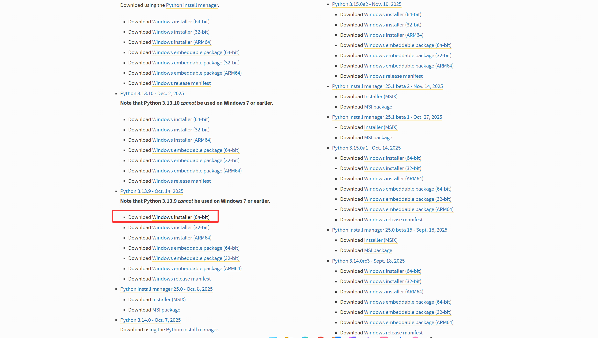
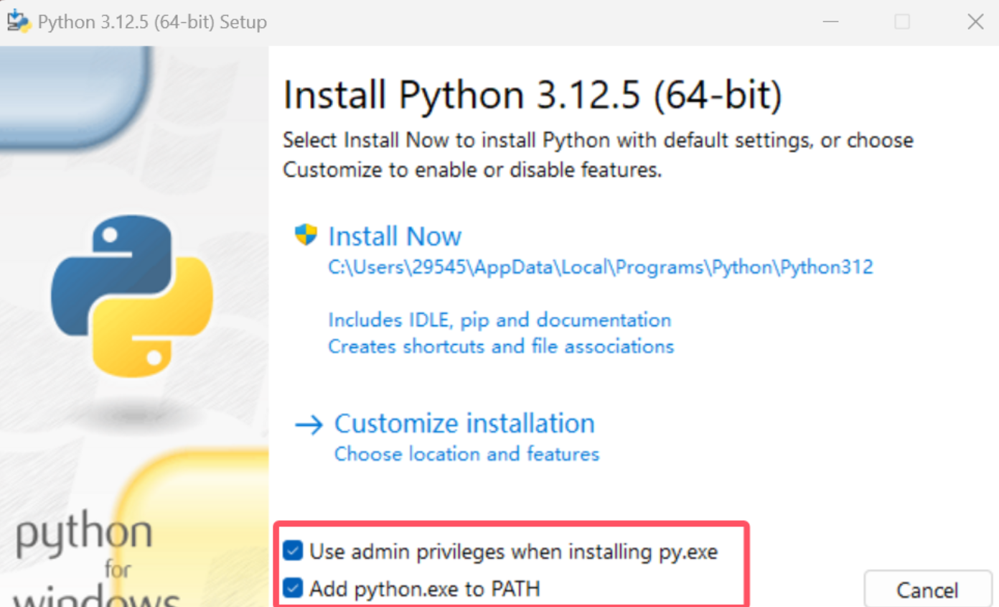
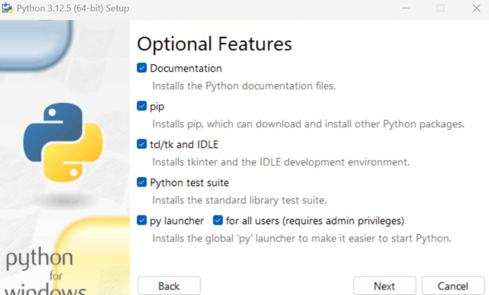
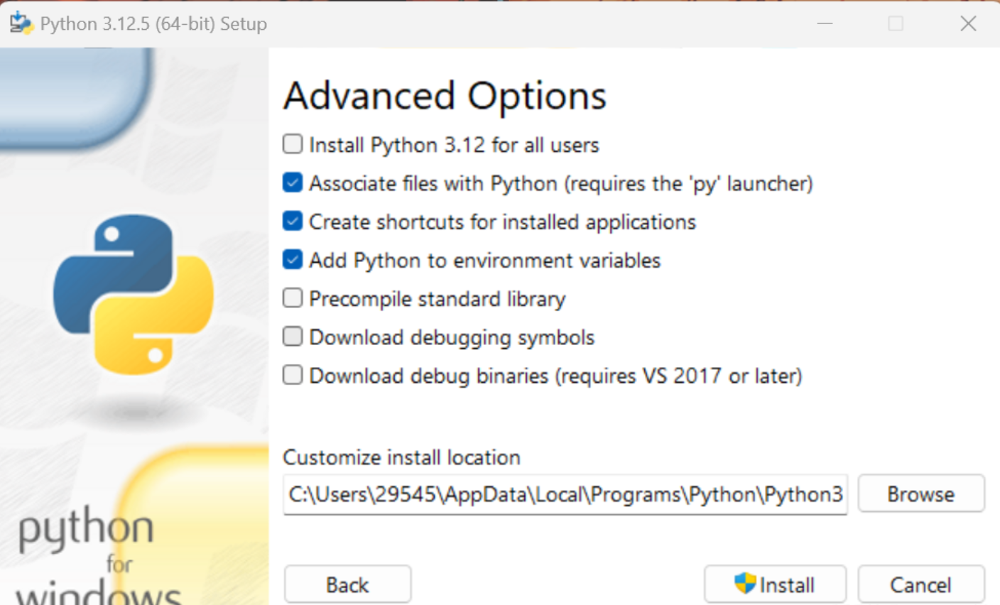
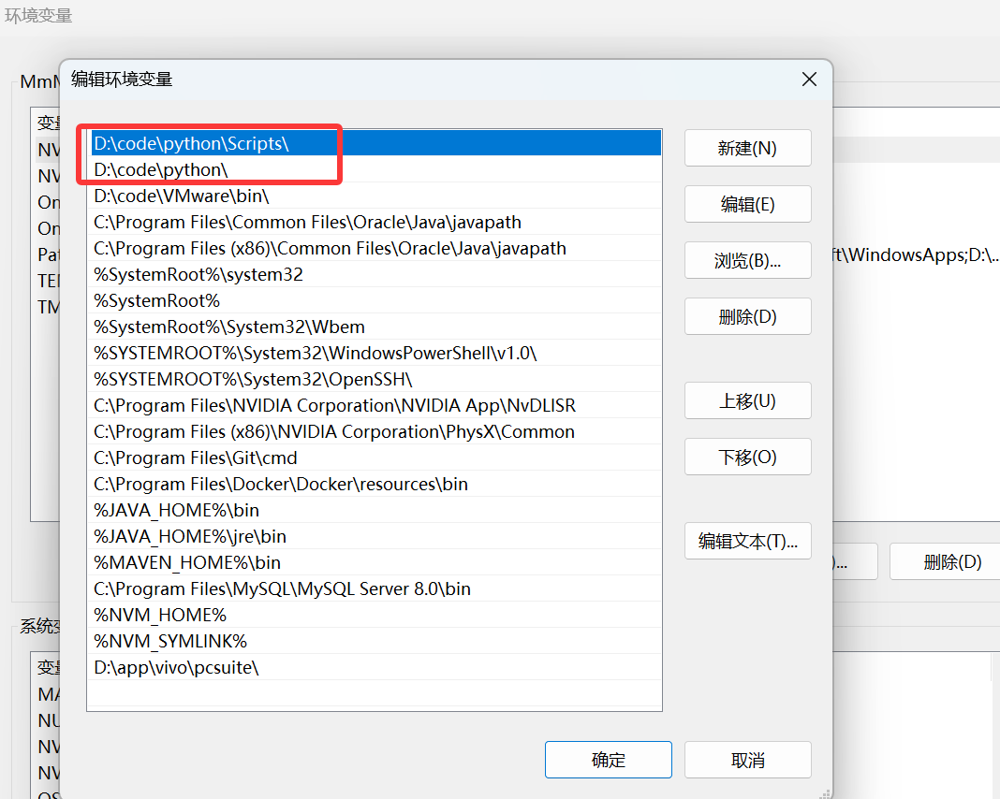
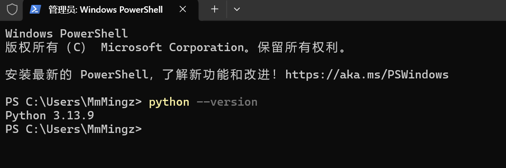

# python 基础

正在学习....
## Python的安装

Python下载地址：[Download Python | Python.org](https://www.python.org/downloads/ "Download Python | Python.org")

面解释这些选项：

Documentation：安装Python的文档和帮助文件

pip：安装Python包管理工具，非常关键，必选

tcl/tk and IDLE：其中tcl/tk是两个图形用户界面，而IDLE的名字是Integrated Development Environment and Learning Environment（集成开发环境和学习环境）所以这一项是一个python自带的ide但是我们后文更推荐使用pycharm作为ide进行学习

Python test suite：Python官方提供的一套用于测试Python解释器和标准库的测试套件，听上去很重要但是对新手来说不重要，留着吧

py launcher for all users（requires admin privileges）：首先py launcher可以保证用户在命令行里使用python命令启动python，而后半句for all users是询问是否为电脑上的所有用户安装上python，而这一步需要管理员权限对应的是括号里的那句话

这里首先下面Customize install location选择的是安装路径，这个可以自选（建议路径中不要带中文），选择好后点击Install

下面解释这些选项：

Install Python 3.12 for all users：为所有用户安装，效果与前面的py launcher for all users（requires admin privileges）一致

Associate files with Python（requires the 'py' launcher）：让系统自动将 Python 关联到特定的文件类型，使得在文件资源管理器中双击 Python 脚本文件时，系统会自动使用 Python 解释器来运行这些脚本

Create shortcuts for installed applications：创建桌面快捷方式

Add Python to environment variables：选择这个选项会将 Python 解释器的路径添加到系统的环境变量中，这样就可以在命令行中直接运行 Python 解释器而不需要输入完整的路径，本来就勾着的就不动了

Precompile standard library：对 Python 标准库进行预编译，以提高标准库模块的导入速度，听着很厉害但是对新手来说不重要，可以勾可以不勾

Download debugging symbols：给开发人员和调试人员用的调试符号

Download debug binaries（requires VS 2017 or later）：给开发人员和调试人员用的调试版本的二进制文件

检查他是否帮你配置好了

搞定

