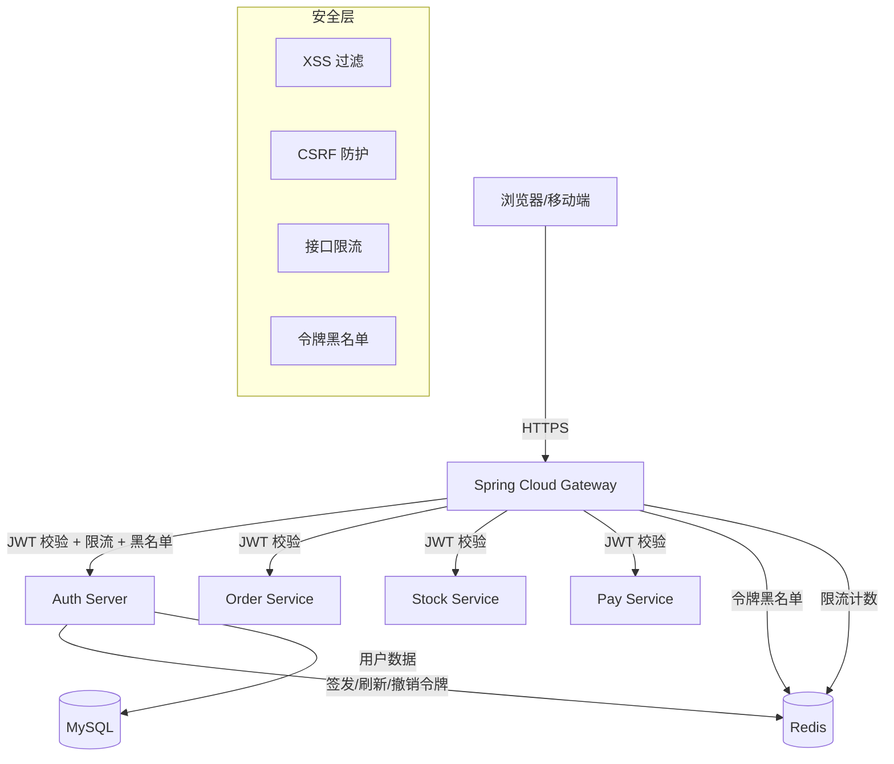

# 基于 Java 21 + Spring Boot 3.5 + Spring Cloud Alibaba 2025，使用 Spring Authorization Server 实现企业级微服务 SSO 单点登录框架，覆盖认证授权、JWT 令牌签发与校验、网关安全防护（限流、黑名单、XSS、Cookie 令牌窃取防御）等核心机制。

## 引子

一个典型的微服务系统有 15-30 个服务，用户登录后需要在订单、库存、支付、物流等服务间自由切换。如果每个服务各自维护一套登录逻辑，会带来两个问题：用户每切换一个服务就要重新登录一次；安全策略分散在各服务中，改一次密码策略需要改 15 个服务。

SSO（Single Sign-On）解决的核心问题就是：**一次登录，处处通行**。而 Spring Authorization Server 是 Spring 官方在 2022 年 GA 的 OAuth 2.1 授权服务器框架，替代了已经进入维护模式的 Spring Security OAuth。它基于 OAuth 2.1 规范，原生支持 OIDC，与 Spring Security 生态无缝集成。

本文从零搭建一套完整的 SSO 框架，代码可直接用于生产环境。

## 架构总览

下图展示了整个 SSO 微服务系统的分层架构：浏览器/移动端经过 HTTPS 连接网关，网关统一处理 JWT 校验、限流和黑名单，再将合法请求路由到 Auth Server 和各业务服务。Auth Server 负责令牌签发，Redis 存储令牌状态和限流数据，MySQL 存储用户信息。



整个系统分为 4 层：

| 层 | 职责 | 技术组件 |
|---|---|---|
| 接入层 | 流量入口、路由分发、安全防护 | Spring Cloud Gateway |
| 认证层 | 用户认证、令牌签发、令牌刷新与撤销 | Spring Authorization Server |
| 业务层 | 各微服务业务逻辑 | Spring Boot + Spring Security Resource Server |
| 存储层 | 用户数据、令牌状态、限流数据 | MySQL + Redis |

## 一、项目结构与依赖

### 1.1 模块划分

项目采用多模块结构，授权服务器、网关、各业务服务各自独立，公共逻辑抽取到 `sso-common` 模块：

```
sso-parent/
├── sso-auth-server/          # 授权服务器
├── sso-gateway/              # API 网关
├── sso-common/               # 公共模块（工具类、常量、异常定义）
├── sso-order-service/        # 订单服务（示例资源服务器）
└── sso-stock-service/        # 库存服务（示例资源服务器）
```

### 1.2 父 POM 依赖管理

父 POM 统一管理 Spring Boot、Spring Cloud、Spring Cloud Alibaba 三个 BOM 的版本号，子模块无需重复声明版本：

```xml
<properties>
    <java.version>21</java.version>
    <spring-boot.version>3.5.3</spring-boot.version>
    <spring-cloud.version>2025.0.0</spring-cloud.version>
    <spring-cloud-alibaba.version>2025.0.0.0</spring-cloud-alibaba.version>
</properties>

<dependencyManagement>
    <dependencies>
        <dependency>
            <groupId>org.springframework.boot</groupId>
            <artifactId>spring-boot-dependencies</artifactId>
            <version>${spring-boot.version}</version>
            <type>pom</type>
            <scope>import</scope>
        </dependency>
        <dependency>
            <groupId>org.springframework.cloud</groupId>
            <artifactId>spring-cloud-dependencies</artifactId>
            <version>${spring-cloud.version}</version>
            <type>pom</type>
            <scope>import</scope>
        </dependency>
        <dependency>
            <groupId>com.alibaba.cloud</groupId>
            <artifactId>spring-cloud-alibaba-dependencies</artifactId>
            <version>${spring-cloud-alibaba.version}</version>
            <type>pom</type>
            <scope>import</scope>
        </dependency>
    </dependencies>
</dependencyManagement>
```

### 1.3 授权服务器依赖

授权服务器需要 Spring Authorization Server（核心认证框架）、Spring Security、Redis（令牌存储与黑名单）、MySQL + MyBatis-Plus（用户数据持久化）、Nacos（服务注册）：

```xml
<dependencies>
    <!-- Spring Authorization Server -->
    <dependency>
        <groupId>org.springframework.security</groupId>
        <artifactId>spring-security-oauth2-authorization-server</artifactId>
        <version>1.5.1</version>
    </dependency>
    <!-- Spring Boot Web -->
    <dependency>
        <groupId>org.springframework.boot</groupId>
        <artifactId>spring-boot-starter-web</artifactId>
    </dependency>
    <!-- Spring Security -->
    <dependency>
        <groupId>org.springframework.boot</groupId>
        <artifactId>spring-boot-starter-security</artifactId>
    </dependency>
    <!-- Redis（令牌存储、黑名单） -->
    <dependency>
        <groupId>org.springframework.boot</groupId>
        <artifactId>spring-boot-starter-data-redis</artifactId>
    </dependency>
    <!-- MySQL -->
    <dependency>
        <groupId>com.mysql</groupId>
        <artifactId>mysql-connector-j</artifactId>
    </dependency>
    <!-- MyBatis-Plus -->
    <dependency>
        <groupId>com.baomidou</groupId>
        <artifactId>mybatis-plus-spring-boot3-starter</artifactId>
        <version>3.5.9</version>
    </dependency>
    <!-- Nacos 服务发现 -->
    <dependency>
        <groupId>com.alibaba.cloud</groupId>
        <artifactId>spring-cloud-starter-alibaba-nacos-discovery</artifactId>
    </dependency>
</dependencies>
```

### 1.4 网关依赖

网关基于 WebFlux 响应式栈，需要 Spring Cloud Gateway（路由）、Redis Reactive（限流与黑名单）、Spring Security + OAuth2 Resource Server（JWT 校验）：

```xml
<dependencies>
    <!-- Spring Cloud Gateway（基于 WebFlux） -->
    <dependency>
        <groupId>org.springframework.cloud</groupId>
        <artifactId>spring-cloud-starter-gateway</artifactId>
    </dependency>
    <!-- Redis Reactive（限流 + 黑名单） -->
    <dependency>
        <groupId>org.springframework.boot</groupId>
        <artifactId>spring-boot-starter-data-redis-reactive</artifactId>
    </dependency>
    <!-- Spring Security Reactive -->
    <dependency>
        <groupId>org.springframework.boot</groupId>
        <artifactId>spring-boot-starter-security</artifactId>
    </dependency>
    <!-- OAuth2 Resource Server（网关校验 JWT） -->
    <dependency>
        <groupId>org.springframework.boot</groupId>
        <artifactId>spring-boot-starter-oauth2-resource-server</artifactId>
    </dependency>
    <!-- Nacos -->
    <dependency>
        <groupId>com.alibaba.cloud</groupId>
        <artifactId>spring-cloud-starter-alibaba-nacos-discovery</artifactId>
    </dependency>
</dependencies>
```

## 二、Spring Authorization Server 配置

这是整个 SSO 系统的核心。Spring Authorization Server 基于 OAuth 2.1 规范，不再支持隐式授权（Implicit Grant）和密码模式（Resource Owner Password Credentials），这两者在 OAuth 2.1 中被明确废弃。

### 2.1 授权服务器安全过滤链

授权服务器需要两条独立的 SecurityFilterChain：第一条（Order 1）处理 OAuth2/OIDC 专用端点，第二条（Order 2）兜底处理登录页和表单认证。两条链通过 `securityMatcher` 隔离，互不干扰：

```java
@Configuration
@EnableWebSecurity
public class AuthorizationServerConfig {

    /**
     * 授权服务器专用过滤链 — Order(1) 优先匹配
     * 处理 /oauth2/authorize、/oauth2/token、/.well-known/* 等端点
     */
    @Bean
    @Order(1)
    public SecurityFilterChain authorizationServerSecurityFilterChain(HttpSecurity http)
            throws Exception {
        OAuth2AuthorizationServerConfigurer authorizationServerConfigurer =
                OAuth2AuthorizationServerConfigurer.authorizationServer();

        http
            .securityMatcher(authorizationServerConfigurer.getEndpointsMatcher())
            .with(authorizationServerConfigurer, authServer ->
                authServer
                    .oidc(Customizer.withDefaults())    // 启用 OIDC
                    // 注册自定义 token 端点（如手机号登录）
                    .tokenEndpoint(tokenEndpoint ->
                        tokenEndpoint
                            .accessTokenRequestConverter(new MobileGrantAuthenticationConverter())
                            .authenticationProvider(new MobileGrantAuthenticationProvider(...))
                    )
            )
            .authorizeHttpRequests(authorize ->
                authorize.anyRequest().authenticated()
            )
            .exceptionHandling(exceptions ->
                exceptions.defaultAuthenticationEntryPointFor(
                    new LoginUrlAuthenticationEntryPoint("/login"),
                    new MediaTypeRequestMatcher(MediaType.TEXT_HTML)
                )
            );

        return http.build();
    }

    /**
     * 通用安全过滤链 — Order(2) 兜底
     * 处理登录页面、表单认证等
     */
    @Bean
    @Order(2)
    public SecurityFilterChain defaultSecurityFilterChain(HttpSecurity http)
            throws Exception {
        http
            .authorizeHttpRequests(authorize -> authorize
                // 静态资源、登录页、错误页放行
                .requestMatchers("/login", "/error", "/css/**", "/js/**").permitAll()
                .anyRequest().authenticated()
            )
            .formLogin(form -> form
                .loginPage("/login")
                .loginProcessingUrl("/login")
                .successHandler(new SsoAuthenticationSuccessHandler())
                .failureHandler(new SsoAuthenticationFailureHandler())
            )
            .csrf(csrf -> csrf
                .csrfTokenRepository(CookieCsrfTokenRepository.withHttpOnlyFalse())
                .csrfTokenRequestHandler(new SpaCsrfTokenRequestHandler())
            )
            .headers(headers -> headers
                .contentSecurityPolicy(csp -> csp
                    .policyDirectives("default-src 'self'; script-src 'self'")
                )
                .frameOptions(frame -> frame.deny())
            );

        return http.build();
    }
}
```

**关键决策点**：`@Order(1)` 的过滤链通过 `securityMatcher` 匹配授权服务器专用端点（`/oauth2/authorize`、`/oauth2/token`、`/oauth2/jwks` 等），`@Order(2)` 兜底处理其他请求。两条链各自独立，不会互相干扰。

### 2.2 客户端注册

注册两种客户端：`web-app` 是前端 SPA 的公开客户端，使用 Authorization Code + PKCE 模式，不设 clientSecret；`service-internal` 是服务间调用的机密客户端，使用 Client Credentials 模式，通过 BCrypt 加密的 clientSecret 认证：

```java
@Bean
public RegisteredClientRepository registeredClientRepository(JdbcTemplate jdbcTemplate) {
    // 前端 SPA 应用 — Authorization Code + PKCE
    RegisteredClient webClient = RegisteredClient.withId(UUID.randomUUID().toString())
        .clientId("web-app")
        // 纯 PKCE 客户端不设 clientSecret（公开客户端）
        .clientAuthenticationMethod(ClientAuthenticationMethod.NONE)
        .authorizationGrantType(AuthorizationGrantType.AUTHORIZATION_CODE)
        .authorizationGrantType(AuthorizationGrantType.REFRESH_TOKEN)
        .redirectUri("https://app.example.com/login/oauth2/code/sso")
        .postLogoutRedirectUri("https://app.example.com/")
        .scope(OidcScopes.OPENID)
        .scope(OidcScopes.PROFILE)
        .scope("read")
        .scope("write")
        .clientSettings(ClientSettings.builder()
            .requireAuthorizationConsent(true)   // 首次授权需用户确认
            .requireProofKey(true)               // 强制 PKCE
            .build())
        .tokenSettings(TokenSettings.builder()
            .accessTokenTimeToLive(Duration.ofMinutes(30))
            .refreshTokenTimeToLive(Duration.ofDays(7))
            .reuseRefreshTokens(false)           // 刷新后旧 refresh_token 立即失效
            .accessTokenFormat(OAuth2TokenFormat.SELF_CONTAINED)  // JWT 格式
            .build())
        .build();

    // 服务间调用 — Client Credentials
    RegisteredClient serviceClient = RegisteredClient.withId(UUID.randomUUID().toString())
        .clientId("service-internal")
        .clientSecret("{bcrypt}$2a$10$...")  // BCrypt 加密
        .clientAuthenticationMethod(ClientAuthenticationMethod.CLIENT_SECRET_BASIC)
        .authorizationGrantType(AuthorizationGrantType.CLIENT_CREDENTIALS)
        .scope("internal")
        .tokenSettings(TokenSettings.builder()
            .accessTokenTimeToLive(Duration.ofMinutes(10))
            .accessTokenFormat(OAuth2TokenFormat.SELF_CONTAINED)
            .build())
        .build();

    // 生产环境应使用 JdbcRegisteredClientRepository
    return new InMemoryRegisteredClientRepository(webClient, serviceClient);
}
```

**客户端类型对比**：

| 属性 | web-app（公开客户端） | service-internal（机密客户端） |
|---|---|---|
| 认证方式 | NONE（PKCE 替代） | CLIENT_SECRET_BASIC |
| 授权模式 | Authorization Code + PKCE | Client Credentials |
| Access Token TTL | 30 分钟 | 10 分钟 |
| Refresh Token | 支持（7 天） | 不支持 |
| 适用场景 | 浏览器/移动端 | 服务间调用 |

### 2.3 JWK 密钥对配置

JWT 令牌需要一对 RSA 密钥进行签名和验证。授权服务器持有私钥签名，资源服务器持有公钥验签。

```java
@Bean
public JWKSource<SecurityContext> jwkSource() {
    RSAKey rsaKey = generateRsaKey();
    JWKSet jwkSet = new JWKSet(rsaKey);
    return new ImmutableJWKSet<>(jwkSet);
}

private RSAKey generateRsaKey() {
    try {
        KeyPairGenerator generator = KeyPairGenerator.getInstance("RSA");
        generator.initialize(2048);
        KeyPair keyPair = generator.generateKeyPair();

        RSAPublicKey publicKey = (RSAPublicKey) keyPair.getPublic();
        RSAPrivateKey privateKey = (RSAPrivateKey) keyPair.getPrivate();

        return new RSAKey.Builder(publicKey)
            .privateKey(privateKey)
            .keyID(UUID.randomUUID().toString())
            .algorithm(JWSAlgorithm.RS256)
            .build();
    } catch (NoSuchAlgorithmException e) {
        throw new IllegalStateException("Failed to generate RSA key pair", e);
    }
}

/**
 * 生产环境：从文件加载密钥，避免每次重启重新生成
 * 重启后旧令牌将无法验证（密钥变了）
 */
@Bean
public JWKSource<SecurityContext> jwkSourceFromProperties(
        @Value("${auth.server.jks.path}") String jksPath,
        @Value("${auth.server.jks.password}") String jksPassword,
        @Value("${auth.server.jks.alias}") String keyAlias) throws Exception {
    KeyStore keyStore = KeyStore.getInstance("JKS");
    keyStore.load(Files.newInputStream(Path.of(jksPath)), jksPassword.toCharArray());

    RSAKey rsaKey = RSAKey.load(keyStore, keyAlias, jksPassword.toCharArray());
    JWKSet jwkSet = new JWKSet(rsaKey);
    return new ImmutableJWKSet<>(jwkSet);
}

@Bean
public JwtDecoder jwtDecoder(JWKSource<SecurityContext> jwkSource) {
    return OAuth2AuthorizationServerConfiguration.jwtDecoder(jwkSource);
}
```

**风险**：开发环境使用内存密钥对时，每次重启服务会重新生成密钥，导致已签发的全部 JWT 失效。生产环境必须持久化密钥。

### 2.4 自定义 JWT Claims

Spring Authorization Server 通过 `OAuth2TokenCustomizer<JwtEncodingContext>` 注入自定义声明。

```java
@Bean
public OAuth2TokenCustomizer<JwtEncodingContext> jwtCustomizer(
        UserDetailsService userDetailsService) {
    return context -> {
        if (context.getTokenType().equals(OAuth2TokenType.ACCESS_TOKEN)) {
            JwtClaimsSet.Builder claims = context.getClaims();
            Authentication principal = context.getPrincipal();

            // 注入用户角色
            Set<String> authorities = principal.getAuthorities().stream()
                .map(GrantedAuthority::getAuthority)
                .collect(Collectors.toSet());
            claims.claim("authorities", authorities);

            // 注入用户 ID（从自定义 UserDetails 中获取）
            Object userPrincipal = principal.getPrincipal();
            if (userPrincipal instanceof SsoUserDetails userDetails) {
                claims.claim("user_id", userDetails.getUserId());
                claims.claim("dept_id", userDetails.getDeptId());
            }

            // 注入租户 ID（多租户场景）
            String tenantId = TenantContextHolder.getTenantId();
            if (tenantId != null) {
                claims.claim("tenant_id", tenantId);
            }

            // 注入令牌唯一标识（用于黑名单）
            claims.claim("jti", UUID.randomUUID().toString());
        }
    };
}
```

签发后的 JWT Payload 示例：

```json
{
  "sub": "admin",
  "aud": "web-app",
  "iss": "https://auth.example.com",
  "exp": 1747488000,
  "iat": 1747486200,
  "authorities": ["ROLE_ADMIN", "order:read", "order:write"],
  "user_id": 10001,
  "dept_id": 200,
  "tenant_id": "t_001",
  "jti": "a1b2c3d4-e5f6-7890-abcd-ef1234567890",
  "scope": ["openid", "profile", "read", "write"]
}
```

### 2.5 授权服务器端点配置

通过 `AuthorizationServerSettings` 自定义各 OAuth2/OIDC 端点的路径和 Issuer 地址。Issuer 地址必须与实际部署地址一致，资源服务器会用它做 OIDC 发现：

```java
@Bean
public AuthorizationServerSettings authorizationServerSettings() {
    return AuthorizationServerSettings.builder()
        .issuer("https://auth.example.com")
        .authorizationEndpoint("/oauth2/authorize")
        .tokenEndpoint("/oauth2/token")
        .tokenIntrospectionEndpoint("/oauth2/introspect")
        .tokenRevocationEndpoint("/oauth2/revoke")
        .jwkSetEndpoint("/oauth2/jwks")
        .oidcUserInfoEndpoint("/connect/userinfo")
        .oidcLogoutEndpoint("/connect/logout")
        .build();
}
```

配置完成后，授权服务器自动暴露以下发现端点，客户端和资源服务器通过这些端点获取服务器元数据和公钥：

```
GET /.well-known/oauth-authorization-server   # OAuth2 元数据
GET /.well-known/openid-configuration         # OIDC 配置
GET /oauth2/jwks                              # 公钥集
POST /oauth2/token                            # 令牌端点
POST /oauth2/revoke                           # 令牌撤销
POST /oauth2/introspect                       # 令牌内省
```

## 三、自定义授权模式：手机号 + 验证码登录

Spring Authorization Server 只内置了 Authorization Code、Client Credentials、Refresh Token 三种授权模式。企业应用普遍需要手机号+验证码登录，需要自定义扩展授权模式（Grant Type）。

### 3.1 定义自定义 Grant Type

自定义 `AuthorizationGrantType` 为 `"mobile"`，携带手机号和验证码两个参数，继承 `OAuth2AuthorizationGrantAuthenticationToken` 以融入 Spring Authorization Server 的认证链路：

```java
public class MobileGrantAuthentication extends OAuth2AuthorizationGrantAuthenticationToken {

    private final String mobile;
    private final String code;

    public MobileGrantAuthentication(String mobile, String code,
            Authentication clientPrincipal,
            Map<String, Object> additionalParameters) {
        super(new AuthorizationGrantType("mobile"), clientPrincipal, additionalParameters);
        this.mobile = mobile;
        this.code = code;
    }

    public String getMobile() { return mobile; }
    public String getCode() { return code; }
}
```

### 3.2 认证转换器

从 `/oauth2/token` 请求中提取 `grant_type=mobile`、`mobile`、`code` 参数。当 `grant_type` 不是 `mobile` 时返回 `null`，交给下一个 Converter 处理：

```java
public class MobileGrantAuthenticationConverter
        implements AuthenticationConverter {

    @Override
    public Authentication convert(HttpServletRequest request) {
        String grantType = request.getParameter(OAuth2ParameterNames.GRANT_TYPE);
        if (!"mobile".equals(grantType)) {
            return null;
        }

        String mobile = request.getParameter("mobile");
        String code = request.getParameter("code");

        if (!StringUtils.hasText(mobile) || !StringUtils.hasText(code)) {
            throw new OAuth2AuthenticationException(OAuth2ErrorCodes.INVALID_REQUEST);
        }

        Authentication clientPrincipal = SecurityContextHolder.getContext().getAuthentication();
        Map<String, Object> additionalParameters = new HashMap<>();

        return new MobileGrantAuthentication(mobile, code,
                clientPrincipal, additionalParameters);
    }
}
```

### 3.3 认证提供者

认证提供者是自定义授权模式的核心逻辑：先校验短信验证码，再根据手机号查询用户，最后复用 Spring Authorization Server 的令牌生成链路签发 Access Token 和 Refresh Token：

```java
@Component
public class MobileGrantAuthenticationProvider
        implements AuthenticationProvider {

    private final OAuth2AuthorizationService authorizationService;
    private final OAuth2TokenGenerator<? extends OAuth2Token> tokenGenerator;
    private final SmsCodeService smsCodeService;
    private final UserDetailsService userDetailsService;

    @Override
    public Authentication authenticate(Authentication authentication) {
        MobileGrantAuthentication mobileAuth = (MobileGrantAuthentication) authentication;

        // 1. 校验验证码
        boolean valid = smsCodeService.verify(mobileAuth.getMobile(), mobileAuth.getCode());
        if (!valid) {
            throw new OAuth2AuthenticationException(
                new OAuth2Error("invalid_grant", "验证码错误或已过期", null));
        }

        // 2. 根据手机号查询用户
        UserDetails userDetails = userDetailsService
            .loadUserByUsername(mobileAuth.getMobile());

        // 3. 构建 UsernamePasswordAuthenticationToken
        UsernamePasswordAuthenticationToken principal =
            UsernamePasswordAuthenticationToken.authenticated(
                userDetails, null, userDetails.getAuthorities());

        // 4. 生成令牌（复用 Spring Authorization Server 的令牌生成链路）
        Set<String> authorizedScopes = Set.of("openid", "profile");
        DefaultOAuth2AuthorizationContext.Builder contextBuilder =
            DefaultOAuth2AuthorizationContext.with(mobileAuth.getClientPrincipal())
                .principal(principal)
                .authorizedScopes(authorizedScopes)
                .authorizationGrantType(new AuthorizationGrantType("mobile"));

        // ... 省略令牌生成与持久化逻辑，与内置模式一致

        return new OAuth2AccessTokenAuthenticationToken(
            mobileAuth.getRegisteredClient(),
            mobileAuth.getClientPrincipal(),
            accessToken, refreshToken);
    }

    @Override
    public boolean supports(Class<?> authentication) {
        return MobileGrantAuthentication.class.isAssignableFrom(authentication);
    }
}
```

客户端调用手机号登录的 HTTP 请求示例，`grant_type` 设为 `mobile`，携带手机号和验证码：

```bash
POST /oauth2/token
Content-Type: application/x-www-form-urlencoded

grant_type=mobile&mobile=13800138000&code=482915
Authorization: Basic base64(web-app:)  # 公开客户端无需密码
```

## 四、资源服务器配置

各微服务作为资源服务器（Resource Server），校验网关转发过来的 JWT。

### 4.1 资源服务器安全配置

资源服务器的核心职责是校验 JWT 签名、提取 Claims 中的权限信息并构建 Spring Security 的 Authentication 对象。`JwtAuthenticationConverter` 将 JWT 中的 `authorities` claim 映射为 `GrantedAuthority`，`user_id` 作为 Principal：

```java
@Configuration
@EnableWebSecurity
@EnableMethodSecurity
public class ResourceServerConfig {

    @Bean
    public SecurityFilterChain securityFilterChain(HttpSecurity http) throws Exception {
        http
            .authorizeHttpRequests(authorize -> authorize
                .requestMatchers("/actuator/health", "/actuator/info").permitAll()
                .requestMatchers("/api/public/**").permitAll()
                .anyRequest().authenticated()
            )
            .oauth2ResourceServer(oauth2 -> oauth2
                .jwt(jwt -> jwt
                    .jwtAuthenticationConverter(jwtAuthenticationConverter())
                )
            )
            .csrf(csrf -> csrf.disable())  // 前后端分离场景禁用 CSRF
            .cors(Customizer.withDefaults());

        return http.build();
    }

    /**
     * 将 JWT claims 转换为 Spring Security 的 Authentication 对象
     */
    @Bean
    public JwtAuthenticationConverter jwtAuthenticationConverter() {
        JwtGrantedAuthoritiesConverter authoritiesConverter =
            new JwtGrantedAuthoritiesConverter();
        // 自定义 authorities claim 名称（默认是 "scope"）
        authoritiesConverter.setAuthoritiesClaimName("authorities");
        authoritiesConverter.setAuthorityPrefix("");

        JwtAuthenticationConverter converter = new JwtAuthenticationConverter();
        converter.setJwtGrantedAuthoritiesConverter(authoritiesConverter);
        converter.setPrincipalClaimName("user_id");
        return converter;
    }
}
```

### 4.2 application.yml

配置 `issuer-uri` 指向授权服务器，资源服务器启动时自动通过 OIDC 发现获取 JWK Set URI 并缓存公钥：

```yaml
spring:
  security:
    oauth2:
      resourceserver:
        jwt:
          issuer-uri: https://auth.example.com
          # 或直接指定 JWK Set URI（避免 OIDC 发现请求）
          # jwk-set-uri: https://auth.example.com/oauth2/jwks
```

资源服务器启动时会向 `issuer-uri` 发送 OIDC 发现请求（`/.well-known/openid-configuration`），自动获取 `jwks_uri`，然后缓存公钥用于 JWT 签名验证。

### 4.3 方法级权限控制

通过 `@PreAuthorize` 注解实现方法级权限校验，Spring Security 自动从 JWT 的 `authorities` claim 中提取权限并与注解中的表达式比对：

```java
@RestController
@RequestMapping("/api/orders")
public class OrderController {

    @GetMapping
    @PreAuthorize("hasAuthority('order:read')")
    public Page<Order> listOrders(Pageable pageable) {
        return orderService.list(pageable);
    }

    @PostMapping
    @PreAuthorize("hasAuthority('order:write')")
    public Order createOrder(@RequestBody @Valid CreateOrderRequest request) {
        return orderService.create(request);
    }

    @DeleteMapping("/{id}")
    @PreAuthorize("hasAuthority('order:delete') and hasRole('ADMIN')")
    public void deleteOrder(@PathVariable Long id) {
        orderService.delete(id);
    }
}
```

## 五、网关安全层

网关是整个系统的安全边界。所有外部请求必须经过网关，由网关统一完成 JWT 校验、限流、黑名单检查，再将合法请求转发到后端服务。

### 5.1 网关 JWT 校验配置

网关作为资源服务器，通过 `issuer-uri` 自动获取授权服务器的公钥，对每个经过的请求做 JWT 签名验证。未携带令牌或令牌无效的请求直接被拒绝，不会到达后端服务：

```yaml
spring:
  security:
    oauth2:
      resourceserver:
        jwt:
          issuer-uri: https://auth.example.com
```

网关的 SecurityFilterChain 基于 WebFlux 的 `ServerHttpSecurity`，配置公开端点白名单和 OAuth2 Resource Server：

```java
@Configuration
@EnableWebSecurity
public class GatewaySecurityConfig {

    @Bean
    public SecurityWebFilterChain springSecurityFilterChain(ServerHttpSecurity http) {
        http
            .csrf(ServerHttpSecurity.CsrfSpec::disable)
            .authorizeExchange(exchange -> exchange
                // 公开端点
                .pathMatchers("/auth/**", "/oauth2/**", "/.well-known/**").permitAll()
                .pathMatchers("/actuator/**").permitAll()
                // 静态资源
                .pathMatchers("/public/**", "/favicon.ico").permitAll()
                // 其他全部需要认证
                .anyExchange().authenticated()
            )
            .oauth2ResourceServer(oauth2 -> oauth2
                .jwt(Customizer.withDefaults())
            );

        return http.build();
    }
}
```

### 5.2 令牌黑名单过滤器

用户登出后，已签发的 JWT 在有效期内仍然合法（JWT 无状态特性）。令牌黑名单机制在网关层拦截已撤销的令牌。

全局过滤器从请求中提取 JWT，解析出 `jti`（令牌唯一标识），然后查询 Redis 黑名单。如果 `jti` 存在于黑名单中，直接返回 401，不转发到后端服务：

```java
@Component
public class TokenBlacklistFilter implements GlobalFilter, Ordered {

    private final ReactiveStringRedisTemplate redisTemplate;

    @Override
    public Mono<Void> filter(ServerWebExchange exchange, GatewayFilterChain chain) {
        String token = extractToken(exchange.getRequest());
        if (token == null) {
            return chain.filter(exchange);
        }

        String jti = extractJti(token);
        if (jti == null) {
            return chain.filter(exchange);
        }

        // 检查 Redis 黑名单
        return redisTemplate.hasKey("token:blacklist:" + jti)
            .flatMap(isBlacklisted -> {
                if (Boolean.TRUE.equals(isBlacklisted)) {
                    exchange.getResponse().setStatusCode(HttpStatus.UNAUTHORIZED);
                    exchange.getResponse().getHeaders()
                        .setContentType(MediaType.APPLICATION_JSON);
                    String body = "{\"error\":\"token_revoked\",\"message\":\"令牌已失效\"}";
                    DataBuffer buffer = exchange.getResponse().bufferFactory()
                        .wrap(body.getBytes(StandardCharsets.UTF_8));
                    return exchange.getResponse().writeWith(Mono.just(buffer));
                }
                return chain.filter(exchange);
            });
    }

    private String extractToken(ServerHttpRequest request) {
        String authorization = request.getHeaders().getFirst(HttpHeaders.AUTHORIZATION);
        if (authorization != null && authorization.startsWith("Bearer ")) {
            return authorization.substring(7);
        }
        // 也支持从 Cookie 中提取
        if (request.getCookies().containsKey("ACCESS_TOKEN")) {
            return request.getCookies().getFirst("ACCESS_TOKEN").getValue();
        }
        return null;
    }

    private String extractJti(String token) {
        try {
            // 解码 JWT payload（不验证签名，网关层已有 Spring Security 验签）
            String[] parts = token.split("\\.");
            String payload = new String(Base64.getUrlDecoder().decode(parts[1]),
                StandardCharsets.UTF_8);
            ObjectMapper mapper = new ObjectMapper();
            JsonNode node = mapper.readTree(payload);
            return node.has("jti") ? node.get("jti").asText() : null;
        } catch (Exception e) {
            return null;
        }
    }

    @Override
    public int getOrder() {
        return -100;  // 在路由过滤之前执行
    }
}
```

**登出时写入黑名单**（在授权服务器中）。`revokeToken` 将单个令牌的 `jti` 写入 Redis，TTL 设为令牌剩余有效期；`revokeAllUserTokens` 用于修改密码等场景，撤销该用户的所有活跃令牌：

```java
@Service
public class TokenRevocationService {

    private final StringRedisTemplate redisTemplate;

    /**
     * 撤销令牌：写入 Redis 黑名单，TTL 设置为令牌剩余有效期
     */
    public void revokeToken(String jti, Instant expiresAt) {
        String key = "token:blacklist:" + jti;
        Duration ttl = Duration.between(Instant.now(), expiresAt);
        if (!ttl.isNegative()) {
            redisTemplate.opsForValue().set(key, "revoked", ttl);
        }
    }

    /**
     * 撤销用户的所有令牌（修改密码时调用）
     * 实现方式：在 Redis 中维护用户 → 令牌 JTI 的映射
     */
    public void revokeAllUserTokens(Long userId) {
        Set<String> jtis = redisTemplate.opsForSet()
            .members("user:tokens:" + userId);
        if (jtis != null) {
            for (String jti : jtis) {
                redisTemplate.opsForValue().set(
                    "token:blacklist:" + jti, "revoked",
                    Duration.ofHours(24));  // 最长 TTL
            }
            redisTemplate.delete("user:tokens:" + userId);
        }
    }
}
```

### 5.3 接口限流

使用 Spring Cloud Gateway 内置的 `RequestRateLimiter` 过滤器，基于 Redis 实现令牌桶算法。为不同路由配置不同的限流策略，登录接口按 IP 限流（防止暴力破解），业务接口按用户 ID 限流：

```yaml
spring:
  cloud:
    gateway:
      server:
        webflux:
          routes:
            - id: auth-service
              uri: lb://sso-auth-server
              predicates:
                - Path=/auth/**
              filters:
                - name: RequestRateLimiter
                  args:
                    redis-rate-limiter.replenishRate: 50    # 每秒填充 50 个令牌
                    redis-rate-limiter.burstCapacity: 100   # 最大突发 100 请求
                    redis-rate-limiter.requestedTokens: 1   # 每次请求消耗 1 个令牌
                    key-resolver: "#{@ipKeyResolver}"

            - id: order-service
              uri: lb://sso-order-service
              predicates:
                - Path=/api/orders/**
              filters:
                - name: RequestRateLimiter
                  args:
                    redis-rate-limiter.replenishRate: 100
                    redis-rate-limiter.burstCapacity: 200
                    redis-rate-limiter.requestedTokens: 1
                    key-resolver: "#{@userKeyResolver}"
```

定义三个 `KeyResolver` Bean：`ipKeyResolver` 按客户端 IP 限流（登录接口），`userKeyResolver` 按 JWT 中的 `user_id` 限流（业务接口），`loginRateKeyResolver` 登录专用的严格 IP 限流：

```java
@Configuration
public class RateLimiterConfig {

    /**
     * 按 IP 限流 — 适用于登录等未认证接口
     */
    @Bean
    public KeyResolver ipKeyResolver() {
        return exchange -> {
            String ip = exchange.getRequest().getHeaders()
                .getFirst("X-Forwarded-For");
            if (ip == null || ip.isEmpty()) {
                ip = exchange.getRequest().getRemoteAddress()
                    .getAddress().getHostAddress();
            }
            return Mono.just("rate:ip:" + ip);
        };
    }

    /**
     * 按用户 ID 限流 — 适用于业务接口
     */
    @Bean
    public KeyResolver userKeyResolver() {
        return exchange -> {
            Authentication auth = exchange.getPrincipal()
                .blockOptional().orElse(null);
            if (auth instanceof JwtAuthenticationToken jwtAuth) {
                String userId = jwtAuth.getToken().getClaimAsString("user_id");
                return Mono.just("rate:user:" + userId);
            }
            return Mono.just("rate:ip:" + exchange.getRequest()
                .getRemoteAddress().getAddress().getHostAddress());
        };
    }

    /**
     * 登录接口专用限流 — 按 IP，更严格的限制
     * 防止暴力破解和验证码轰炸
     */
    @Bean
    public KeyResolver loginRateKeyResolver() {
        return exchange -> {
            String ip = exchange.getRequest().getHeaders()
                .getFirst("X-Forwarded-For");
            return Mono.just("rate:login:" + (ip != null ? ip : "unknown"));
        };
    }
}
```

**限流参数说明**：

| 参数 | 含义 | 建议值 |
|---|---|---|
| `replenishRate` | 每秒填充的令牌数（即稳态 QPS 上限） | 业务峰值的 1.5 倍 |
| `burstCapacity` | 令牌桶最大容量（允许的突发请求） | `replenishRate` 的 2 倍 |
| `requestedTokens` | 每次请求消耗的令牌数 | 默认 1，重要接口可设更高 |

### 5.4 登录防暴力破解

网关过滤器拦截登录请求，按客户端 IP 统计失败次数。同一 IP 连续失败 5 次后锁定 15 分钟，返回 429 状态码：

```java
@Component
public class LoginAttemptFilter implements GlobalFilter, Ordered {

    private final ReactiveStringRedisTemplate redisTemplate;

    private static final int MAX_ATTEMPTS = 5;
    private static final Duration LOCK_DURATION = Duration.ofMinutes(15);

    @Override
    public Mono<Void> filter(ServerWebExchange exchange, GatewayFilterChain chain) {
        if (!isLoginRequest(exchange)) {
            return chain.filter(exchange);
        }

        String clientIp = getClientIp(exchange);
        String key = "login:attempts:" + clientIp;

        return redisTemplate.opsForValue().get(key)
            .defaultIfEmpty("0")
            .flatMap(attempts -> {
                int count = Integer.parseInt(attempts);
                if (count >= MAX_ATTEMPTS) {
                    exchange.getResponse().setStatusCode(HttpStatus.TOO_MANY_REQUESTS);
                    String body = String.format(
                        "{\"error\":\"too_many_attempts\",\"message\":\"登录尝试次数过多，请 %d 分钟后重试\"}",
                        LOCK_DURATION.toMinutes());
                    DataBuffer buffer = exchange.getResponse().bufferFactory()
                        .wrap(body.getBytes(StandardCharsets.UTF_8));
                    exchange.getResponse().getHeaders()
                        .setContentType(MediaType.APPLICATION_JSON);
                    return exchange.getResponse().writeWith(Mono.just(buffer));
                }
                return chain.filter(exchange).then(Mono.defer(() ->
                    redisTemplate.opsForValue().increment(key)
                        .then(redisTemplate.expire(key, LOCK_DURATION))
                ));
            });
    }

    private boolean isLoginRequest(ServerWebExchange exchange) {
        return exchange.getRequest().getMethod() == HttpMethod.POST
            && exchange.getRequest().getPath().value().contains("/login");
    }

    @Override
    public int getOrder() { return -90; }
}
```

### 5.5 CORS 跨域配置

网关统一配置 CORS 策略，指定允许的域名、HTTP 方法和响应头。`allowCredentials: true` 表示允许携带 Cookie，必须配合具体域名使用，不能用 `*`：

```yaml
spring:
  cloud:
    gateway:
      server:
        webflux:
          globalcors:
            cors-configurations:
              '[/**]':
                allowedOrigins:
                  - "https://app.example.com"
                  - "https://admin.example.com"
                allowedMethods:
                  - GET
                  - POST
                  - PUT
                  - DELETE
                  - OPTIONS
                allowedHeaders: "*"
                exposedHeaders:
                  - X-Request-Id
                  - X-Total-Count
                allowCredentials: true
                maxAge: 3600
```

**安全要点**：`allowedOrigins` 必须指定具体域名，禁止使用 `*`。`allowCredentials: true` 与 `allowedOrigins: *` 互斥，浏览器会拒绝这种组合。

### 5.6 XSS 防护过滤器

网关层的 XSS 防护是第一道防线：过滤器扫描所有 Query 参数和关键请求头（User-Agent、Referer），检测到 `<script`、`javascript:`、`onerror=` 等 XSS 特征时直接返回 400：

```java
@Component
public class XssProtectionFilter implements GlobalFilter, Ordered {

    private static final List<String> XSS_PATTERNS = List.of(
        "<script", "</script", "javascript:", "onerror=", "onload=",
        "onclick=", "onfocus=", "onblur=", "expression(", "eval(",
        "document.cookie", "document.write", "innerHTML"
    );

    @Override
    public Mono<Void> filter(ServerWebExchange exchange, GatewayFilterChain chain) {
        ServerHttpRequest request = exchange.getRequest();

        // 检查 Query 参数
        for (Map.Entry<String, List<String>> entry :
                request.getQueryParams().entrySet()) {
            for (String value : entry.getValue()) {
                if (containsXss(value)) {
                    exchange.getResponse().setStatusCode(HttpStatus.BAD_REQUEST);
                    String body = "{\"error\":\"xss_detected\",\"message\":\"请求参数包含非法字符\"}";
                    DataBuffer buffer = exchange.getResponse().bufferFactory()
                        .wrap(body.getBytes(StandardCharsets.UTF_8));
                    exchange.getResponse().getHeaders()
                        .setContentType(MediaType.APPLICATION_JSON);
                    return exchange.getResponse().writeWith(Mono.just(buffer));
                }
            }
        }

        // 检查请求头中的 User-Agent、Referer 等
        String userAgent = request.getHeaders().getFirst(HttpHeaders.USER_AGENT);
        if (userAgent != null && containsXss(userAgent)) {
            exchange.getResponse().setStatusCode(HttpStatus.BAD_REQUEST);
            return exchange.getResponse().setComplete();
        }

        return chain.filter(exchange);
    }

    private boolean containsXss(String value) {
        String lower = value.toLowerCase();
        return XSS_PATTERNS.stream().anyMatch(lower::contains);
    }

    @Override
    public int getOrder() { return -80; }
}
```

**限制**：正则/关键字匹配无法覆盖所有 XSS 攻击变体（如 Unicode 编码绕过）。更完整的方案是在业务层使用 OWASP Java HTML Sanitizer 对用户输入做白名单过滤。网关层的 XSS 过滤是第一道防线，不是唯一一道。

### 5.7 安全响应头

网关统一注入安全响应头：`X-Content-Type-Options` 防 MIME 嗅探，`X-Frame-Options` 防点击劫持，`Strict-Transport-Security` 强制 HTTPS，`Content-Security-Policy` 限制资源加载来源：

```java
@Component
public class SecurityHeadersFilter implements GlobalFilter, Ordered {

    @Override
    public Mono<Void> filter(ServerWebExchange exchange, GatewayFilterChain chain) {
        ServerHttpResponse response = exchange.getResponse();
        HttpHeaders headers = response.getHeaders();

        // 防止 MIME 类型嗅探
        headers.set("X-Content-Type-Options", "nosniff");
        // 防止点击劫持
        headers.set("X-Frame-Options", "DENY");
        // XSS 保护（旧浏览器兼容）
        headers.set("X-XSS-Protection", "1; mode=block");
        // 严格传输安全（HSTS，强制 HTTPS）
        headers.set("Strict-Transport-Security", "max-age=31536000; includeSubDomains");
        // 内容安全策略
        headers.set("Content-Security-Policy", "default-src 'self'");
        // 控制 Referer 信息泄露
        headers.set("Referrer-Policy", "strict-origin-when-cross-origin");
        // 删除服务器标识
        headers.remove("Server");

        return chain.filter(exchange);
    }

    @Override
    public int getOrder() { return -70; }
}
```

## 六、Cookie 中的令牌管理

前后端分离架构中，JWT 通常有两种存储位置：localStorage 和 Cookie。两者各有风险。

### 6.1 localStorage vs Cookie 对比

| 维度 | localStorage | HttpOnly Cookie |
|---|---|---|
| XSS 窃取风险 | 高（`localStorage.getItem` 即可获取） | 低（HttpOnly 阻止 JS 读取） |
| CSRF 风险 | 无（不自动携带） | 有（浏览器自动携带） |
| 跨域携带 | 需手动在 Header 中附加 | 同域自动携带 |
| 前端可控性 | 完全可控 | 有限 |

**推荐方案**：Access Token 存 HttpOnly Cookie + 前端通过 Response Header 读取（不解析 Cookie），Refresh Token 必须存 HttpOnly Cookie。

### 6.2 授权服务器设置令牌 Cookie

令牌签发后写入 HttpOnly Cookie：Access Token 设置 `SameSite=Lax`（允许顶级导航携带），Refresh Token 设置 `SameSite=Strict` 且 `path` 限定为 `/oauth2/token`（仅刷新时携带）：

```java
@Component
public class TokenCookieService {

    private static final String ACCESS_TOKEN_COOKIE = "ACCESS_TOKEN";
    private static final String REFRESH_TOKEN_COOKIE = "REFRESH_TOKEN";

    public void writeTokenCookies(HttpServletResponse response,
            OAuth2AccessToken accessToken, OAuth2RefreshToken refreshToken) {

        // Access Token Cookie
        ResponseCookie accessCookie = ResponseCookie.from(ACCESS_TOKEN_COOKIE,
                accessToken.getTokenValue())
            .httpOnly(true)       // JS 无法读取
            .secure(true)         // 仅 HTTPS 传输
            .sameSite("Lax")      // 防 CSRF（Lax 允许顶级导航携带）
            .path("/")
            .maxAge(Duration.ofMinutes(30))
            .build();
        response.addHeader(HttpHeaders.SET_COOKIE, accessCookie.toString());

        // Refresh Token Cookie
        if (refreshToken != null) {
            ResponseCookie refreshCookie = ResponseCookie.from(REFRESH_TOKEN_COOKIE,
                    refreshToken.getTokenValue())
                .httpOnly(true)
                .secure(true)
                .sameSite("Strict")   // 更严格，禁止跨站携带
                .path("/oauth2/token")  // 仅在刷新端点路径下携带
                .maxAge(Duration.ofDays(7))
                .build();
            response.addHeader(HttpHeaders.SET_COOKIE, refreshCookie.toString());
        }
    }

    public void clearTokenCookies(HttpServletResponse response) {
        ResponseCookie accessClear = ResponseCookie.from(ACCESS_TOKEN_COOKIE, "")
            .httpOnly(true).secure(true).sameSite("Lax")
            .path("/").maxAge(0).build();
        ResponseCookie refreshClear = ResponseCookie.from(REFRESH_TOKEN_COOKIE, "")
            .httpOnly(true).secure(true).sameSite("Strict")
            .path("/oauth2/token").maxAge(0).build();

        response.addHeader(HttpHeaders.SET_COOKIE, accessClear.toString());
        response.addHeader(HttpHeaders.SET_COOKIE, refreshClear.toString());
    }
}
```

### 6.3 从 Cookie 中提取令牌的安全处理

网关和资源服务器从 Cookie 中提取令牌时，必须注意以下安全处理。提取器优先从 Authorization Header 获取令牌，降级从 Cookie 获取，并对令牌做基本格式校验（3 段 Base64URL、长度限制）防止注入攻击：

```java
/**
 * 从请求中安全提取 JWT 令牌
 * 优先级：Authorization Header > Cookie
 */
public class TokenExtractor {

    public static String extract(ServerHttpRequest request) {
        // 1. 优先从 Authorization Header 获取
        String bearerToken = request.getHeaders().getFirst(HttpHeaders.AUTHORIZATION);
        if (bearerToken != null && bearerToken.startsWith("Bearer ")) {
            String token = bearerToken.substring(7).trim();
            if (!token.isEmpty() && isValidTokenFormat(token)) {
                return token;
            }
        }

        // 2. 降级从 Cookie 获取
        String cookieToken = extractFromCookie(request, "ACCESS_TOKEN");
        if (cookieToken != null && isValidTokenFormat(cookieToken)) {
            return cookieToken;
        }

        return null;
    }

    private static String extractFromCookie(ServerHttpRequest request, String cookieName) {
        HttpCookie cookie = request.getCookies().getFirst(cookieName);
        if (cookie != null) {
            return cookie.getValue();
        }
        return null;
    }

    /**
     * 基本格式校验：JWT 由 3 段 Base64URL 编码组成，用 . 分隔
     * 防止注入攻击
     */
    private static boolean isValidTokenFormat(String token) {
        if (token == null || token.length() < 10 || token.length() > 4096) {
            return false;
        }
        String[] parts = token.split("\\.");
        if (parts.length != 3) {
            return false;
        }
        // 校验每段都是合法 Base64URL
        for (String part : parts) {
            if (!part.matches("[A-Za-z0-9_-]+")) {
                return false;
            }
        }
        return true;
    }
}
```

### 6.4 防止令牌窃取的多层防御

令牌绑定将 JWT 与客户端特征（IP + User-Agent 的 SHA-256 哈希）关联。首次访问时记录绑定关系，后续请求校验指纹是否匹配。即使令牌被窃取，攻击者从不同设备/IP 发起请求也会被拒绝：

```java
/**
 * 令牌绑定检查 — 将令牌与客户端特征绑定
 * 即使令牌被窃取，在不同设备/IP 上也无法使用
 */
@Component
public class TokenBindingFilter implements GlobalFilter, Ordered {

    private final ReactiveStringRedisTemplate redisTemplate;

    @Override
    public Mono<Void> filter(ServerWebExchange exchange, GatewayFilterChain chain) {
        String token = TokenExtractor.extract(exchange.getRequest());
        if (token == null) {
            return chain.filter(exchange);
        }

        String jti = extractJti(token);
        if (jti == null) {
            return chain.filter(exchange);
        }

        String currentFingerprint = buildClientFingerprint(exchange);
        String bindingKey = "token:binding:" + jti;

        return redisTemplate.opsForValue().get(bindingKey)
            .switchIfEmpty(Mono.defer(() -> {
                // 首次访问，记录绑定关系
                return redisTemplate.opsForValue()
                    .set(bindingKey, currentFingerprint, Duration.ofHours(24))
                    .thenReturn(currentFingerprint);
            }))
            .flatMap(boundFingerprint -> {
                if (boundFingerprint.equals(currentFingerprint)) {
                    return chain.filter(exchange);
                }
                // 绑定不匹配，拒绝请求
                exchange.getResponse().setStatusCode(HttpStatus.UNAUTHORIZED);
                String body = "{\"error\":\"token_binding_mismatch\",\"message\":\"令牌与当前设备不匹配\"}";
                DataBuffer buffer = exchange.getResponse().bufferFactory()
                    .wrap(body.getBytes(StandardCharsets.UTF_8));
                exchange.getResponse().getHeaders()
                    .setContentType(MediaType.APPLICATION_JSON);
                return exchange.getResponse().writeWith(Mono.just(buffer));
            });
    }

    /**
     * 基于 IP 段 + User-Agent 生成客户端指纹
     * 注意：同一 NAT 下的用户可能共享 IP，此时仅依赖 UA
     */
    private String buildClientFingerprint(ServerWebExchange exchange) {
        String ip = exchange.getRequest().getHeaders()
            .getFirst("X-Forwarded-For");
        if (ip == null) {
            ip = exchange.getRequest().getRemoteAddress()
                .getAddress().getHostAddress();
        }
        String userAgent = exchange.getRequest().getHeaders()
            .getFirst(HttpHeaders.USER_AGENT);

        String raw = ip + "|" + (userAgent != null ? userAgent : "");
        // 使用 SHA-256 哈希，避免存储明文
        return DigestUtils.sha256Hex(raw);
    }

    @Override
    public int getOrder() { return -95; }
}
```

## 七、完整的过滤器执行顺序

网关层多个 GlobalFilter 需要严格排序，确保安全检查在路由转发之前完成。

```
Order    过滤器                    职责
───────────────────────────────────────────────────
-100     TokenBlacklistFilter      令牌黑名单检查
-95      TokenBindingFilter        令牌-设备绑定检查
-90      LoginAttemptFilter        登录防暴力破解
-80      XssProtectionFilter       XSS 攻击检测
-70      SecurityHeadersFilter     安全响应头注入
-10      RequestRateLimiter        接口限流（Spring Cloud Gateway 内置）
  0      NettyRoutingFilter        路由转发
  100    NettyResponseFilter       响应处理
```


Order 值越小，执行越早。安全过滤器全部在路由转发之前执行，确保非法请求不会到达后端服务。

## 八、Spring Cloud Alibaba 集成

### 8.1 Nacos 服务发现

各服务通过 Nacos 注册中心实现服务发现，网关通过 `lb://service-name` 路由到具体服务实例。`namespace` 用于环境隔离，`group` 用于业务分组：

```yaml
spring:
  cloud:
    nacos:
      discovery:
        server-addr: nacos.example.com:8848
        namespace: prod-namespace-id
        group: SSO_GROUP
        # 元数据，用于网关路由
        metadata:
          version: v1
          env: prod
```

### 8.2 Sentinel 限流降级（替代 Gateway 内置限流）

如果需要更细粒度的限流策略（如按用户等级区分限流阈值），可以使用 Sentinel 替代 Gateway 内置的 `RequestRateLimiter`。添加 Sentinel 网关适配依赖：

```xml
<dependency>
    <groupId>com.alibaba.cloud</groupId>
    <artifactId>spring-cloud-alibaba-sentinel-gateway</artifactId>
</dependency>
```

配置 Sentinel Dashboard 地址和网关降级策略，限流触发时返回 429 状态码和 JSON 错误信息：

```yaml
spring:
  cloud:
    sentinel:
      transport:
        dashboard: sentinel.example.com:8080
      scg:
        fallback:
          mode: response
          response-status: 429
          response-body: '{"error":"rate_limited","message":"请求过于频繁"}'
```

## 九、OAuth 2.1 授权模式选择指南

Spring Authorization Server 基于 OAuth 2.1 规范。以下是各授权模式的适用场景和安全考量。

| 授权模式 | 适用场景 | 安全等级 | 是否推荐 |
|---|---|---|---|
| Authorization Code + PKCE | 浏览器 SPA、移动端 | 高 | 推荐 |
| Client Credentials | 服务间调用（无用户上下文） | 高 | 推荐 |
| 自定义 Mobile Grant | 手机号+验证码登录 | 中 | 仅限特定场景 |
| ~~Implicit~~ | ~~浏览器 SPA~~ | ~~低~~ | OAuth 2.1 已废弃 |
| ~~Password Grant~~ | ~~原生应用~~ | ~~低~~ | OAuth 2.1 已废弃 |


**PKCE（Proof Key for Code Exchange）的必要性**：Authorization Code 模式中，授权码可能在传输过程中被截获（如网络日志、Referer 头泄露）。PKCE 通过 code_verifier/code_challenge 机制确保只有发起授权请求的客户端才能用授权码换取令牌。即使授权码被截获，攻击者没有 code_verifier 也无法换取令牌。

## 十、生产环境部署清单

| 项目 | 开发环境 | 生产环境 |
|---|---|---|
| JWK 密钥 | 内存生成（每次重启失效） | JKS 文件持久化，私钥存 KMS |
| 客户端注册 | InMemoryRegisteredClientRepository | JdbcRegisteredClientRepository（MySQL） |
| 令牌存储 | 内存 | Redis（支持集群模式） |
| 限流 | 关闭 | Redis 令牌桶，按 IP/用户双重限制 |
| CORS | 允许 localhost | 严格限制具体域名 |
| HTTPS | 可选 | 强制（HSTS + Secure Cookie） |
| 日志 | DEBUG | WARN，记录认证失败事件 |
| 黑名单 | 关闭 | Redis，TTL 与令牌剩余有效期一致 |
| 监控 | 无 | Prometheus + Grafana（令牌签发量、认证失败率、限流触发率） |

## 十一、常见问题排查

### 11.1 JWT 签名验证失败

```
JwtException: An error occurred while attempting to decode the Jwt: Unable to resolve an RSA key
```

**原因**：资源服务器的 `jwk-set-uri` 或 `issuer-uri` 指向的授权服务器不可达，或密钥已轮换但资源服务器缓存了旧公钥。

**排查**：验证 JWK Set 端点可达性，解码 JWT Header 对比 `kid` 是否匹配，必要时重启资源服务器清除 JWK 缓存：

```bash
# 1. 验证 JWK Set 端点是否可访问
curl -s https://auth.example.com/oauth2/jwks | jq .

# 2. 验证 JWT 的 kid 与 JWK Set 中的 kid 是否匹配
# 解码 JWT Header（第一段 Base64）
echo "eyJhbGciOiJSUzI1NiJ9" | base64 -d
# 对比 JWK Set 返回的 keys[].kid

# 3. 清除资源服务器的 JWK 缓存（重启或等待缓存过期）
```

### 11.2 令牌黑名单未生效

**原因**：`jti` claim 未写入 JWT，或 Redis key 前缀不匹配。

**排查**：解码 JWT payload 确认 `jti` 字段存在，然后检查 Redis 中对应的黑名单 key：

```bash
# 解码 JWT 检查 jti 是否存在
echo "$JWT_PAYLOAD" | base64 -d | jq .jti

# 检查 Redis 黑名单
redis-cli EXISTS "token:blacklist:<jti>"
```

### 11.3 限流过于严格导致正常请求被拒

**原因**：`replenishRate` 设置过低，或 `keyResolver` 生成的 key 太粗粒度（如同一 NAT 下所有用户共享一个 IP）。

**解决**：调整 `replenishRate` 和 `burstCapacity`，或改用更细粒度的 KeyResolver（如结合 JWT 中的 `user_id`）。

## 十二、关键技术决策汇总

| 决策 | 选择 | 理由 | 放弃的方案 |
|---|---|---|---|
| 授权服务器 | Spring Authorization Server | Spring 官方维护，原生 OAuth 2.1，与 Spring Security 生态深度集成 | Keycloak（运维成本高）、自研（重复造轮子） |
| JWT 签名算法 | RS256（RSA + SHA-256） | 非对称签名，公钥可公开分发，资源服务器无需共享密钥 | HS256（对称签名，需共享密钥，安全风险高） |
| 令牌存储位置 | HttpOnly Secure Cookie | 阻止 JS 读取（防 XSS），Secure 限制 HTTPS 传输 | localStorage（XSS 风险高）、Session（有状态） |
| 限流实现 | Redis 令牌桶 | 分布式一致性，Gateway 原生支持，配置简洁 | 本地计数器（多实例不一致）、Sentinel（额外运维） |
| 服务发现 | Nacos | Spring Cloud Alibaba 原生支持，配置中心+服务发现一体化 | Eureka（功能单一）、Consul（运维复杂） |

## 十三、安全防护体系全景

本文聚焦于 SSO 认证授权链路的实现。一套完整的企业级安全体系还包括以下机制，按防御层级从外到内排列：

### HTTPS

传输层加密，防止中间人窃听和篡改。所有涉及令牌、密码、验证码的通信必须走 HTTPS。生产环境通过网关统一终止 TLS，后端服务走内网 HTTP。配合 HSTS 响应头（`Strict-Transport-Security: max-age=31536000`）强制浏览器后续请求使用 HTTPS，防止 SSL 剥离攻击。

### CSP（Content Security Policy）

通过 `Content-Security-Policy` 响应头限制页面可加载的资源来源。例如 `default-src 'self'; script-src 'self' https://cdn.example.com` 只允许加载同域脚本和指定 CDN 的脚本，从源头阻断 XSS 注入的恶意脚本执行。CSP 是 XSS 防御的最终兜底——即使 XSS 注入成功，CSP 也能阻止恶意脚本的加载和执行。

### XSS 防御

跨站脚本攻击防御分三层：**输入过滤**（网关层关键字检测 `<script`、`javascript:` 等特征，业务层使用 OWASP Java HTML Sanitizer 做白名单过滤）、**输出编码**（模板引擎自动转义，Thymeleaf 默认开启，FreeMarker 需手动配置）、**CSP 兜底**（限制脚本来源）。三层缺一不可，单独依赖任何一层都会被绕过。

### CSRF 防御

跨站请求伪造防御的核心是确保请求来自本站。Spring Security 提供 `CookieCsrfTokenRepository`（将 CSRF Token 存入 Cookie）配合 `SpaCsrfTokenRequestHandler`（SPA 专用，支持 BREACH 防护）。前后端分离场景下，如果已使用 JWT + HttpOnly Cookie + `SameSite=Lax`，CSRF 风险已大幅降低，但仍建议保留 CSRF Token 作为纵深防御。

### 限流

防止接口被恶意高频调用。本文实现了三级限流：**IP 限流**（登录接口，50 QPS/每 IP）、**用户限流**（业务接口，100 QPS/每用户）、**登录防暴力破解**（5 次失败锁定 15 分钟）。基于 Redis 令牌桶算法，多网关实例共享限流状态。更细粒度的场景（如按用户等级区分阈值）可引入 Sentinel。

### 风控

基于用户行为特征的动态风险评估。常见维度包括：登录时间异常（凌晨 3 点登录 vs 工作时间登录）、地理位置跳跃（10 分钟前在北京、现在在上海）、设备指纹变更、短时间内频繁切换账号。风控引擎根据风险评分决定放行、要求二次验证或直接拒绝。风控不在本文实现范围内，但它是安全体系从"静态规则"迈向"动态决策"的关键一步。

### MFA（多因素认证）

在密码之外增加第二验证因素。常见方式：短信验证码（已实现）、TOTP 动态口令（Google Authenticator）、硬件密钥（FIDO2/WebAuthn）。Spring Authorization Server 的自定义授权模式（如本文的手机号+验证码）天然支持 MFA 扩展——在认证流程中插入额外的验证步骤即可。高安全场景（如修改密码、大额转账）应强制触发 MFA。

### 黑名单

本文已实现令牌黑名单：用户登出或修改密码后，将令牌的 `jti` 写入 Redis，TTL 与令牌剩余有效期一致。黑名单解决的是 JWT 无状态特性带来的"签发即有效"问题。扩展场景还包括：用户级黑名单（封禁账号）、IP 级黑名单（封禁恶意 IP 段）、客户端级黑名单（封禁异常设备）。

### 设备管理

记录用户的登录设备信息（设备类型、操作系统、浏览器、IP 地址），用户可在个人中心查看活跃设备并远程登出。本文的令牌绑定机制（`TokenBindingFilter`）是设备管理的基础——将令牌与客户端指纹（IP + User-Agent 的哈希）绑定，阻止令牌在非授权设备上使用。完整的设备管理还需要设备信任标记（"记住此设备"跳过 MFA）。

### 登录审计

记录所有认证事件：登录成功/失败、令牌签发/刷新/撤销、权限变更、密码修改。审计日志包含时间戳、用户 ID、客户端 IP、User-Agent、操作结果、失败原因。审计日志用于事后追溯（安全事件调查）、合规要求（等保/SOC2）、异常检测（同一 IP 大量失败登录）。实现方式：通过 Spring Security 的 `AuthenticationSuccessHandler`/`AuthenticationFailureHandler` 或 AOP 切面采集事件，写入独立的日志存储（Elasticsearch/ClickHouse）。

### IP 风险分析

对登录 IP 进行风险评估：是否为已知代理/VPN/Tor 出口、是否在短时间内大量注册、是否在黑名单中、地理位置是否与用户历史行为匹配。IP 风险评分可接入第三方威胁情报服务（如 MaxMind GeoIP2、AbuseIPDB），也可基于内部数据自建。高风险 IP 的请求应触发额外验证（MFA）或直接拦截。IP 风险分析是风控体系的核心输入维度之一。

## 总结

本文从零搭建了一套基于 Java 21 + Spring Boot 3.5 + Spring Cloud Alibaba 2025 的企业级 SSO 框架。核心要点：

1. **Spring Authorization Server 是 Spring 生态下 OAuth 2.1 的唯一官方实现**。它取代了已进入维护模式的 Spring Security OAuth，支持 Authorization Code + PKCE、Client Credentials 等现代授权模式，并通过 `OAuth2TokenCustomizer` 支持自定义 JWT Claims 注入。

2. **网关是安全边界**。JWT 校验、令牌黑名单、接口限流、XSS 过滤、安全响应头注入全部在网关层完成。后端服务只需关注业务逻辑和方法级权限控制。

3. **令牌管理需要多层防御**：HttpOnly Cookie 防 XSS 窃取、SameSite 防 CSRF、令牌绑定防跨设备使用、黑名单防令牌撤销后被滥用。

4. **OAuth 2.1 废弃了隐式授权和密码模式**。新项目应直接使用 Authorization Code + PKCE，不要为了"兼容"保留已废弃的模式。


---
> 如果这篇文章对你有帮助，欢迎点赞收藏。有问题欢迎评论区交流。
