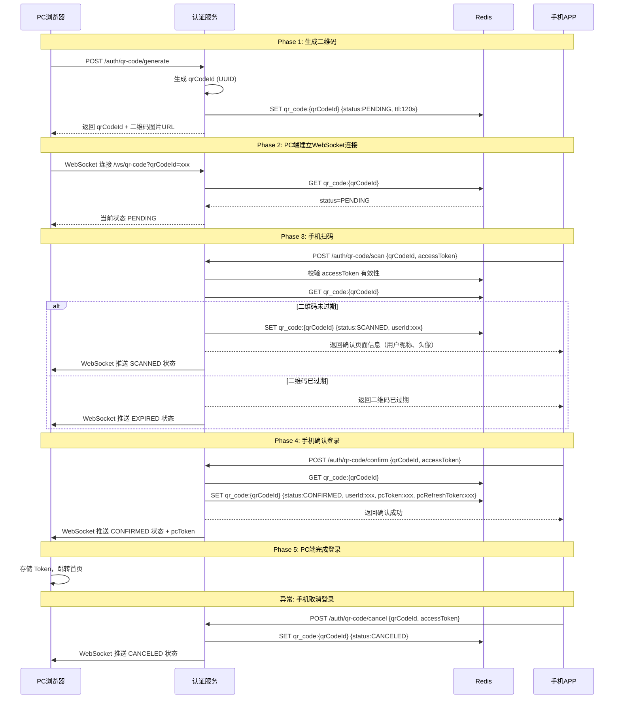

# Java 扫码登录实现与方案对比

> 核心思路：PC 端生成带唯一标识的二维码，手机端扫码确认后，服务端更新 Redis 状态，PC 端通过 WebSocket 实时感知状态变更并获取 Token。评审重点：二维码状态机的 5 种状态转换是否完整、WebSocket 与长轮询的降级策略是否可靠、安全防御是否覆盖二维码劫持和重放攻击。

---

## 一、引子：为什么需要扫码登录

用户在 PC 端访问 Web 应用时，输入账号密码是最直接的登录方式。但在以下场景中，扫码登录体验更优：

| 场景 | 密码登录的问题 | 扫码登录的优势 |
|------|--------------|--------------|
| 公共电脑 | 键盘记录器窃取密码 | 无需输入密码，凭证不经过 PC |
| 移动端已登录 | 重复输入密码体验差 | 手机一键确认，零输入 |
| 大屏设备 | 虚拟键盘输入效率低 | 扫码即登，3 秒完成 |
| 安全敏感场景 | 密码可能泄露 | Token 在手机端签发，PC 端不接触凭证 |

扫码登录的本质是**将手机端已有的登录态"转移"到 PC 端**，而非重新认证。这要求手机端用户必须已登录——扫码确认时，手机端携带的 Token 证明身份，服务端据此为 PC 端签发新 Token。

---

## 二、扫码登录核心流程

### 2.1 完整时序



### 2.2 二维码状态机

二维码有 5 种状态，转换关系如下：

```
                    ┌─────────────────────────────────────┐
                    │          生成二维码                    │
                    │          (PENDING)                    │
                    └──────────┬──────────────────────────┘
                               │
                    ┌──────────▼──────────────────────────┐
              ┌─────┤         等待扫码                      │
              │     │         (PENDING)                    │
              │     └──┬──────────────────┬───────────────┘
              │        │                  │
              │   ┌────▼─────┐     ┌─────▼──────┐
              │   │  超时     │     │  手机扫码    │
              │   │ (EXPIRED) │     │ (SCANNED)   │
              │   └──────────┘     └──┬───────┬──┘
              │                        │       │
              │                   ┌────▼──┐ ┌──▼────────┐
              │                   │ 确认   │ │  取消      │
              │                   │(CONFIRMED)│(CANCELED) │
              │                   └────┬──┘ └───────────┘
              │                        │
              └────────────────────────┘
                    (任何非PENDING状态
                     均为终态，不可逆)
```

| 状态 | 含义 | 可转换到 | 触发条件 |
|------|------|---------|---------|
| `PENDING` | 等待扫码 | SCANNED / EXPIRED | 手机扫码 / 超时 |
| `SCANNED` | 已扫码待确认 | CONFIRMED / CANCELED / EXPIRED | 手机确认 / 手机取消 / 超时 |
| `CONFIRMED` | 已确认 | — | 终态，PC 端获取 Token |
| `CANCELED` | 已取消 | — | 终态，PC 端提示取消 |
| `EXPIRED` | 已过期 | — | 终态，PC 端提示刷新 |

**关键约束**：状态只能单向流转，不可回退。CONFIRMED / CANCELED / EXPIRED 均为终态。

---

## 三、方案对比：PC 端如何感知状态变更

PC 端生成二维码后，需要实时感知"手机已扫码/已确认/已取消"的状态变更。四种主流方案的对比如下：

### 3.1 方案总览

| 维度 | 短轮询 | 长轮询 | WebSocket | SSE |
|------|--------|--------|-----------|-----|
| **通信方向** | 客户端→服务端 | 客户端→服务端 | 双向 | 服务端→客户端 |
| **实时性** | 取决于轮询间隔（1-5s 延迟） | 近实时（状态变更即返回） | 实时 | 实时 |
| **服务端资源** | 每次请求都查 Redis | 等待期间占用线程 | 连接建立后无额外请求（NIO不占线程） | 同 WebSocket |
| **连接复杂度** | 无需维持连接 | 无需维持连接 | 需维持长连接 + 心跳 | 需维持长连接 |
| **兼容性** | 全平台 | 全平台 | IE10+，移动端需注意 | IE 不支持 |
| **断线重连** | 天然支持（下次轮询即可） | 需客户端重发请求 | 需心跳 + 重连机制 | 内置重连（EventSource） |
| **防火墙/代理** | 无问题 | 部分代理提前返回 | 可能被拦截 | 可能被拦截 |
| **实现复杂度** | ★☆☆ | ★★☆ | ★★★ | ★★☆ |

### 3.2 资源消耗对比

以 10,000 个并发等待扫码的 PC 端为例：

| 方案 | 每秒请求数 | 线程占用 | Redis 查询次数/秒 | 带宽消耗 |
|------|-----------|---------|-------------------|---------|
| 短轮询 (2s 间隔) | 5,000 QPS | 低（请求即释放） | 5,000 次 | 高（频繁 HTTP 头） |
| 长轮询 (30s 超时) | ~333 QPS | 中（hold 线程） | ~333 次 | 低 |
| WebSocket | 0（仅心跳） | 低（NIO 不占线程） | 仅状态变更时 | 极低 |
| SSE | 0（仅心跳） | 低 | 仅状态变更时 | 极低 |

### 3.3 方案选型结论

```
┌──────────────────────────────────────────────────────────────────┐
│                    扫码登录方案选择决策树                            │
├──────────────────────────────────────────────────────────────────┤
│                                                                   │
│  企业级首选：WebSocket                                             │
│  └── 实时性最好，资源占用最低，体验最佳                            │
│                                                                   │
│  降级方案：长轮询                                                  │
│  └── WebSocket 连接失败时自动降级，保证兼容性                      │
│                                                                   │
│  快速验证：短轮询                                                  │
│  └── 实现简单，适合原型验证                                        │
│                                                                   │
│  需兼容旧浏览器：短轮询 + 长轮询                                    │
│  └── 最差体验，最强兼容性                                          │
│                                                                   │
│  企业级推荐：WebSocket 为主 + 长轮询降级                            │
│  └── 优先 WebSocket，连接失败自动降级为长轮询                       │
│                                                                   │
└──────────────────────────────────────────────────────────────────┘
```

**本文选择 WebSocket 为主方案，长轮询为降级方案**，原因：
1. 实时性最好，状态变更立即推送
2. 资源占用最低，NIO 不占用 Servlet 线程
3. 用户体验最佳，无延迟感
4. 长轮询降级保证兼容性

---

## 四、后端实现：基于 Spring Boot + Redis

### 4.1 Maven 依赖配置

```xml
<!-- pom.xml -->
<parent>
    <groupId>org.springframework.boot</groupId>
    <artifactId>spring-boot-starter-parent</artifactId>
    <version>3.2.0</version>
    <relativePath/>
</parent>

<dependencies>
    <!-- WebSocket 支持 -->
    <dependency>
        <groupId>org.springframework.boot</groupId>
        <artifactId>spring-boot-starter-websocket</artifactId>
    </dependency>

    <!-- Redis 支持 -->
    <dependency>
        <groupId>org.springframework.boot</groupId>
        <artifactId>spring-boot-starter-data-redis</artifactId>
    </dependency>

    <!-- Web 支持 -->
    <dependency>
        <groupId>org.springframework.boot</groupId>
        <artifactId>spring-boot-starter-web</artifactId>
    </dependency>

    <!-- JWT 支持 -->
    <dependency>
        <groupId>io.jsonwebtoken</groupId>
        <artifactId>jjwt-api</artifactId>
        <version>0.12.3</version>
    </dependency>
    <dependency>
        <groupId>io.jsonwebtoken</groupId>
        <artifactId>jjwt-impl</artifactId>
        <version>0.12.3</version>
        <scope>runtime</scope>
    </dependency>
    <dependency>
        <groupId>io.jsonwebtoken</groupId>
        <artifactId>jjwt-jackson</artifactId>
        <version>0.12.3</version>
        <scope>runtime</scope>
    </dependency>

    <!-- Lombok -->
    <dependency>
        <groupId>org.projectlombok</groupId>
        <artifactId>lombok</artifactId>
        <optional>true</optional>
    </dependency>

    <!-- Swagger/OpenAPI -->
    <dependency>
        <groupId>org.springdoc</groupId>
        <artifactId>springdoc-openapi-starter-webmvc-ui</artifactId>
        <version>2.3.0</version>
    </dependency>
</dependencies>
```

### 4.2 数据模型

```java
@Data
@Builder
@NoArgsConstructor
@AllArgsConstructor
public class QrCodeStatus {
    private String qrCodeId;
    private QrCodeStatusEnum status;
    private Long userId;
    private String nickname;
    private String avatar;
    private String pcAccessToken;
    private String pcRefreshToken;
    private LocalDateTime createdAt;
    private LocalDateTime expireAt;
}
```

```java
public enum QrCodeStatusEnum {
    PENDING(0, "等待扫码"),
    SCANNED(1, "已扫码待确认"),
    CONFIRMED(2, "已确认"),
    CANCELED(3, "已取消"),
    EXPIRED(4, "已过期");

    private final int code;
    private final String desc;
}
```

### 4.2 Redis 存储设计

| Key | 类型 | TTL | 说明 |
|-----|------|-----|------|
| `qr_code:{qrCodeId}` | Hash | 120s | 二维码状态数据 |
| `qr_code:scan_lock:{qrCodeId}` | String (NX) | 120s | 扫码操作分布式锁，防并发扫码 |

Hash 字段：

| Field | 说明 |
|-------|------|
| `status` | 状态码（0-4） |
| `userId` | 扫码用户 ID |
| `nickname` | 扫码用户昵称 |
| `avatar` | 扫码用户头像 |
| `pcAccessToken` | PC 端访问 Token |
| `pcRefreshToken` | PC 端刷新 Token |
| `createdAt` | 创建时间戳 |

### 4.3 WebSocket 配置

```java
@Configuration
@EnableWebSocket
public class WebSocketConfig implements WebSocketConfigurer {

    private final QrCodeWebSocketHandler qrCodeWebSocketHandler;

    @Override
    public void registerWebSocketHandlers(WebSocketHandlerRegistry registry) {
        registry.addHandler(qrCodeWebSocketHandler, "/ws/qr-code")
                .setAllowedOrigins("*");
    }
}
```

```java
@Component
public class QrCodeWebSocketHandler extends TextWebSocketHandler {

    private final ConcurrentHashMap<String, WebSocketSession> sessions = new ConcurrentHashMap<>();
    private final RedisService redisService;

    private static final String QR_CODE_KEY_PREFIX = "qr_code:";

    @Override
    public void afterConnectionEstablished(WebSocketSession session) throws Exception {
        String qrCodeId = getQrCodeId(session);
        if (qrCodeId == null) {
            session.close();
            return;
        }

        sessions.put(qrCodeId, session);

        QrCodeStatus current = getQrCodeStatusFromRedis(qrCodeId);
        if (current != null) {
            sendStatus(session, current);
        }
    }

    @Override
    public void afterConnectionClosed(WebSocketSession session, CloseStatus status) throws Exception {
        String qrCodeId = getQrCodeId(session);
        if (qrCodeId != null) {
            sessions.remove(qrCodeId);
        }
    }

    public void pushStatusUpdate(String qrCodeId, QrCodeStatus status) {
        WebSocketSession session = sessions.get(qrCodeId);
        if (session != null && session.isOpen()) {
            sendStatus(session, status);
        }
    }

    private void sendStatus(WebSocketSession session, QrCodeStatus status) {
        try {
            ObjectMapper mapper = new ObjectMapper();
            session.sendMessage(new TextMessage(mapper.writeValueAsString(buildResponse(status))));
        } catch (Exception e) {
            e.printStackTrace();
        }
    }

    private QrCodeStatusResponse buildResponse(QrCodeStatus status) {
        return QrCodeStatusResponse.builder()
                .qrCodeId(status.getQrCodeId())
                .status(status.getStatus())
                .userId(status.getUserId())
                .nickname(status.getNickname())
                .avatar(status.getAvatar())
                .pcAccessToken(status.getPcAccessToken())
                .pcRefreshToken(status.getPcRefreshToken())
                .build();
    }

    private String getQrCodeId(WebSocketSession session) {
        String query = session.getUri().getQuery();
        if (query == null) return null;
        for (String param : query.split("&")) {
            String[] pair = param.split("=");
            if ("qrCodeId".equals(pair[0])) {
                return pair[1];
            }
        }
        return null;
    }

    private QrCodeStatus getQrCodeStatusFromRedis(String qrCodeId) {
        String key = QR_CODE_KEY_PREFIX + qrCodeId;
        Map<String, String> hash = redisService.hGetAll(key);
        if (hash == null || hash.isEmpty()) {
            return null;
        }
        return QrCodeStatus.builder()
                .qrCodeId(qrCodeId)
                .status(QrCodeStatusEnum.fromCode(Integer.parseInt(hash.get("status"))))
                .userId(hash.containsKey("userId") ? Long.parseLong(hash.get("userId")) : null)
                .nickname(hash.get("nickname"))
                .avatar(hash.get("avatar"))
                .pcAccessToken(hash.get("pcAccessToken"))
                .pcRefreshToken(hash.get("pcRefreshToken"))
                .build();
    }
}
```

### 4.4 生成二维码

```java
@Service
@RequiredArgsConstructor
@Slf4j
public class QrCodeLoginServiceImpl implements QrCodeLoginService {

    private final RedisService redisService;
    private final JwtUtils jwtUtils;
    private final QrCodeWebSocketHandler webSocketHandler;

    private static final long QR_CODE_TTL_SECONDS = 120;
    private static final String QR_CODE_KEY_PREFIX = "qr_code:";
    private static final String QR_CODE_SCAN_LOCK_PREFIX = "qr_code:scan_lock:";

    @Override
    public QrCodeGenerateResponse generate() {
        String qrCodeId = UUID.randomUUID().toString().replace("-", "");

        QrCodeStatus status = QrCodeStatus.builder()
                .qrCodeId(qrCodeId)
                .status(QrCodeStatusEnum.PENDING)
                .createdAt(LocalDateTime.now())
                .expireAt(LocalDateTime.now().plusSeconds(QR_CODE_TTL_SECONDS))
                .build();

        String key = QR_CODE_KEY_PREFIX + qrCodeId;
        Map<String, String> hash = new HashMap<>();
        hash.put("status", String.valueOf(QrCodeStatusEnum.PENDING.getCode()));
        hash.put("createdAt", String.valueOf(System.currentTimeMillis()));
        redisService.hPutAll(key, hash);
        redisService.expire(key, QR_CODE_TTL_SECONDS, TimeUnit.SECONDS);

        String qrCodeUrl = buildQrCodeUrl(qrCodeId);

        return QrCodeGenerateResponse.builder()
                .qrCodeId(qrCodeId)
                .qrCodeUrl(qrCodeUrl)
                .expireIn(QR_CODE_TTL_SECONDS)
                .build();
    }

    private String buildQrCodeUrl(String qrCodeId) {
        return "https://your-domain.com/scan?qrCodeId=" + qrCodeId;
    }
```

### 4.5 手机扫码

```java
    @Override
    public QrCodeScanResponse scan(String qrCodeId, String accessToken) {
        Long userId = jwtUtils.getUserIdAsLong(accessToken);
        String lockKey = QR_CODE_SCAN_LOCK_PREFIX + qrCodeId;

        Boolean locked = redisService.setIfAbsent(lockKey, String.valueOf(userId), 5, TimeUnit.SECONDS);
        if (Boolean.FALSE.equals(locked)) {
            throw new AuthException("二维码正在被其他设备处理，请稍后重试");
        }

        try {
            String key = QR_CODE_KEY_PREFIX + qrCodeId;
            Map<String, String> hash = redisService.hGetAll(key);

            if (hash == null || hash.isEmpty()) {
                QrCodeStatus expiredStatus = QrCodeStatus.builder()
                        .qrCodeId(qrCodeId)
                        .status(QrCodeStatusEnum.EXPIRED)
                        .build();
                webSocketHandler.pushStatusUpdate(qrCodeId, expiredStatus);
                throw new AuthException("二维码已过期，请刷新重试");
            }

            QrCodeStatusEnum currentStatus = QrCodeStatusEnum.fromCode(
                    Integer.parseInt(hash.get("status")));

            if (currentStatus == QrCodeStatusEnum.SCANNED) {
                Long existUserId = Long.parseLong(hash.get("userId"));
                if (!existUserId.equals(userId)) {
                    throw new AuthException("该二维码已被其他用户扫描");
                }
                return QrCodeScanResponse.alreadyScanned();
            }

            if (currentStatus != QrCodeStatusEnum.PENDING) {
                throw new AuthException("二维码状态异常: " + currentStatus.getDesc());
            }

            hash.put("status", String.valueOf(QrCodeStatusEnum.SCANNED.getCode()));
            hash.put("userId", String.valueOf(userId));
            SysUserApi user = remoteUserService.getUserById(userId);
            hash.put("nickname", user.getNickName());
            hash.put("avatar", user.getAvatar());
            redisService.hPutAll(key, hash);
            redisService.expire(key, 60, TimeUnit.SECONDS);

            QrCodeStatus scannedStatus = QrCodeStatus.builder()
                    .qrCodeId(qrCodeId)
                    .status(QrCodeStatusEnum.SCANNED)
                    .userId(userId)
                    .nickname(user.getNickName())
                    .avatar(user.getAvatar())
                    .build();
            webSocketHandler.pushStatusUpdate(qrCodeId, scannedStatus);

            return QrCodeScanResponse.builder()
                    .qrCodeId(qrCodeId)
                    .nickname(user.getNickName())
                    .avatar(user.getAvatar())
                    .build();
        } finally {
            redisService.deleteObject(lockKey);
        }
    }
```

### 4.7 手机确认登录

```java
    @Override
    public QrCodeConfirmResponse confirm(String qrCodeId, String accessToken) {
        Long userId = jwtUtils.getUserIdAsLong(accessToken);

        String key = QR_CODE_KEY_PREFIX + qrCodeId;
        Map<String, String> hash = redisService.hGetAll(key);

        if (hash == null || hash.isEmpty()) {
            QrCodeStatus expiredStatus = QrCodeStatus.builder()
                    .qrCodeId(qrCodeId)
                    .status(QrCodeStatusEnum.EXPIRED)
                    .build();
            webSocketHandler.pushStatusUpdate(qrCodeId, expiredStatus);
            throw new AuthException("二维码已过期");
        }

        QrCodeStatusEnum currentStatus = QrCodeStatusEnum.fromCode(
                Integer.parseInt(hash.get("status")));

        if (currentStatus != QrCodeStatusEnum.SCANNED) {
            throw new AuthException("二维码状态异常，当前状态: " + currentStatus.getDesc());
        }

        Long scannedUserId = Long.parseLong(hash.get("userId"));
        if (!scannedUserId.equals(userId)) {
            throw new AuthException("确认用户与扫码用户不一致");
        }

        Map<String, Object> claims = new HashMap<>();
        claims.put(SecurityConstants.USER_ID, userId);
        claims.put(SecurityConstants.USER_NAME, hash.get("nickname"));
        claims.put("token_type", "access");
        String pcAccessToken = jwtUtils.createToken(claims);

        String refreshToken = jwtUtils.createRefreshToken(userId);

        String accessTokenKey = CacheConstants.CACHE_LOGIN_TOKEN + userId;
        String refreshTokenKey = CacheConstants.CACHE_LOGIN_REFRESH + userId;
        redisService.setSetCacheObject(accessTokenKey, pcAccessToken);
        redisService.expire(accessTokenKey, SecurityConstants.TOKEN_EXPIRE, TimeUnit.MINUTES);
        redisService.setSetCacheObject(refreshTokenKey, refreshToken);
        redisService.expire(refreshTokenKey, SecurityConstants.REFRESH_TOKEN_EXPIRE, TimeUnit.DAYS);

        hash.put("status", String.valueOf(QrCodeStatusEnum.CONFIRMED.getCode()));
        hash.put("pcAccessToken", pcAccessToken);
        hash.put("pcRefreshToken", refreshToken);
        redisService.hPutAll(key, hash);

        QrCodeStatus confirmedStatus = QrCodeStatus.builder()
                .qrCodeId(qrCodeId)
                .status(QrCodeStatusEnum.CONFIRMED)
                .userId(userId)
                .nickname(hash.get("nickname"))
                .avatar(hash.get("avatar"))
                .pcAccessToken(pcAccessToken)
                .pcRefreshToken(refreshToken)
                .build();
        webSocketHandler.pushStatusUpdate(qrCodeId, confirmedStatus);

        redisService.deleteObject(key);

        return QrCodeConfirmResponse.success(qrCodeId);
    }
```

### 4.8 手机取消登录

```java
    @Override
    public void cancel(String qrCodeId, String accessToken) {
        Long userId = jwtUtils.getUserIdAsLong(accessToken);

        String key = QR_CODE_KEY_PREFIX + qrCodeId;
        Map<String, String> hash = redisService.hGetAll(key);

        if (hash == null || hash.isEmpty()) {
            QrCodeStatus expiredStatus = QrCodeStatus.builder()
                    .qrCodeId(qrCodeId)
                    .status(QrCodeStatusEnum.EXPIRED)
                    .build();
            webSocketHandler.pushStatusUpdate(qrCodeId, expiredStatus);
            return;
        }

        QrCodeStatusEnum currentStatus = QrCodeStatusEnum.fromCode(
                Integer.parseInt(hash.get("status")));

        if (currentStatus != QrCodeStatusEnum.SCANNED) {
            return;
        }

        Long scannedUserId = Long.parseLong(hash.get("userId"));
        if (!scannedUserId.equals(userId)) {
            throw new AuthException("取消用户与扫码用户不一致");
        }

        hash.put("status", String.valueOf(QrCodeStatusEnum.CANCELED.getCode()));
        redisService.hPutAll(key, hash);

        QrCodeStatus canceledStatus = QrCodeStatus.builder()
                .qrCodeId(qrCodeId)
                .status(QrCodeStatusEnum.CANCELED)
                .userId(userId)
                .build();
        webSocketHandler.pushStatusUpdate(qrCodeId, canceledStatus);
    }
```

### 4.9 长轮询降级实现

```java
    @Override
    public QrCodeStatusResponse getStatus(String qrCodeId, long timeoutSeconds) {
        long startTime = System.currentTimeMillis();
        long timeoutMillis = TimeUnit.SECONDS.toMillis(Math.min(timeoutSeconds, 25));

        while (System.currentTimeMillis() - startTime < timeoutMillis) {
            QrCodeStatus status = getQrCodeStatusFromRedis(qrCodeId);

            if (status == null) {
                return QrCodeStatusResponse.expired(qrCodeId);
            }

            if (status.getStatus() != QrCodeStatusEnum.PENDING) {
                return buildResponse(status);
            }

            try {
                Thread.sleep(500);
            } catch (InterruptedException e) {
                Thread.currentThread().interrupt();
                return buildResponse(status);
            }
        }

        QrCodeStatus status = getQrCodeStatusFromRedis(qrCodeId);
        if (status == null) {
            return QrCodeStatusResponse.expired(qrCodeId);
        }
        return buildResponse(status);
    }

    private QrCodeStatusResponse buildResponse(QrCodeStatus status) {
        return QrCodeStatusResponse.builder()
                .qrCodeId(status.getQrCodeId())
                .status(status.getStatus())
                .userId(status.getUserId())
                .nickname(status.getNickname())
                .avatar(status.getAvatar())
                .pcAccessToken(status.getPcAccessToken())
                .pcRefreshToken(status.getPcRefreshToken())
                .build();
    }

    private QrCodeStatus getQrCodeStatusFromRedis(String qrCodeId) {
        String key = QR_CODE_KEY_PREFIX + qrCodeId;
        Map<String, String> hash = redisService.hGetAll(key);
        if (hash == null || hash.isEmpty()) {
            return null;
        }
        return QrCodeStatus.builder()
                .qrCodeId(qrCodeId)
                .status(QrCodeStatusEnum.fromCode(Integer.parseInt(hash.get("status"))))
                .userId(hash.containsKey("userId") ? Long.parseLong(hash.get("userId")) : null)
                .nickname(hash.get("nickname"))
                .avatar(hash.get("avatar"))
                .pcAccessToken(hash.get("pcAccessToken"))
                .pcRefreshToken(hash.get("pcRefreshToken"))
                .build();
    }
}
```

### 4.10 Controller 层

```java
@RestController
@RequestMapping("/auth/qr-code")
@RequiredArgsConstructor
@Tag(name = "扫码登录")
public class QrCodeLoginController {

    private final QrCodeLoginService qrCodeLoginService;

    @Operation(summary = "生成二维码")
    @PostMapping("/generate")
    public R<QrCodeGenerateResponse> generate() {
        return R.ok(qrCodeLoginService.generate());
    }

    @Operation(summary = "查询二维码状态（长轮询降级）")
    @GetMapping("/status")
    public R<QrCodeStatusResponse> getStatus(
            @RequestParam String qrCodeId,
            @RequestParam(defaultValue = "25") long timeout) {
        return R.ok(qrCodeLoginService.getStatus(qrCodeId, timeout));
    }

    @Operation(summary = "手机扫码")
    @PostMapping("/scan")
    public R<QrCodeScanResponse> scan(
            @RequestParam String qrCodeId,
            @RequestHeader(SecurityConstants.AUTHORIZATION_HEADER) String authorization) {
        String accessToken = authorization.replace(SecurityConstants.TOKEN_PREFIX, "");
        return R.ok(qrCodeLoginService.scan(qrCodeId, accessToken));
    }

    @Operation(summary = "手机确认登录")
    @PostMapping("/confirm")
    public R<QrCodeConfirmResponse> confirm(
            @RequestParam String qrCodeId,
            @RequestHeader(SecurityConstants.AUTHORIZATION_HEADER) String authorization) {
        String accessToken = authorization.replace(SecurityConstants.TOKEN_PREFIX, "");
        return R.ok(qrCodeLoginService.confirm(qrCodeId, accessToken));
    }

    @Operation(summary = "手机取消登录")
    @PostMapping("/cancel")
    public R<Void> cancel(
            @RequestParam String qrCodeId,
            @RequestHeader(SecurityConstants.AUTHORIZATION_HEADER) String authorization) {
        String accessToken = authorization.replace(SecurityConstants.TOKEN_PREFIX, "");
        qrCodeLoginService.cancel(qrCodeId, accessToken);
        return R.ok();
    }
}
```

### 4.11 Gateway 白名单

```yaml
security:
  ignore:
    whites:
      - /api/auth/qr-code/generate
      - /api/auth/qr-code/status
      - /ws/qr-code/**
```

> `/scan`、`/confirm`、`/cancel` 不在白名单中——手机端必须携带有效 Token 才能操作。

---

## 五、前端实现

### 5.1 PC 端：二维码展示 + WebSocket

```typescript
import { ref, onMounted, onUnmounted } from 'vue'
import { useRouter } from 'vue-router'
import { useUserStore } from '@/stores/user'
import { qrCodeApi } from '@/api/auth'

type QrCodeStatus = 'PENDING' | 'SCANNED' | 'CONFIRMED' | 'CANCELED' | 'EXPIRED'

interface QrCodeStatusResponse {
  qrCodeId: string
  status: QrCodeStatus
  userId?: number
  nickname?: string
  avatar?: string
  pcAccessToken?: string
  pcRefreshToken?: string
}

export function useQrCodeLogin() {
  const router = useRouter()
  const userStore = useUserStore()

  const qrCodeId = ref('')
  const qrCodeUrl = ref('')
  const status = ref<QrCodeStatus>('PENDING')
  const scannedUser = ref<{ nickname: string; avatar: string } | null>(null)
  const countdown = ref(0)
  const loading = ref(false)
  const useFallback = ref(false)

  let ws: WebSocket | null = null
  let countdownTimer: ReturnType<typeof setInterval> | null = null
  let reconnectAttempts = 0
  const MAX_RECONNECT = 3
  let pollTimer: ReturnType<typeof setTimeout> | null = null

  async function generateQrCode() {
    loading.value = true
    try {
      const res = await qrCodeApi.generate()
      qrCodeId.value = res.data.qrCodeId
      qrCodeUrl.value = res.data.qrCodeUrl
      countdown.value = res.data.expireIn
      status.value = 'PENDING'
      scannedUser.value = null
      useFallback.value = false
      reconnectAttempts = 0
      startCountdown()
      connectWs()
    } finally {
      loading.value = false
    }
  }

  function connectWs() {
    const protocol = window.location.protocol === 'https:' ? 'wss:' : 'ws:'
    const wsUrl = `${protocol}//${window.location.host}/ws/qr-code?qrCodeId=${qrCodeId.value}`
    ws = new WebSocket(wsUrl)

    ws.onopen = () => {
      reconnectAttempts = 0
    }

    ws.onmessage = (event) => {
      const data: QrCodeStatusResponse = JSON.parse(event.data)
      handleStatusUpdate(data)
    }

    ws.onclose = () => {
      if (status.value === 'CONFIRMED' || status.value === 'CANCELED' || status.value === 'EXPIRED') {
        return
      }

      if (reconnectAttempts < MAX_RECONNECT) {
        reconnectAttempts++
        setTimeout(() => connectWs(), 2000 * reconnectAttempts)
      } else {
        fallbackToPolling()
      }
    }

    ws.onerror = () => {
      ws?.close()
    }
  }

  function fallbackToPolling() {
    useFallback.value = true
    startPolling()
  }

  async function startPolling() {
    if (status.value === 'CONFIRMED' || status.value === 'CANCELED' || status.value === 'EXPIRED') {
      return
    }

    try {
      const res = await qrCodeApi.getStatus(qrCodeId.value, 25)
      handleStatusUpdate(res.data)
    } catch {
    } finally {
      if (useFallback.value && status.value === 'PENDING') {
        pollTimer = setTimeout(() => startPolling(), 2000)
      }
    }
  }

  function handleStatusUpdate(data: QrCodeStatusResponse) {
    status.value = data.status

    switch (data.status) {
      case 'SCANNED':
        scannedUser.value = { nickname: data.nickname!, avatar: data.avatar! }
        break
      case 'CONFIRMED':
        handleLoginSuccess(data)
        break
      case 'CANCELED':
      case 'EXPIRED':
        break
    }
  }

  function handleLoginSuccess(data: QrCodeStatusResponse) {
    if (data.pcAccessToken) {
      document.cookie = `access_token=${data.pcAccessToken}; path=/; max-age=1800; SameSite=Lax; ${window.location.protocol === 'https:' ? 'Secure;' : ''}`
    }
    if (data.pcRefreshToken) {
      document.cookie = `refresh_token=${data.pcRefreshToken}; path=/; max-age=2592000; SameSite=Lax; ${window.location.protocol === 'https:' ? 'Secure;' : ''}`
    }
    userStore.setUserInfo({ accessToken: data.pcAccessToken! })
    router.push('/dashboard')
  }

  function startCountdown() {
    if (countdownTimer) clearInterval(countdownTimer)
    countdownTimer = setInterval(() => {
      countdown.value--
      if (countdown.value <= 0) {
        status.value = 'EXPIRED'
        cleanup()
      }
    }, 1000)
  }

  function cleanup() {
    if (ws) {
      ws.close()
      ws = null
    }
    if (pollTimer) {
      clearTimeout(pollTimer)
      pollTimer = null
    }
    if (countdownTimer) {
      clearInterval(countdownTimer)
      countdownTimer = null
    }
  }

  function refreshQrCode() {
    cleanup()
    generateQrCode()
  }

  onMounted(() => generateQrCode())
  onUnmounted(() => cleanup())

  return {
    qrCodeId, qrCodeUrl, status, scannedUser, countdown, loading,
    useFallback, refreshQrCode
  }
}
```

### 5.2 PC 端：Vue 组件

```vue
<template>
  <div class="qr-login">
    <div v-if="status === 'PENDING'" class="qr-pending">
      <QrCodeCanvas :value="qrCodeUrl" :size="200" />
      <p>请使用手机 APP 扫描二维码登录</p>
      <span class="countdown">{{ countdown }}s 后过期</span>
      <span v-if="useFallback" class="fallback">当前使用降级连接</span>
    </div>

    <div v-else-if="status === 'SCANNED'" class="qr-scanned">
      <Avatar :src="scannedUser?.avatar" :size="48" />
      <p>{{ scannedUser?.nickname }} 已扫码</p>
      <p>请在手机上确认登录</p>
    </div>

    <div v-else-if="status === 'CONFIRMED'" class="qr-confirmed">
      <CheckCircleFilled style="font-size: 48px; color: #52c41a" />
      <p>登录成功，正在跳转...</p>
    </div>

    <div v-else-if="status === 'CANCELED'" class="qr-canceled">
      <CloseCircleFilled style="font-size: 48px; color: #ff4d4f" />
      <p>登录已取消</p>
      <Button type="primary" @click="refreshQrCode">重新扫码</Button>
    </div>

    <div v-else-if="status === 'EXPIRED'" class="qr-expired">
      <QrCodeCanvas :value="qrCodeUrl" :size="200" level="L" :fg-color="#d9d9d9" />
      <p>二维码已过期</p>
      <Button type="primary" @click="refreshQrCode">刷新二维码</Button>
    </div>
  </div>
</template>

<script setup lang="ts">
import { QrCodeCanvas } from 'qrcode.react'
import { useQrCodeLogin } from '@/composables/useQrCodeLogin'

const {
  qrCodeUrl, status, scannedUser, countdown, loading, useFallback, refreshQrCode
} = useQrCodeLogin()
</script>

<style scoped>
.fallback {
  font-size: 12px;
  color: #999;
  margin-top: 8px;
}
</style>
```

### 5.3 手机端：扫码 + 确认流程

```typescript
export function useScanLogin() {
  const router = useRouter()
  const confirmLoading = ref(false)
  const scanResult = ref<QrCodeScanResponse | null>(null)

  async function scanQrCode(qrCodeId: string) {
    try {
      const res = await qrCodeApi.scan(qrCodeId)
      scanResult.value = res.data
    } catch (error: any) {
      if (error.response?.data?.msg?.includes('已过期')) {
        showToast('二维码已过期，请在 PC 端刷新')
      } else if (error.response?.data?.msg?.includes('已被其他用户')) {
        showToast('该二维码已被其他用户扫描')
      } else {
        showToast('扫码失败，请重试')
      }
      router.back()
    }
  }

  async function confirmLogin(qrCodeId: string) {
    confirmLoading.value = true
    try {
      await qrCodeApi.confirm(qrCodeId)
      showToast('登录成功')
      router.back()
    } catch {
      showToast('确认失败，请重试')
    } finally {
      confirmLoading.value = false
    }
  }

  async function cancelLogin(qrCodeId: string) {
    try {
      await qrCodeApi.cancel(qrCodeId)
      router.back()
    } catch {
      router.back()
    }
  }

  return { scanResult, confirmLoading, scanQrCode, confirmLogin, cancelLogin }
}
```

### 5.4 手机端：确认页面组件

```vue
<template>
  <div class="scan-confirm">
    <div class="user-info">
      <Avatar :src="scanResult?.avatar" :size="64" />
      <p class="nickname">{{ scanResult?.nickname }}</p>
    </div>

    <div class="confirm-text">
      <p>确认登录 Web 端？</p>
    </div>

    <div class="actions">
      <Button block @click="cancelLogin(qrCodeId)">取消</Button>
      <Button block type="primary" :loading="confirmLoading" @click="confirmLogin(qrCodeId)">
        确认登录
      </Button>
    </div>

    <p class="tip">确认后，PC 端将自动登录您的账号</p>
  </div>
</template>

<script setup lang="ts">
import { useRoute } from 'vue-router'
import { useScanLogin } from '@/composables/useScanLogin'

const route = useRoute()
const qrCodeId = route.query.qrCodeId as string

const { scanResult, confirmLoading, scanQrCode, confirmLogin, cancelLogin } = useScanLogin()

onMounted(() => scanQrCode(qrCodeId))
</script>
```

---

## 六、安全防御

### 6.1 威胁模型

| 攻击类型 | 攻击方式 | 影响 |
|---------|---------|------|
| **二维码劫持** | 攻击者生成自己的二维码，诱导用户扫描 | 用户登录到攻击者会话 |
| **二维码替换** | 攻击者替换页面上的二维码图片 | 同上 |
| **重放攻击** | 截获确认请求重放 | 重复登录 |
| **暴力扫码** | 脚本遍历 qrCodeId 尝试扫码 | 占用资源，可能撞到有效二维码 |
| **CSRF 扫码** | 跨站请求触发扫码/确认 | 非授权操作 |
| **中间人攻击** | HTTP 明文截获 Token | Token 泄露 |
| **WebSocket 劫持** | 劫持 WebSocket 连接获取状态推送 | 非授权获取状态变更 |

### 6.2 防御措施

**1）二维码劫持防御**

二维码 URL 中不包含任何敏感信息，仅包含 `qrCodeId`。攻击者即使生成自己的二维码，也无法获取受害者的 Token——因为 Token 是服务端根据扫码用户的身份签发的，与二维码本身无关。

```
攻击者生成 qrCodeId=attacker123 → 诱导用户扫描
→ 用户扫码后，服务端将 attacker123 的状态设为 SCANNED + userId=受害者
→ 攻击者 PC 端 WebSocket 连接 attacker123 → 获取到受害者的 Token

防御：Token 不直接写入 Redis Hash，而是在状态变更时
      临时生成并立即通过 WebSocket 推送，推送后立即删除
      同时校验 WebSocket 连接的同源性
```

**关键防御**：WebSocket 连接校验 Origin，确保只有同源页面能连接。

```java
@Override
public void afterConnectionEstablished(WebSocketSession session) throws Exception {
    String origin = session.getHandshakeHeaders().getOrigin();
    if (!isValidOrigin(origin)) {
        session.close();
        return;
    }
    // ...
}
```

**2）暴力扫码防御**

qrCodeId 使用 UUID v4（128 位随机），暴力遍历的概率极低。额外限制：

```java
@PostMapping("/scan")
@RateLimit(resource = "auth:qr-code:scan", key = "#accessToken", count = 10, timeUnit = TimeUnit.MINUTES)
public R<QrCodeScanResponse> scan(...) { }
```

**3）分布式锁防并发扫码**

同一个 qrCodeId 同时只能被一个用户扫码。使用 Redis `SET NX` 实现分布式锁：

```java
String lockKey = QR_CODE_SCAN_LOCK_PREFIX + qrCodeId;
Boolean locked = redisService.setIfAbsent(lockKey, String.valueOf(userId), 5, TimeUnit.SECONDS);
if (Boolean.FALSE.equals(locked)) {
    throw new AuthException("二维码正在被其他设备处理");
}
```

**4）Token 不经过手机端传输**

确认登录时，服务端直接为 PC 端签发 Token，Token 通过 WebSocket 推送返回。手机端只接收"确认成功/失败"的结果，不接触 PC 端的 Token。

**5）WSS 强制**

生产环境 WebSocket 必须使用 `wss://`，所有接口必须走 HTTPS，防止中间人截获 Token。

### 6.3 安全措施汇总

| 威胁 | 防御措施 | 防御效果 |
|------|---------|---------|
| 二维码劫持 | Origin 校验 + Token 即时推送即时删除 | ✅ 攻击者无法获取他人 Token |
| 二维码替换 | 二维码由服务端生成，前端不缓存 | ✅ 每次刷新都是新二维码 |
| 重放攻击 | HTTPS + 请求签名 + qrCodeId 一次性 | ✅ 确认后二维码状态不可逆 |
| 暴力扫码 | UUID v4 + RateLimit + 分布式锁 | ✅ 遍历空间 2^128，限流 10次/分钟 |
| CSRF 扫码 | 手机端需 Authorization Header | ✅ 跨站请求无法携带 Token |
| 中间人攻击 | WSS + HTTPS + Secure Cookie | ✅ 传输加密 |
| WebSocket 劫持 | Origin 校验 + 连接 ID 绑定 | ✅ 非同源连接被拒绝 |

---

## 七、踩坑点 & 注意事项

### 7.1 WebSocket 连接断开后状态丢失

**问题**：用户网络抖动导致 WebSocket 断开，重连后无法获取之前的状态。

**解决**：WebSocket 连接建立后，立即从 Redis 读取当前状态并推送：

```java
@Override
public void afterConnectionEstablished(WebSocketSession session) throws Exception {
    String qrCodeId = getQrCodeId(session);
    // ... 校验逻辑 ...

    sessions.put(qrCodeId, session);

    QrCodeStatus current = getQrCodeStatusFromRedis(qrCodeId);
    if (current != null) {
        sendStatus(session, current);
    }
}
```

### 7.2 二维码过期但手机端还在确认

**问题**：用户在二维码即将过期时扫码，确认请求到达时二维码已过期。

**解决**：扫码时延长 TTL，给确认操作留出时间窗口：

```java
@Override
public QrCodeScanResponse scan(String qrCodeId, String accessToken) {
    // ... 校验逻辑 ...

    // 扫码后延长 TTL 至 60 秒（给确认操作留时间）
    redisService.expire(QR_CODE_KEY_PREFIX + qrCodeId, 60, TimeUnit.SECONDS);

    // ...
}
```

### 7.3 用户扫码后不确认也不取消

**问题**：用户扫码后关闭了手机 APP，二维码停留在 SCANNED 状态，PC 端一直等待。

**解决**：SCANNED 状态也设置超时（60 秒），超时后自动变为 EXPIRED：

```java
// 扫码时设置 60 秒 TTL
redisService.expire(QR_CODE_KEY_PREFIX + qrCodeId, 60, TimeUnit.SECONDS);
```

Redis Key 过期时，通过 Keyspace Notification 触发状态推送：

```java
@Component
public class QrCodeExpireListener {

    private final QrCodeWebSocketHandler webSocketHandler;

    public QrCodeExpireListener(QrCodeWebSocketHandler webSocketHandler) {
        this.webSocketHandler = webSocketHandler;
    }

    public void onQrCodeExpire(String qrCodeId) {
        QrCodeStatus expiredStatus = QrCodeStatus.builder()
                .qrCodeId(qrCodeId)
                .status(QrCodeStatusEnum.EXPIRED)
                .build();
        webSocketHandler.pushStatusUpdate(qrCodeId, expiredStatus);
    }
}
```

### 7.4 PC 端刷新页面后丢失二维码

**问题**：用户刷新页面，qrCodeId 丢失，无法继续连接。

**解决**：将 qrCodeId 存入 sessionStorage：

```typescript
function persistQrCodeId(id: string) {
  sessionStorage.setItem('pendingQrCodeId', id)
}

function restoreQrCodeId(): string | null {
  const id = sessionStorage.getItem('pendingQrCodeId')
  if (id) {
    sessionStorage.removeItem('pendingQrCodeId')
  }
  return id
}

function generateQrCode() {
  const savedId = restoreQrCodeId()
  if (savedId) {
    qrCodeId.value = savedId
    // 重新建立连接
  } else {
    // 生成新二维码
  }
}
```

页面加载时先检查 sessionStorage，如果有未完成的 qrCodeId，继续连接而非重新生成。

### 7.5 WebSocket 被防火墙/代理拦截

**问题**：企业内网防火墙拦截 WebSocket 连接。

**解决**：长轮询降级机制，WebSocket 连接失败 3 次后自动降级为长轮询：

```typescript
ws.onclose = () => {
  if (status.value === 'CONFIRMED' || status.value === 'CANCELED' || status.value === 'EXPIRED') {
    return
  }

  if (reconnectAttempts < MAX_RECONNECT) {
    reconnectAttempts++
    setTimeout(() => connectWs(), 2000 * reconnectAttempts)
  } else {
    fallbackToPolling()
  }
}
```

---

## 八、生产环境部署清单

```
□ 后端
  □ Gateway 白名单添加 /api/auth/qr-code/generate、/api/auth/qr-code/status、/ws/qr-code/**
  □ /scan、/confirm、/cancel 不在白名单中（需 Token）
  □ WebSocket 配置 Origin 校验
  □ Redis Keyspace Notification 开启（notify-keyspace-events Eg$）
  □ RateLimit 配置：scan 接口 10 次/分钟/用户
  □ WSS + HTTPS 强制

□ 前端 PC 端
  □ 二维码使用 HTTPS URL
  □ WebSocket 使用 wss://
  □ 长轮询降级逻辑（WebSocket 失败 3 次后降级）
  □ sessionStorage 保存 qrCodeId 防刷新丢失
  □ 过期倒计时 UI 提示
  □ 降级状态显示（当前使用降级连接）

□ 前端手机端
  □ 扫码使用系统相机或 APP 内扫码组件
  □ 确认页面展示 PC 端信息（如"Windows Chrome"）
  □ 确认/取消操作需 Authorization Header

□ 安全
  □ 二维码 URL 不含敏感信息
  □ PC 端 Token 不经过手机端
  □ 分布式锁防并发扫码
  □ WebSocket Origin 校验
  □ Cookie Secure + SameSite=Lax

□ 监控
  □ 二维码生成量监控
  □ 扫码→确认转化率监控
  □ WebSocket 连接数监控
  □ 长轮询降级比例监控
  □ Redis Key 过期事件监控
```

---

## 九、方案对比总结

| 维度 | 短轮询 | 长轮询 | WebSocket |
|------|--------|--------|-----------|
| **实时性** | 1-5s 延迟 | 近实时 | 实时 |
| **服务端压力** | 高（5,000 QPS/万用户） | 低（~333 QPS/万用户） | 最低（仅状态变更时） |
| **实现复杂度** | 低 | 中 | 高 |
| **断线恢复** | 天然支持 | 客户端重发 | 需心跳+重连+即时状态推送 |
| **代理/防火墙** | 无问题 | 部分代理提前返回 | 可能被拦截 |
| **适用规模** | < 1,000 并发 | < 5,000 并发 | 任意规模 |
| **推荐场景** | 快速验证 | 降级方案 | **企业级首选** |

**核心判断**：WebSocket 实时性最好、资源占用最低，应作为首选方案。但需要配套长轮询降级机制，保证在 WebSocket 被拦截的场景下仍能正常使用。

---

## 参考资料

- [RFC 6749: The WebSocket Protocol](https://tools.ietf.org/html/rfc6455)
- [RFC 6749: OAuth 2.0 Authorization Framework](https://tools.ietf.org/html/rfc6749)
- [微信扫码登录技术原理](https://developers.weixin.qq.com/doc/oplatform/Website_App/WeChat_Login/WeChat_Login.html)
- [Spring WebSocket Support](https://docs.spring.io/spring-framework/reference/web/websocket.html)
- [Redis Keyspace Notifications](https://redis.io/docs/manual/keyspace-notifications/)
- 项目源码：
  - [AuthServiceImpl.java](file:///e:/code/zsk/zsk-cloud/zsk-auth/src/main/java/com/zsk/auth/service/impl/AuthServiceImpl.java)
  - [AuthController.java](file:///e:/code/zsk/zsk-cloud/zsk-auth/src/main/java/com/zsk/auth/controller/AuthController.java)
  - [CacheConstants.java](file:///e:/code/zsk/zsk-cloud/zsk-common/zsk-common-core/src/main/java/com/zsk/common/core/constant/CacheConstants.java)

---
> 如果这篇文章对你有帮助，欢迎点赞收藏。有问题欢迎评论区交流。
